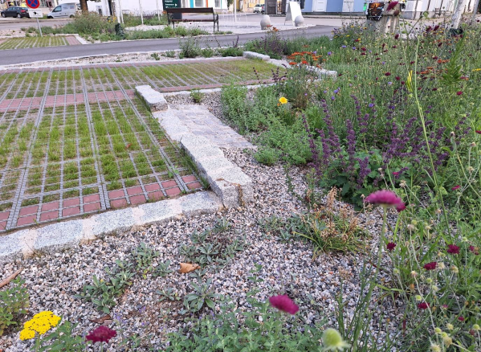
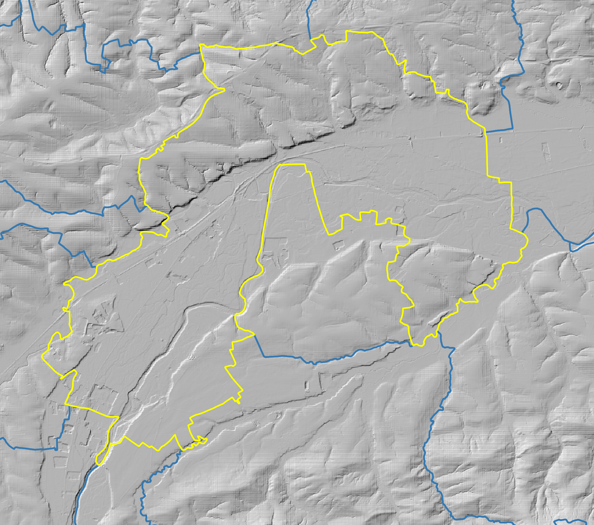
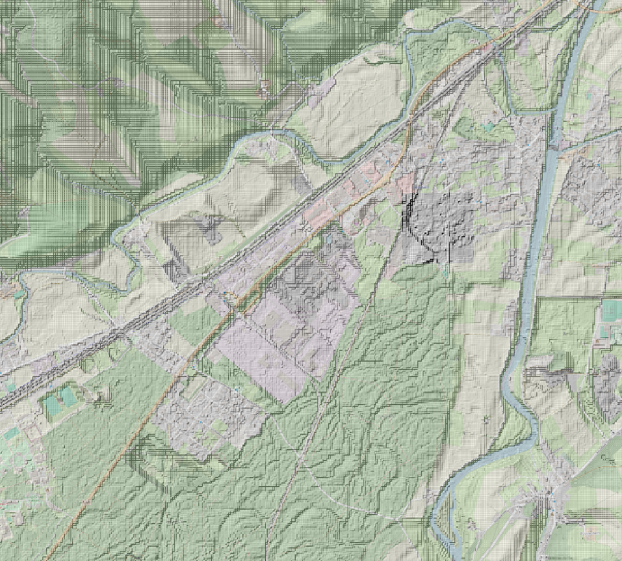
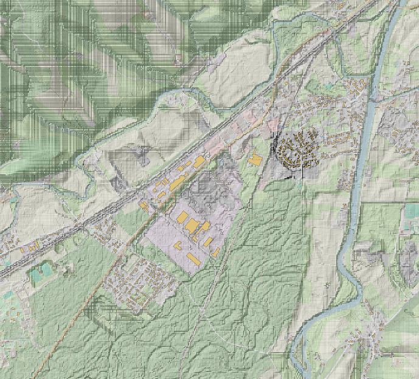
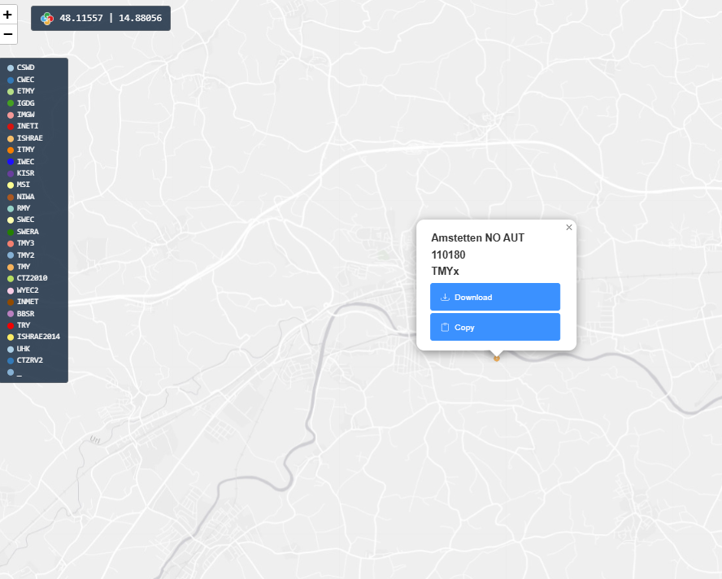
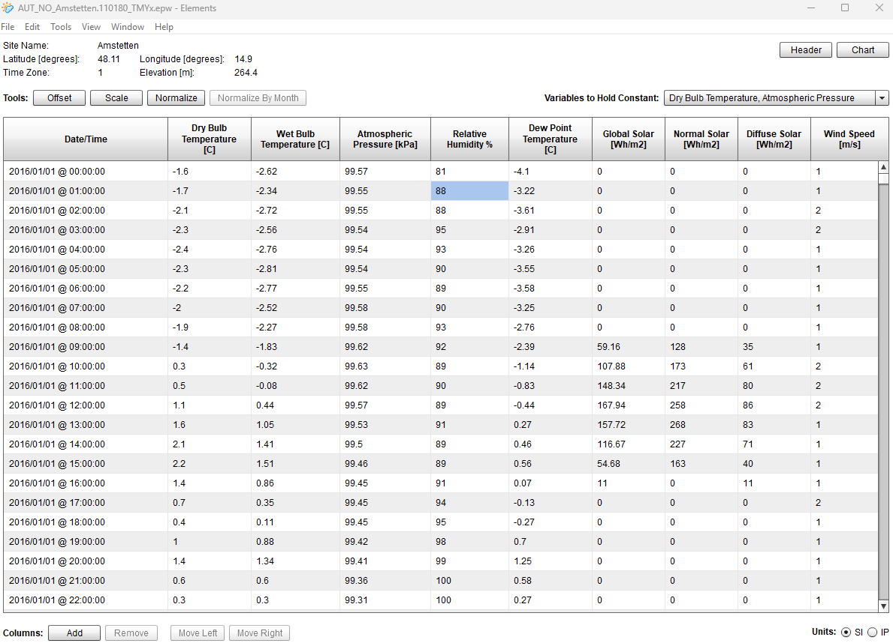
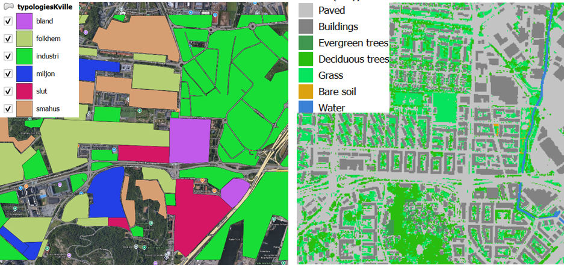
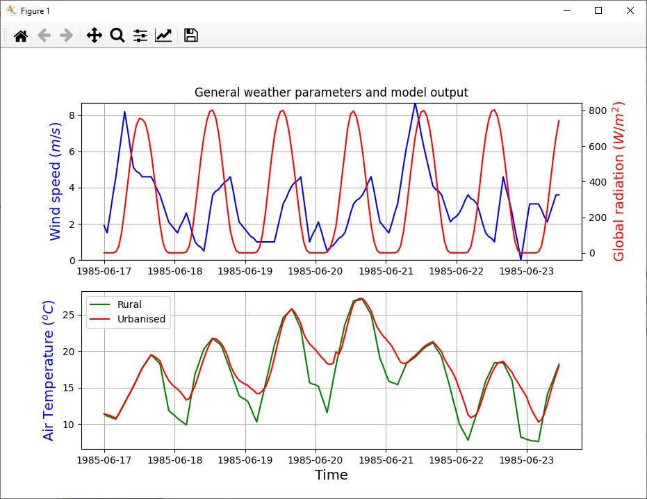

# aut lab3 heatstress draft2

### Introduction and Objectives of the Climate Risk Assessment

#### Regional context

The Innovation Lab 3 is located in [Lower Austria](https://en.wikipedia.org/wiki/Lower_Austria), with a focus on the urban area of [**Amstetten**](https://en.wikipedia.org/wiki/Amstetten,_Lower_Austria). The region combines medium-sized urban centres, densely built residential zones, and surrounding rural areas. Rising temperatures, limited vegetation in central districts, and a high proportion of sealed surfaces contribute to an intensification of **urban heat stress**.

This hazard is further amplified by the **urban heat island effect**, where built-up zones record significantly higher air and surface temperatures compared to adjacent rural surroundings. Vulnerable groups—such as the elderly, children, and people with pre-existing health conditions—are particularly at risk.

Urban heat stress represents a **priority climate risk** for Amstetten and similar Austrian towns, with direct impacts on **public health, liveability, and energy demand for cooling**.

**Climate Projections** from public datasets indicate that the **frequency, duration, and intensity of heatwaves** will increase under future climate scenarios, posing long-term adaptation challenges.

Nature-Based Solutions (NbS) such as **expansion of tree canopy, creation of public green spaces, and installation of green roofs** (Figure 2) are identified as the most relevant adaptation strategies to mitigate urban heat in this regional context.

The Climate Risk Assessment in this tutorial focuses on testing the effectiveness of these NbS to reduce thermal stress and to provide evidence for integration into **urban planning and adaptation strategies**.

<figure><figcaption></figcaption></figure>

<figure><figcaption>
Figure 1 - physical map of Lower Austria. Source: https://maps-austria.com/lower-austria-map (top), location of city of Amstetten (bottom)
</figcaption></figure>

<figure><figcaption>
Figure 2 – example of NbS in urban areas following the sponge-city principle. © P. Hirner, NiG.
</figcaption></figure>

#### Scope of the tutorial

This tutorial outlines a **replicable Climate Risk Assessment (CRA) workflow** for urban heat stress in Amstetten.

The methodology combines **climate datasets, socio-economic data, and high-resolution geospatial information** with the **PALM-4U urban climate model** to identify hotspots of heat exposure and test the cooling potential of NbS interventions.

The workflow is designed to be **transferable to other regions**, even outside Austria, by suggesting **open and European-wide datasets** (e.g. Copernicus, EURO-CORDEX) when national or local data are unavailable. It does not require advanced programming and, at the current stage, the CRA relies on existing datasets and modelling tools.

The aim is to support **urban planning, public health strategies, and climate adaptation policies**, providing evidence-based insights for municipalities and regional authorities. The outputs allow for **prioritisation of greening measures**, **evaluation of vulnerable districts**, and **long-term integration of NbS** into adaptation strategies.


**Disclaimer**

This tutorial is intended as a general workflow example and does not replace software-specific documentation (e.g., GIS, heatwave modelling tools user/technical manuals). Users should already be familiar with the relevant geospatial data formats, data pre-processing techniques, and modelling concepts, as well as with the specific input/output requirements and run functionalities of the modelling software before attempting to replicate this workflow.


#### CRA objectives

The Climate Risk Assessment (CRA) in Amstetten aims to:

* **Identify and quantify high-risk heat exposure zones**, especially in urban areas with limited vegetation and high sealing.
* **Evaluate the effectiveness of NbS interventions** (tree canopy management, public green spaces, green roofs) in reducing thermal stress.
* **Provide technical evidence (spatial risk assessment) to be integrated into urban planning processes**, enabling proactive and spatially differentiated decision-making.
* **Provide evidence base for investment in green infrastructure**, public awareness, and long-term climate resilience.
* **Acknowledge limitations** related to microclimatic variability, climate projection uncertainties, and NbS performance under extreme heat scenarios.

#### Intended users

The CRA in Lab 3 is designed for stakeholders involved in **urban planning, environmental health, and climate adaptation policy**.

The intended users include:

* **City administrations and municipal planning departments** – to integrate heat risk maps and NbS scenarios into local development frameworks.
* **Public health authorities** – to identify vulnerable groups and prepare targeted protection measures during heatwaves.
* **Municipal environmental departments and regional authorities** – to prioritise NbS interventions and guide climate adaptation strategies.

By providing spatially explicit evidence, the CRA enables these actors to **prioritize interventions, develop adaptation strategies, and embed NbS** into decision-making processes for stronger long-term urban resilience.

### Hazard – Urban heat stress

#### Description and context

The city of **Amstetten** faces a growing risk of **urban heat stress**, intensified by the **urban heat island (UHI) effect**. Dense built-up areas with sealed surfaces and limited vegetation retain heat, resulting in significantly higher air and surface temperatures compared to surrounding rural zones.

This condition threatens **public health, comfort, and liveability**, especially for vulnerable groups such as elderly citizens, children, and people with pre-existing medical conditions. Climate projections from **EURO-CORDEX** and **ÖKS15** datasets indicate a steady rise in the **frequency, duration, and intensity of heatwaves** in the coming decades.

To address these challenges, the CRA supports both the identification and quantification of high-risk heat exposure zones and provides an evidence base for evaluating the effectiveness of **Nature-Based Solutions (NbS)**, including:

* management and expansion of urban **tree canopy**,
* creation of **public green spaces**,
* deployment of **green roofs**.

The assessment focuses on quantifying the **cooling potential** of these NbS interventions and on identifying areas of **highest vulnerability** within Amstetten.

| **Dimension**            | **Indicator(s)**                        | **Unit**        | **Purpose**                                      |
| ------------------------ | --------------------------------------- | --------------- | ------------------------------------------------ |
| Heatwave characteristics | Number of heat-days and tropical-nights | Days per season | Quantify hazard severity and temporal evolution  |
| UHI extent & intensity   | Maps of near surface air temperature    | °C, km²         | Delineate urban heat island extent and intensity |

Table 1 – key indicators tracked — Urban heat stress Hazard.

#### Data sources and tools

The CRA combines datasets on **climate hazards, exposure, and vulnerability** under both current and future conditions. Required inputs include **climate projections, high-resolution geospatial data, building geometries, land cover, urban tree inventories, and socio-economic indicators**. These datasets provide the basis for heat stress simulations and for the derivation of spatially explicit risk indicators.

In relation to **topography**, urban climate models benefit from **high-resolution terrain and surface data** to represent accurately both ground morphology and above-ground structures such as buildings and vegetation. While **LiDAR-based products** are preferable, at present a **national DTM at 10 × 10 m resolution** has been identified as the available baseline source for Amstetten, to be complemented where possible by higher-resolution datasets.

| Data type                                        | Source                                                                                                                                                                     | Role in workflow                                                                                  | Open/EU alternative                                                                                                                                                                                                                                                                                                         |
| ------------------------------------------------ | -------------------------------------------------------------------------------------------------------------------------------------------------------------------------- | ------------------------------------------------------------------------------------------------- | --------------------------------------------------------------------------------------------------------------------------------------------------------------------------------------------------------------------------------------------------------------------------------------------------------------------------- |
| Climate projections (precipitation, temperature) | [ÖKS15](https://data.hub.geosphere.at/group/oks15) (Austrian scenarios, 1 km)                                                                                              | Input for modelling future urban heat exposure under different climate scenarios                  | 
Copernicus <a href="https://cds.climate.copernicus.eu/datasets/projections-cordex-domains-single-levels?tab=overview">EURO-CORDEX </a>(12.5 km /0.11°)

 

<a href="https://cds.climate.copernicus.eu/datasets/reanalysis-era5-land?tab=overview">ERA5-Land hourly data from 1950 to present</a> (current)
 |
| Topography                                       | 
<a href="https://www.data.gv.at/katalog/en/dataset/b5de6975-417b-4320-afdb-eb2a9e2a1dbf#additional-info">National DEM Austria</a> (10 m available resource) 

 | Base terrain morphology for heat modelling. LiDAR datasets are generally preferable for high res. | No open alternative general DTM available at the resolution required; explore national/regional geoportals for **LiDAR datasets**                                                                                                                                                                                           |
| Building geometries with height                  | Local datasets / project partners                                                                                                                                          | Representation of urban form (building footprints, heights)                                       | 
OpenStreetMap building layer (<a href="https://osmbuildings.org/">vector, global)</a>

 

Copernicus <a href="https://land.copernicus.eu/en/products/urban-atlas">Urban Atlas </a>(harmonised land use and land cover maps as well as information
                                                          |
| Land cover / surface sealing                     | Local datasets / project partners                                                                                                                                          | Input for surface characteristics in urban climate simulations                                    | 
Copernicus <a href="https://land.copernicus.eu/en/products/urban-atlas">Urban Atlas</a>

<a href="https://land.copernicus.eu/en/products/clc-backbone">CLCplus Backbone</a>
                                                                                                                                     |
| Urban tree inventory                             | Local datasets / project partners                                                                                                                                          | Input for NbS scenarios (tree canopy, crown diameter, height)                                     | Copernicus High Resolution Layer [Tree Cover and Forests](https://land.copernicus.eu/en/products/high-resolution-layer-forests-and-tree-cover) (raster 10m)                                                                                                                                                                 |
| Socio-economic and demographic data              | [Statistik Austria, DISCC-AT platform](https://wegcshiny.uni-graz.at/alm/DISCC-AT/)                                                                                        | Exposure and vulnerability assessment (population density, age structure, income)                 | [World pop Hub](https://dx.doi.org/10.5258/SOTON/WP00646) (raster 100m)                                                                                                                                                                                                                                                     |

Table 2 – used data, and alternative datasets to replicate the assessment outside the study area, when available


**Note: high resolution Topography**

_Urban climate modelling at this scale generally benefits from high-resolution topographic data, typically derived from LiDAR surveys. Such datasets allow the extraction of critical information (e.g., building heights from digital surface models, DSM), which can then be assigned to building footprints and other model elements (Figure 5)._


<figure><figcaption>
Figure 3 - Administrative boundaries of the city of Amstetten overlaid on the available national DTM at 10 × 10 m resolution. This terrain model provides the base layer for urban climate simulations.
</figcaption></figure>

<figure><figcaption></figcaption></figure>

<figure><figcaption>
Figure 4 - The DTM is a filtered terrain model without obstacles such as trees or buildings. On the right, building footprints are overlaid to highlight missing above-ground elements, which need to be integrated from complementary datasets (e.g. DSM or building inventories). areas, farmer demographics (age, gender), livestock, labour, and production methods. While coarser in scale, these can serve as vulnerability layers when regional data are unavailable.
</figcaption></figure>


**Meteorological inputs**\
&#xNAN;_&#x4D;eteorological input requirements, and formatting, vary depending on the modelling code used. the required additional variables usually include air temperature, dew point or relative humidity, surface pressure, wind speed and direction, shortwave radiation (global, diffuse and direct), depending on your Modeling suite , please see Step 1 - Data acquisition and preparation for further advice_&#x20;


The Lab uses the **PALM-4U urban climate model** to simulate microclimatic conditions (air temperature, surface temperature, wind, radiation) at building level. It is applied to Amstetten for baseline and NbS scenarios (tree canopy, green spaces, green roofs).

**GIS platforms** (QGIS, ArcGIS) are used for data preparation, spatial integration, and visualization.

Another open alternative has been provided to foster replicability.

| Tool                                                                                                                                                                                                                                                                  | Type                                                                              | Role                                                                                              |
| --------------------------------------------------------------------------------------------------------------------------------------------------------------------------------------------------------------------------------------------------------------------- | --------------------------------------------------------------------------------- | ------------------------------------------------------------------------------------------------- |
| [PALM-4U](https://palm.muk.uni-hannover.de/trac/wiki/palm4u)                                                                                                                                                                                                          | [Urban climate model](https://www.dwd.de/EN/ourservices/palm4u_en/palm4u_en.html) | Simulation of urban microclimate (air/surface temperature, wind, radiation); NbS scenario testing |
| 
<a href="https://umep-docs.readthedocs.io/projects/tutorial/en/latest/Tutorials/UWGSpatial.html">UMEP </a> (QGIS plugin) <a href="https://umep-docs.readthedocs.io/projects/tutorial/en/latest/Tutorials/TARGETTutorial.html">Tutorials </a>a are available
 | Open                                                                              | Urban climate modelling, including UHI mapping and scenario analysis; NbS scenario testing        |
| [QGIS](https://qgis.org/)                                                                                                                                                                                                                                             | Open-source GIS                                                                   | Spatial data preparation, integration of geospatial layers, mapping and visualisation             |

Table 3 – used tools and role in the workflow; all tools are free to use.


**Note on replicability of the CRA and tools.**

PALM-4U is the core model for high-resolution urban climate simulations, but it runs only on Linux/Unix systems and typically requires HPC environments. To improve replicability on Windows systems, the open-source UMEP plugin for QGIS has been included as an alternative tool for UHI mapping and NbS scenario analysis.


#### Methodology


_**Note temporary workflow.**_

_The urban climate simulations in Lab 3 are intended to be run with the PALM-4U model. Due to the high computational cost and complexity, simulations are executed on high-performance computing (HPC) systems. Each run—whether baseline or NbS scenario—is resource-intensive, and results are treated as static datasets for downstream risk analysis._

_At the current stage, the detailed execution workflow for PALM-4U in Amstetten is still under development; comprehensive documentation on data preparation, model setup, and post-processing will be released during Lab 3._

_For tutorial purposes, an alternative workflow based on UMEP (QGIS plugin) is presented. This workflow uses the same data types required by PALM-4U, ensuring consistency in data acquisition and preparation while enabling replicability on standard desktop environments (Windows/Linux)._




### Step 1 — Data acquisition and preparation

The first stage of the workflow consists of collecting and preparing the spatial and environmental datasets required as inputs to the modelling tool (UMEP, which operates within QGIS). All layers must be harmonised in terms of coordinate system, resolution and coverage, and then pre-processed through the plugin’s dedicated utilities.

The climate component is provided by temperature and precipitation series from regional projections such as **ÖKS15** and **EURO-CORDEX**. These must be converted into formats compatible with the modelling suite, typically **EPW weather** files, which are the standard required by UMEP for urban climate simulations. This file tells the model how to reproduce present and future conditions consistently with other CRA activities in Lab 3.


**meteorological inputs**\
&#xNAN;_&#x4D;eteorological input requirements and formatting vary depending on the modelling code used. For UHI simulations with UMEP (Table 2), the required variables include air temperature, dew point or relative humidity, surface pressure, wind speed and direction, shortwave radiation (global, diffuse and direct), longwave radiation, precipitation, and cloud cover. UMEP relies on the **EPW format (EnergyPlus Weather).** EPW files are “typical meteorological dataset with a typical year” and can be downloaded from several sources (e.g. EnergyPlus, EPWmap ) or generated from reanalysis datasets such as ERA5(-Land). Users are encouraged to download the file closest to their location and adapt it with local meteorological data, so that the weather inputs reflect the actual conditions of the study area._

_Free tools are available to inspect and modify EPW files, such as_ [_Elements_](https://bigladdersoftware.com/projects/elements/)_. We recommend changing the epw file after reading  the official UMEP documentation and tutorial examples (Table 2) to adjust the variables, ensuring that the file accurately represents both the local climate data and the modelling requirements (_&#x46;igure 5)


<figure><figcaption></figcaption></figure>

<figure><figcaption>
Figure 5 – example of EPW files as “typical meteorological dataset with a typical year” download nearby Amstetten and open for modification.
</figcaption></figure>

The **topographic base** is currently represented by the national DTM at 10 × 10 m, which provides continuous coverage for Amstetten. For local climate modelling, higher-resolution **LiDAR-derived DSMs and DTMs** are preferable, as they capture the detailed morphology of the city and allow the derivation of building heights. (Figure 4).

&#x20;For microclimate modelling in UMEP, the main spatial datasets – building geometries, land cover and surface sealing, and the urban tree inventory – must be reformatted into the input structure expected by the plugin. Building footprints are attributed with height information and aligned with the terrain model. Land cover layers are reclassified to distinguish impervious and vegetated surfaces, while tree datasets, whether from local inventories or proxies such as Copernicus HRL Tree Cover, are prepared as grids describing canopy cover and crown size. All layers are projected into a common coordinate system, clipped to the Amstetten study area, and harmonized in resolution.

An example of this data preparation, with building polygons on the left and the reclassified land cover raster on the right, is shown in Figure X based on the UMEP tutorial dataset.

<figure><figcaption>
Figure 6 - On the left, the vector file with building footprint polygons classified by building type. On the right, the raster land cover layer reclassified into impervious and vegetated surfaces according to the UMEP tutorial. The example is derived from a sample city dataset provided in the official UMEP documentation.
</figcaption></figure>

Finally, **socio-economic data** such as population density, age distribution or income levels are included as spatial layers to be combined later with hazard indicators. These datasets are not directly ingested by climate modelling but are prepared in parallel to support subsequent risk analysis.

At the end of this step, all datasets are harmonized, clipped to the study area, and converted into the formats required by the climate modelling suite. This ensures that the following analysis steps can be performed consistently, with reliable representation of urban form, surface properties, vegetation, and local climate conditions.

&#x20;



### Step 2 — Analysis and mapping

With the prepared datasets, the modelling environment in UMEP is configured to simulate **near-surface air temperature and related thermal indicators** over the study area of Amstetten.

For example, “Urban Heat Island - Urban Weather Generator” analysis in the UMEP plugin within QGIS, the input grids representing buildings, land cover, and vegetation are combined with the EPW weather file to produce a **spatially explicit simulation of urban heat conditions**.

The model calculates temperature fields and heat stress indices across the city, allowing the identification of thermal anomalies between dense urban cores and surrounding areas.

The outputs of this stage typically consist of **thematic layers that visualize the spatial distribution of heat exposure** and its relationship with key drivers such as vegetation cover, building density, surface sealing, and population distribution.

These maps provide the evidence base for identifying priority zones **where Nature-based Solutions, such as increased tree canopy or green roofs**, can deliver the greatest cooling benefits.



### Step 3 — Baseline urban climate modelling

Using the datasets prepared in Step 1 and the analytical overlays from Step 2, develop a baseline urban climate model to represent current conditions during extreme heat events. The objective is to simulate microclimatic patterns—such as air temperature distribution, surface temperature, and thermal comfort indices—across the study area without any mitigation interventions applied.

This process typically involves:

* Importing pre-processed land cover, vegetation, and morphology grids into the selected modelling framework.
* Integrating meteorological time series representative of identified heatwave periods.
* Parameterizing urban form (building heights, materials, vegetation characteristics) to reflect present-day conditions.

Where available, satellite-derived LST maps and temperature anomaly layers from Step 2 can be used to cross-check the model outputs, ensuring that simulated baseline conditions (e.g. Figure 8) are consistent with observed spatial patterns of heat stress.

These validated baseline results then serve as a quantitative reference for evaluating the potential effects of Nature-Based Solutions in the following step.

&#x20;

The baseline **represents the current urban climate conditions** in Amstetten during extreme heat events, before the introduction of any Nature-Based Solutions. Using the prepared datasets, the climate modelling suite can be  applied to simulate **near-surface air temperature fields**, surface temperature distribution, and thermal comfort indices that describe the extent and intensity of urban heat stress across the city (e.g. Figure 8).

This initial model run provides a reference picture of the prevailing situation, highlighting the areas most exposed to high thermal loads due to building density, land cover composition, or lack of vegetation. The outputs take the form of spatial maps and time series of temperature and radiation, which can be analysed to identify hotspots and areas of relative resilience.

<figure><figcaption>
Figure 8 – example of Above: Wind speed and global radiation from epw-file. Below: Air temperature from ground station data compared with those simulated in the grid of the model including the station (source [1])
</figcaption></figure>

The baseline maps can also be combined with **socio-economic datasets, such as population density or income levels**, to identify vulnerable groups and evaluate the potential social and economic impacts of heat stress. This integrated view allows the baseline to serve not only as a technical benchmark for subsequent scenario analysis, but also as a decision-support layer for urban planners and public authorities.

<figure><figcaption>
Figure 9 – example of temperature difference in mean ground temperature [°C] for an urban area simulated with UMEP
</figcaption></figure>

&#x20;



### Step 4 — NbS scenario testing

Building on the baseline established in Step 3, alternative simulations are carried out to test the effectiveness of selected **Nature-Based Solutions (NbS**) in reducing urban heat stress in Amstetten. The scenarios reflect measures highlighted in regional adaptation strategies, in particular the **increase of urban tree canopy**, the creation of new **public green spaces**, and the implementation of **green roof**s.

&#x20;

Each scenario is configured in UMEP by modifying the spatial input layers to represent the planned interventions, while maintaining the same meteorological forcing used for the baseline. Doing so the resulting maps of air temperature, surface temperature, and thermal comfort indices shall be directly compared with the reference case.

&#x20;

The outputs allow quantification of the cooling effect of each NbS option, highlighting changes in the intensity and extent of heat hotspots and improvements in thermal comfort across different parts of the city.

These results can be again overlaid with socio-economic and demographic layers to identify where the benefits of adaptation measures coincide with concentrations of vulnerable groups.

By comparing NbS scenarios against the baseline, the analysis provides a robust basis for evaluating the potential of green interventions to reduce heat stress and to inform local adaptation planning.

\

***



References

\[1] [https://umep-docs.readthedocs.io/projects/tutorial/en/latest/Tutorials/UWGSpatial.html#executing-the-model](https://umep-docs.readthedocs.io/projects/tutorial/en/latest/Tutorials/UWGSpatial.html#executing-the-model)

