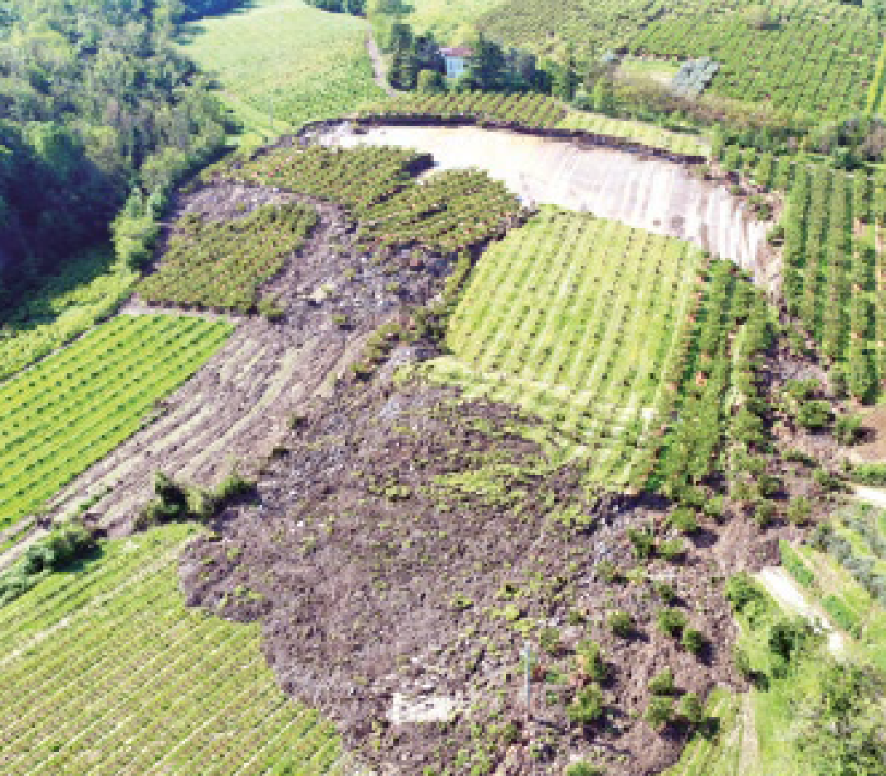
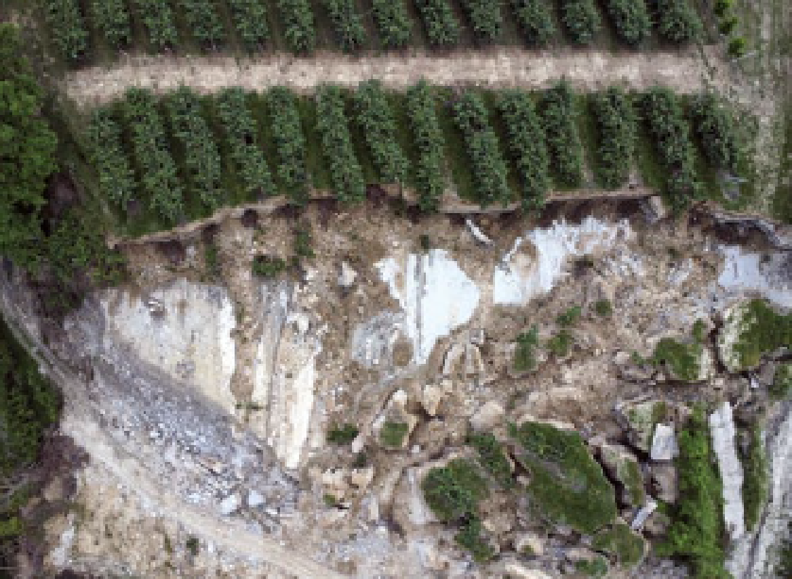
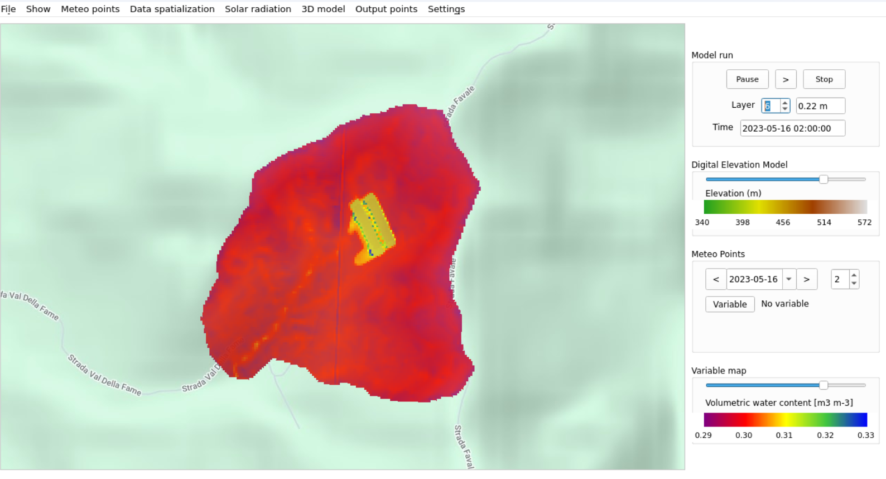
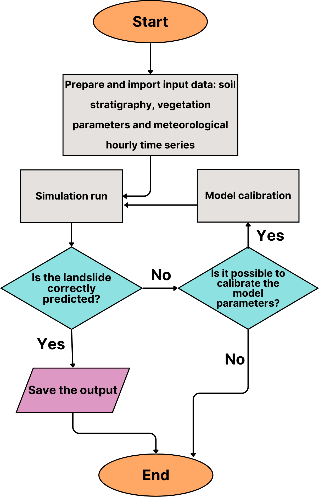
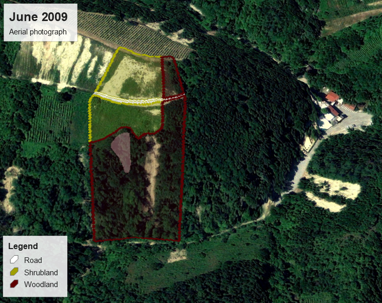
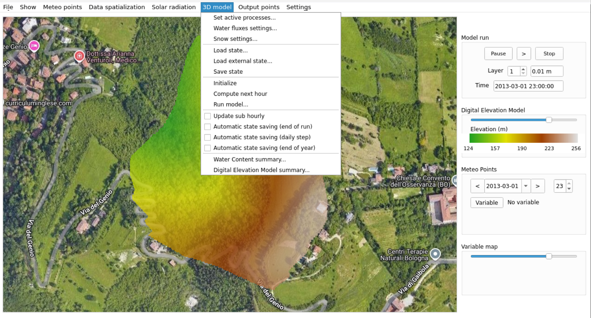
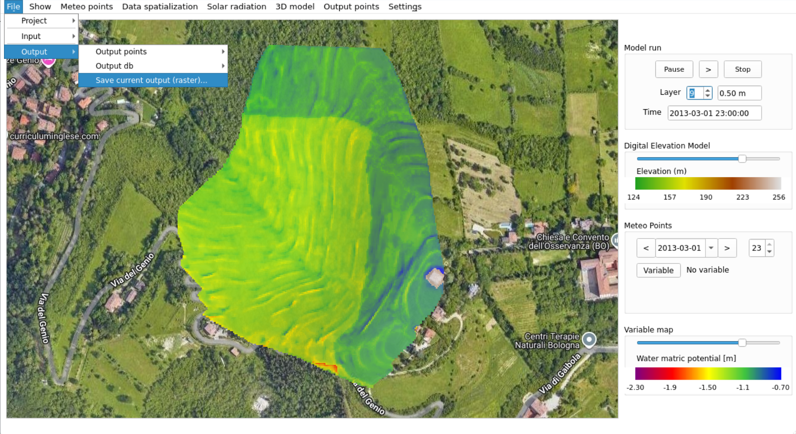
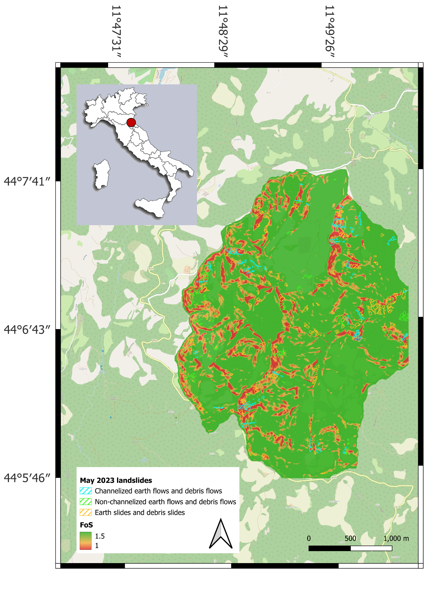

# Emilia-Romagna Region in Italy -Lab1

### Introduction and Objectives of the Climate Risk Assessment

#### Regional context

[Emilia-Romagna](https://en.wikipedia.org/wiki/Emilia-Romagna), Northern Italy, spans the Northern Apennines and the Po Plain. Rainfall-induced shallow landslides concentrate along the Apennine foothills and mountain belts, where flysch and clay formations, steep slopes, road valleys, and forested catchments co-occur.&#x20;

<figure><figcaption></figcaption></figure>

Intense or prolonged rainfall is the primary trigger of shallow landslides, which normally involve soil depths up to 1 or 2 meters; [the May 2023 extreme rainfall event](https://essd.copernicus.org/articles/17/1055/2025/) is used in this Climate Risk Assessment as the reference for landslides back-analysis and model calibration. Exposure to landslides risk is high for municipal settlements, transport corridors, utilities, and productive forests located on slopes, and service disruptions are likely to occur in foothill municipalities.

<figure><figcaption></figcaption></figure>

<figure><figcaption>
<em>Figure 1 – example of surface landslides during May 2023 in Emilia Romagna, source</em><a href="https://www.arpae.it/it/ecoscienza/numeri-ecoscienza/anno-2023/numero-5-anno-2023"> <em>ECOScienza magazine -ARPAE</em></a>
</figcaption></figure>

This Lab targets regional-to-sub-regional screening to inform adaptation planning and civil protection, relying on ARPAE open meteorological records and regional geodata to enable replication in other contexts using equivalent datasets.

#### **Scope of the tutorial**

The scope of this tutorial is to set up a replicable workflow to screen rainfall-induced shallow landslide risk using data for the Emilia-Romagna region. However, the analysis is applicable elsewhere if data are available.

This tutorial describes what is needed to reproduce the assessment, substituting the dataset, setting the parameters, and visualising results.

In this tutorial the landslides triggered by May 2023 extreme rainfall events are back-analyzed in order to provide an example of model calibration. The application of the model to future rainfall scenarios is also described.\
The landslide risk analysis is possible across natural, semi-natural, and urban settings.\
Outputs highlight the more vulnerable slopes and can support adaptation planning and NbS choices by policymakers and planners. At the actual model development, it is suggested to apply the model at sub-basin scale.


Disclaimer

This tutorial is intended as a general workflow example. It does not replace the official documentation of the modelling tools or GIS software. Users should already be familiar with geospatial data formats, pre-processing techniques, as well as with the specific input/output requirements and run functionalities of the modelling software before attempting to replicate this workflow.


#### CRA objectives

The Climate Risk Assessment in Innovation Lab 1 (Emilia-Romagna) pursues the following objectives:

* **Evaluate hazard**: assess shallow landslide triggering linked to extreme rainfall events, using the May 2023 in Emilia Romagna event as calibration event when the model is applied in the Romagna territory;
* **Understand drivers**: explore how land use, soil, and vegetation features influence slope stability and the onset of shallow landslides;
* **Support NbS design**: test and highlight the role of ecosystem restoration, reforestation, climate-smart forestry, tree planting, and greening of infrastructures as Nature-Based Solutions against landslides risk;
* **Enable scenario analysis**: extend the hazard evaluation to future rainfall scenarios to evaluate landslides occurrence under climate change;
* **Guide planning**: provide information for policymakers and civil protection, identifying the most vulnerable areas and informing land use and adaptation planning;
* **Ensure transferability:** present a workflow applicable across natural, semi-natural, and urban contexts, adaptable for replication in other regions with equivalent datasets.

#### Intended users

The Climate Risk Assessment workflow on rainfall-induced shallow landslides is designed for **institutions and practitioners engaged in regional risk management and adaptation planning**. Civil protection agencies can benefit from outputs to support emergency preparedness, early warning, and post-event response.

The tutorial is also relevant to forestry and land managers, as well as environmental agencies such as ARPAE, who can apply the results to guide sustainable land management, ecosystem restoration, and climate-smart forestry. Policymakers and planners use the results to identify priority areas for Nature-Based Solutions and to direct investments towards measures that reduce landslide vulnerability.

### Flood Hazard – Landslides

#### Description and context

The Emilia-Romagna Apennines are recurrently affected by shallow landslides triggered by prolonged or intense rainfall. These processes are concentrated within soil depths of 1–2 meters, where soil saturation and vegetation dynamics strongly influence slope stability. The Climate Risk Assessment developed in Innovation Lab 1 focuses on back analysing the May 2023 rainfall event, which caused widespread shallow landslides, and then extending the analysis to projected rainfall scenarios to assess future hazard conditions.

The workflow integrates meteorological, geomorphological, and land-use datasets from ARPAE and the Emilia-Romagna Region, processed through the open-source CRITERIA-3D model. The assessment is based on three main indicators: the **Factor of Safety,** which quantifies slope stability at different soil depths; **soil hydrology variables**, such as water potential, volumetric water content, and degree of saturation, that describe how rainfall alters soil conditions; and the **soil water balance**, which accounts for drainage, runoff, evaporation, and transpiration. Together, these indicators provide a quantitative picture of the mechanisms that trigger shallow landslides and highlight the conditions under which slopes become more vulnerable.

By identifying the most exposed areas through these indicators, the analysis supports adaptation planning and the prioritization of Nature-Based Solutions such as forest management, reforestation, and eco-engineering interventions. The framework is structured to be replicable in other regions, provided equivalent datasets are available, and delivers results useful for regional authorities, land managers, and civil protection agencies, supporting both strategic planning and emergency preparedness.

Model outputs are produced as raster maps of selected variables, and as hourly series at selected points and soil depths, including Factor of Safety, soil water potential, soil water content, and degree of saturation.

| Dimension                    |                                                    Indicator(s) | Unit          | Purpose                                                                  |
| ---------------------------- | --------------------------------------------------------------: | ------------- | ------------------------------------------------------------------------ |
| Slope stability              |                  Factor of Safety (FoS) at selected soil depths | dimensionless | Identifying unstable areas related to shallow landslide                  |
| Soil water content           | Water potential, volumetric water content, degree of saturation | kPa, %, ratio | Characterizing soil conditions linked to rainfall                        |
| Soil water balance processes |            Lateral drainage, runoff, evaporation, transpiration | mm/hour       | Quantifying hydrological fluxes that control slope wetness and stability |

Table 1 – key indicators tracked - Flood Hazard

<figure><figcaption>
<em>Figure 2 – example of a CRITERIA-3D map, representing the volumetric water content at a depth of 22 cm, 16th May 2023 at 2am.</em>
</figcaption></figure>

#### Data sources and tools

The Climate Risk Assessment for rainfall-induced shallow landslides in Emilia-Romagna is based on a structured set of datasets, provided by ARPAE. In this CRA open data from the Emilia-Romagna Region were used; the data can be found in the open-source CRITERIA-3D distribution. These inputs provide consistency with regional monitoring systems and replicability is guaranteed.

<table><thead><tr><th width="141">Data type</th><th>Source / repository</th><th>Role in workflow</th><th>Open/EU alternative</th></tr></thead><tbody><tr><td>Meteorological series</td><td><a href="https://dati.arpae.it/dataset/erg5-interpolazione-su-griglia-di-dati-meteo">ARPAE Open Data</a> (hourly air temperature, precipitation, humidity, radiation, wind)</td><td>Simulation of the period of interest and initialization of hydrological model</td><td>Copernicus <a href="https://cds.climate.copernicus.eu/datasets/reanalysis-era5-land?tab=download">ERA5-Land hourly data from 1950 to present</a></td></tr><tr><td>Digital Elevation Model (DEM) 1</td><td>Emilia-Romagna Geoportal (<a href="https://geoportale.regione.emilia-romagna.it/servizi/servizi-ogc/wcs">open- WCS service</a>)</td><td>Definition of computational mesh and slope geometry</td><td>Copernicus DEM - Global and European Digital Elevation Model <a href="https://dataspace.copernicus.eu/explore-data/data-collections/copernicus-contributing-missions/collections-description/COP-DEM">(open – raster 30m, 10m for selected users)</a></td></tr><tr><td>Land use raster map 2</td><td><a href="https://geoportale.regione.emilia-romagna.it/approfondimenti/database-uso-del-suolo">Emilia-Romagna Region</a> (land use vector coverage)</td><td>Land cover classes</td><td><a href="https://land.copernicus.eu/en/products/corine-land-cover/clc2018">CORINE Land Cover 2018 (vector/raster 100 m), Europe, 6-yearly</a></td></tr><tr><td>Soil raster map</td><td>Emilia-Romagna regional soil map (<a href="https://datacatalog.regione.emilia-romagna.it/catalogCTA/dataset/r_emiro_2016-01-28t184735">open , shapefile</a>)</td><td>Soil types over the DEM extension</td><td><a href="https://esdac.jrc.ec.europa.eu/content/european-soil-database-v20-vector-and-attribute-data">European Soil Database v2.0 (vector and attribute data)</a></td></tr><tr><td>Crop database</td><td><a href="https://github.com/ARPA-SIMC/CRITERIA3D">CRITERIA-3D GitHub distribution</a> (SQLite .db with default crop parameters)</td><td>Vegetation parameters</td><td>Literature data of similar crop in similar environments</td></tr><tr><td>Soil database</td><td><a href="https://github.com/ARPA-SIMC/CRITERIA3D">CRITERIA-3D GitHub distribution</a> (SQLite .db, customizable, Emilia-Romagna pedological data)</td><td>Hydrological and geotechnical soil properties of the different soil layers</td><td>Literature data of similar soils</td></tr><tr><td>Landslide inventory</td><td><a href="https://geoportale.regione.emilia-romagna.it/catalogo/dati-cartografici/informazioni-geoscientifiche/zone-a-rischio-naturale/layer-55">Emilia-Romagna region 2023 landslides</a> (shapefile)</td><td>It is not an input; it is used in this CRA to check the accuracy of the simulation</td><td>Landslides inventories</td></tr></tbody></table>

_1) In the CRITERIA-3D model the DEM can have any spatial resolution. A good agreement should be found between the accuracy and the computational speedness required._

_2) CRITERIA-3D accepts raster maps as input. The shapefile format usually available as open data online must be converted in a raster with .flt extension._

Table 3 – used data, an alternative dataset to replicate the assessment outside the study area. Instructions about how to prepare input dataset can be found in the [CRITERIA-3D users manual](https://github.com/ARPA-SIMC/CRITERIA3D/blob/master/DOC/CRITERIA3D_user_manual.pdf). Knowledge about how to use GIS environments or similar systems is required.


**⮚      Climate change effects**

_Bias-corrected climate-projection datasets may be incorporated, with particular focus on hydrogeological modelling._

_For example_ [_Copernicus Temperature and precipitation climate impact indicators from 1970 to 2100 derived from European climate projections_](https://cds.climate.copernicus.eu/datasets/sis-hydrology-meteorology-derived-projections?tab=overview)_;_ [_Climate and energy indicators for Europe from 2005 to 2100 derived from climate projections_](about:blank)_._


The Climate Risk Assessment workflow for shallow landslides in Emilia-Romagna is implemented using the CRITERIA-3D model as the core simulation tool. **CRITERIA-3D** is an open-source agro-hydrological and slope stability model that computes soil water fluxes in three dimensions and derives the Factor of Safety (FoS) under different hydrological and vegetation conditions. It allows back-analysis of past events (such as the May 2023 rainfall episode) and forward simulations under climate change scenarios.

For post-processing and visualization, outputs from CRITERIA-3D (SQLite databases and raster maps in .flt format) are analysed in GIS platform like the open solution **QGIS**, which enables users to overlay hazard results with land-use, infrastructure, and exposure data.

This step is useful to translate model outputs into maps and indicators for adaptation planning.

| Tool                                                   | Type        | Role                                                                                                          |
| ------------------------------------------------------ | ----------- | ------------------------------------------------------------------------------------------------------------- |
| [QGIS](https://qgis.org/)                              | Open-source | Spatial analysis, graphical elaboration, and hazard–exposure overlay                                          |
| [CRITERIA-3D](https://github.com/ARPA-SIMC/CRITERIA3D) | Open-source | Simulation of hydrological processes, soil water balance, and slope stability (Factor of Safety, hazard maps) |

Table 2 – used tools and role in the Landslide Hazard workflow: only open-source tools have been used in this tutorial

#### Methodology

Before entering the detailed workflow steps, the scheme below (Figure 3) illustrates a general workflow of a CRITERIA-3D model application when data related to occurred landslide are available.

<figure><figcaption>
<em>Figure 3  -  Schematic representation of the model application workflow with parameters calibration using real landslides</em>
</figcaption></figure>

The diagram highlights the logical sequence of operations: data loading, model initialization, simulation, eventual model parameters calibration based on the landslide prediction, and generation of outputs in both time-series and spatial formats. It is worth highlighting that the parameters calibration for enhancing model accuracy when trying to back-analyze old landslides must be conducted with care, keeping the parameters within acceptable ranges. It is also important to underline that a **spin-up hydrological simulation period of several months is highly recommended** in order to reach realistic initial soil moisture conditions. This simulation period should include meteorological data of several months **before the event of interest**. Secondly, **calibration should be conducted by comparing modelled unstable areas with observed landslide scars,** but, where available, **comparing model hourly outcomes and field measurements of soil water content or pore pressure** can provide higher accuracy levels. These steps are fundamental to improve the reliability of the simulations.



### Step 1 - Data acquisition and preparation

The first phase of the workflow concerns the collection and **formatting of the core datasets required by CRITERIA-3D.**

**Hourly meteorological data** — including precipitation, temperature, humidity, radiation and wind — must cover the entire period of the simulation, plus additional months of data (the optimum would be one year), needed to initialize soil moisture conditions.

**The Digital Elevation Model** defines the computational mesh and slope geometry, while **land use and soil map**s describe, respectively, the land cover and the type of soil present. These maps are linked to two databases: **a crop database,** which supplies vegetation parameters, and a soil database, which provides pedological and geotechnical properties of the different soil layers.

All inputs are **referenced in a project file (.ini)** that connects maps and databases, ensuring consistency for model runs.

Visual support from the [CRITERIA-3D manual](https://github.com/ARPA-SIMC/CRITERIA3D/tree/master/DOC) — such as the project template file and examples of soil and land use maps — can help practitioners understand how their data should be structured before launching simulations.

<figure><figcaption>
<em>Figure 4 – an example of land use definition in Google Earth environment. The definition of land cover can be done manually in any desired way, notwithstanding that the input for CRITERIA-3D must be a .flt raster map with the pixel values corresponding to the code of the desired land use in the database</em>
</figcaption></figure>

.



### Step 2 - Model setup and run

Once the datasets are prepared and correctly linked in the project file, the next step is to **configure and execute the model simulations**. CRITERIA-3D defines the computational domain from the DEM, assigns the soil and land use to the DEM pixels, and ensures that the meteorological database is consistent with the period of analysis. At this stage, the crop and soil databases provide the parameters that govern vegetation growth and soil response during rainfall events.

As already discussed, the simulation should include **an initialization period of at least several months before the period of interest**, so that the soil moisture balance approaches realistic conditions. Model parameters calibration can be supported by comparing simulated unstable areas with observed landslide scars or, when available, by validating soil water outputs against field sensors. In practice, when running the first simulation, the output can be compared with known field data and evaluate if the model is accurate depending on how much the simulated and the field data value overlay.

The model can then be executed **to produce time series in selected points and maps of the Factor of Safety and soil hydrological variables**. These results can be saved at chosen depths and time steps and exported for the next step of analysis in other softwares. The execution can be performed on local servers, with the possibility to rerun simulations under alternative rainfall scenarios — even using future meteorological series — to explore possible hazard conditions.

Figure examples from the [CRITERIA-3D users manual](https://github.com/ARPA-SIMC/CRITERIA3D/blob/master/DOC/CRITERIA3D_user_manual.pdf) show how databases and maps for the simulation are structured, as well as the visualization of maps within the software environment. These graphical references help clarify the logic of the model run.

<figure><figcaption>
<em>Figure 5 – an example of an opened project in the CRITERIA-3D environment. The selected menu in the figure allows users to prepare the simulation run.</em>
</figcaption></figure>

The time series outputs, if output points are defined within a CRITERIA-3D project, are stored in a SQLite database, while the maps of any desired moment are exportable as raster maps (.flt) that can be exported into GIS environments for further spatial analysis. Users can also save intermediate model states to resume or compare different simulation periods.

<figure><figcaption>
<em>Figure 6  – an example of an output map related to water matric potential, at a depth of 50 cm and the menu for saving the output in raster format</em>
</figcaption></figure>




### Step 3 - Analysis and interpretation

Once the simulations have been executed, the third step focuses on the interpretation of the outputs and their translation into usable information. CRITERIA-3D generates **time series of the Factor of Safety, soil water content, degree of saturation, and water balance variables, alongside spatial maps that describe the distribution of slope stability across the study area** in GIS compatible format. These outputs need to be analysed in order to extract indicators relevant to landslide hazard assessment.

A first level of results interpretation is the **comparison between modelled unstable areas and observed landslide scars**, to check the reliability of the simulations. This step is highly recommended, especially when the model is intended to be used for simulating future periods; in fact, by analyzing past real events, the model calibration can be conducted in order to increase the confidence in the model results when it is later applied to future rainfall scenarios. In contexts where soil moisture or pore pressure sensors are available, simulated hydrological outputs can also be validated against field measurements, further strengthening the robustness of results.

Practically, this interpretation is done by overlaying in a GIS environment the output maps of the CRITERIA-3D model related to the Factor of Safety with a landslide inventory. Otherwise, if the accuracy wants to be checked in relation to the hydrological simulation, the time series of water content or water potential as derived by CRITERIA-3D (related to an output control point created in correspondence of the sensors placement) can be plotted against the field records in a graph, in order to see how the simulation worked.

Beyond validation, this analysis step can lead to highlighting the conditions under which slopes become more vulnerable. By studying variations of Factor of Safety in relation to rainfall intensity and soil saturation, practitioners can identify thresholds that signal the onset of instability. When outputs are overlaid with land use and infrastructure data in a GIS environment, the hazard results can be directly linked to exposed elements such as settlements, roads, or managed forests, thus supporting quantitative risk assessments.

<figure><figcaption>
<em>Figure 7 – an example of a CRITERIA-3D output map post-processed in GIS environment, where the instability areas detected by CRITERIA-3D (in red) were overlaid with landslide scars (polygons in blue, green and orange) of the May 2023 events</em>
</figcaption></figure>




### Step 4 - NbS testing for landslides risk mitigation

The last step of the workflow applies the model to explore how landslide hazard evolves under different rainfall scenarios and how **Nature-Based Solutions (NbS) may mitigate associated risks**. The same configuration is used to simulate **future rainfall conditions,** either derived from downscaled **climate projections** or designed storm scenarios. This approach allows practitioners to test the sensitivity of slope stability to more frequent or more intense precipitation events, and to quantify potential changes in the extent of unstable areas.

At this stage, the CRA framework also becomes a tool for **evaluating NbS**. Measures such as reforestation, tree planting, forest management, and the greening of infrastructures are introduced by modifying the land use and vegetation parameters in the model databases. The simulations then highlight how these interventions affect the hydrological balance and slope stability, providing an evidence base for comparing baseline and intervention scenarios.

Outputs from this phase are not limited to hazard maps but extend **to comparative scenarios that show the effectiveness of NbS in reducing landslide susceptibility**. When overlaid in GIS with exposure layers such as infrastructure, settlements, or managed forests, they provide actionable information for policymakers and land managers to prioritize investments.

**Future climate forcing** can be derived from bias-corrected Copernicus climate datasets, which provide long-term projections (1970–2100) for temperature and precipitation. These datasets allow the exploration of changes in hazard under alternative rainfall regimes.

In practical terms, Step 4 closes the workflow by connecting scientific modelling with adaptation planning. It demonstrates how the same technical setup can be used not only to reproduce past events, but also to anticipate future conditions and to design strategies that reduce risk through nature-based approaches.






