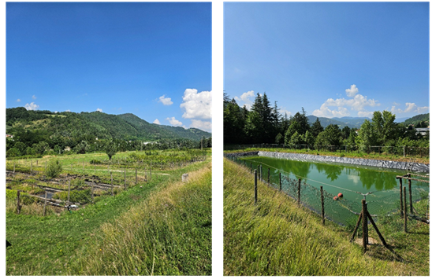
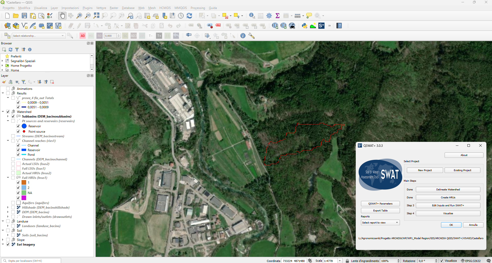
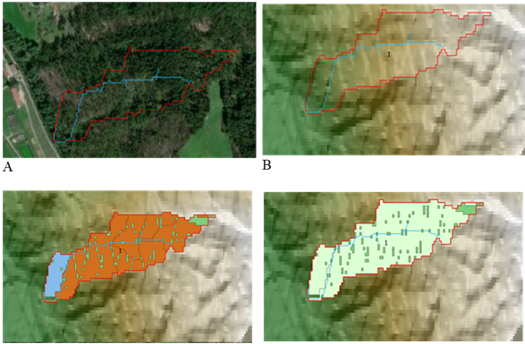
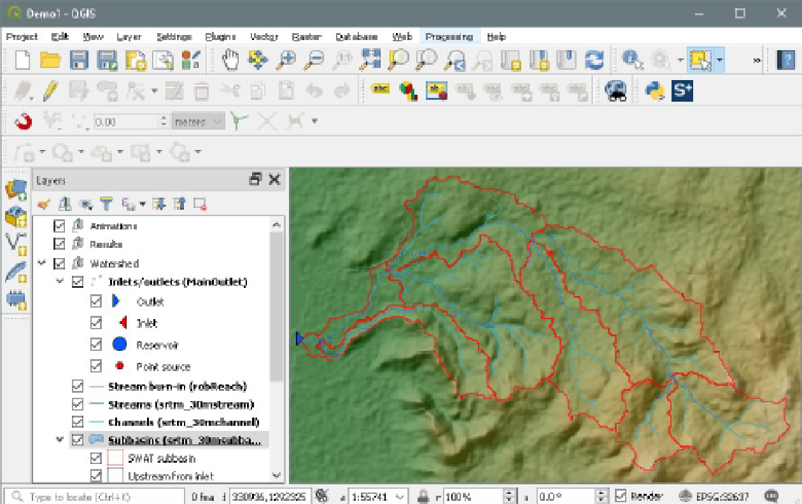
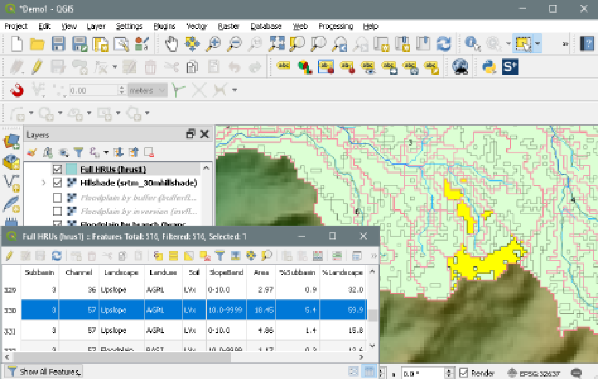
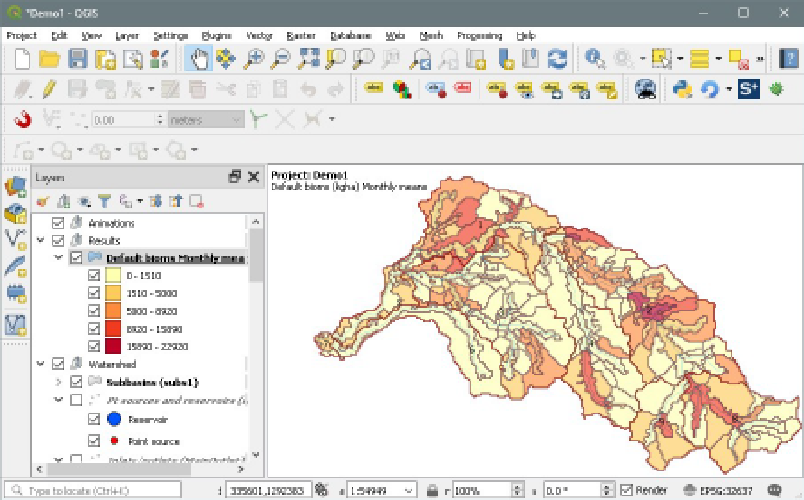
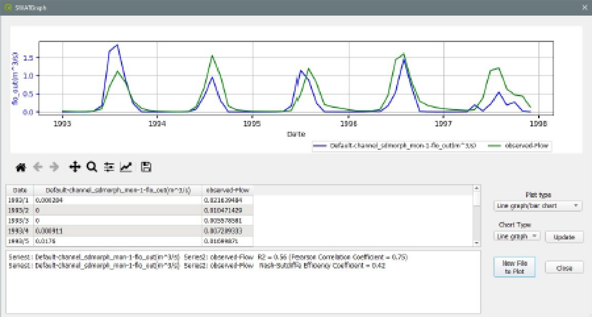
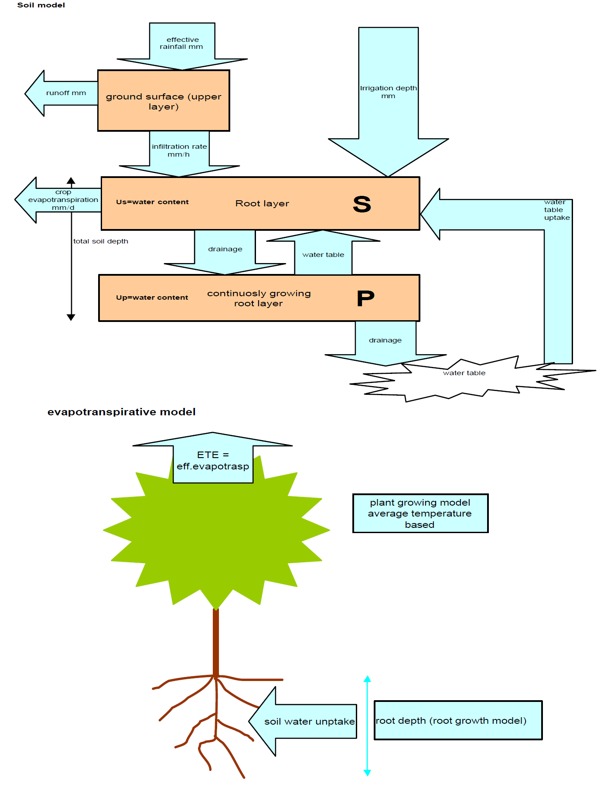
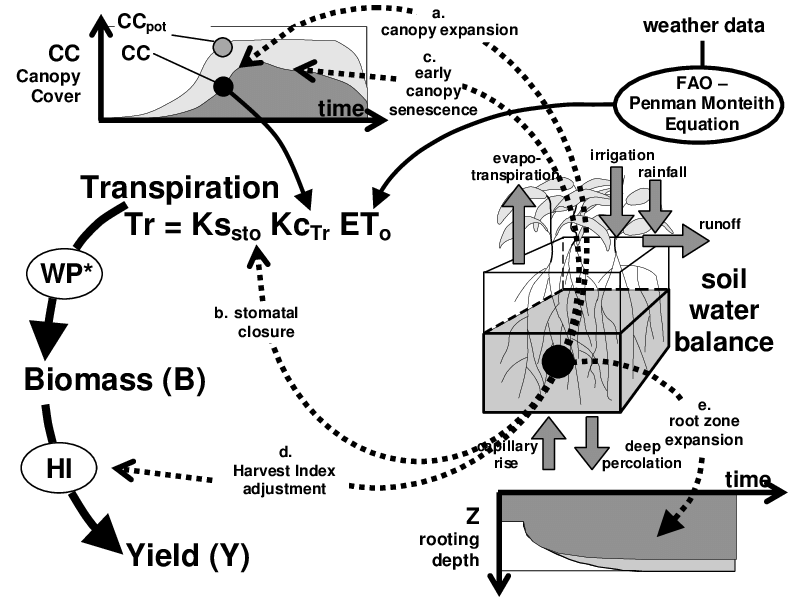
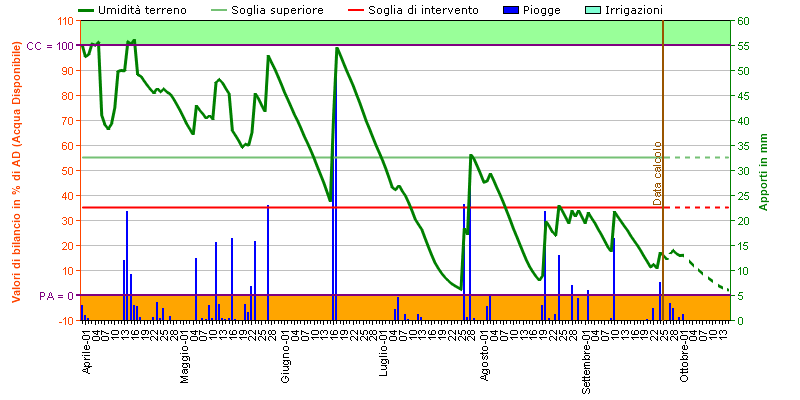

# er lab3 fias draft2

### Introduction and Objectives of the Climate Risk Assessment

#### Regional context

The Innovation Lab 3 is located in the upper Bidente–Ronco basin, in the municipalities of [Galeata](https://maps.app.goo.gl/1z1h3h64Sf2cemWr7)–[Santa Sofia](https://maps.app.goo.gl/AaxfgSnbjj6mExaB7) (Forlì–Cesena Province, Emilia-Romagna, Italy). This area represents a mixed forest–agricultural landscape in the Apennine foothills, characterized by steep slopes, permeable soils, and high rainfall variability.

<figure><figcaption>
Figure 1: Figure of the study area: Castellaro Nursery
</figcaption></figure>

**Heavy precipitation events** often generate flash runoffs and landslides, while prolonged summer dry spells cause water scarcity and stress for crops and ecosystems. These combined hazards directly affect water availability, soil stability, and agricultural productivity. The regional context is also shaped by the role of the **Canale Emiliano Romagnolo (CER)** and the associated land reclamation consortia, which are key actors in irrigation management and climate adaptation strategies. Within this setting, **Forested Infiltration Areas (FIAs)** are tested as a Nature-Based Solution to enhance infiltration, reduce runoff peaks, improve water quality, and support sustainable irrigation demand in forest nurseries and surrounding agricultural lands.

<figure><figcaption>
Figure 2 – Schematic example of the FIAs used in this Lab, source CER  
</figcaption></figure>

#### Scope of the tutorial

This tutorial describes a replicable Climate Risk Assessment (CRA) workflow designed for a mixed forest–agricultural landscape in Emilia-Romagna. The assessment focuses on **Forested Infiltration Areas (FIAs)** as a Nature-Based Solution to address flash runoff, erosion, and water scarcity. Two complementary workflows are presented:

* **a catchment-scale workflow**, aimed at quantifying how land-use changes and infiltration areas influence runoff, water harvesting and water quality.
* **a site-scale workflow**, focused on the water demand and irrigation management of a single forest nursery (NEOS), assessing how improved infiltration capacity supports sustainable operations.

Both workflows integrate geospatial datasets, environmental monitoring, and climate information, and are structured so that methods can be transferred and adapted to other regions. The approach supports the integration of NbS into adaptation planning, providing indicators for land-use strategies, water management, and regional policy development.


**⮚                 Disclaimer**

This tutorial is intended as a general workflow example and does not replace software-specific documentation (e.g., GIS, hydrological, hydraulic models’ user/technical manuals). Users are expected to be familiar with geospatial data formats, pre-processing techniques, and the basic concepts of hydrological and environmental modelling. Inputs, outputs, and methodological details may need to be adapted depending on data availability, local conditions, and the specific software selected for the analysis, before attempting to replicate this workflow.


#### CRA objectives

The Climate Risk Assessment in Innovation Lab 3 aims to:

* **Establish the baseline** — Define the current hydrology and water-quality status of the Galeata–Santa Sofia sub-catchment.
* **Quantify FIA effects at sub-catchment/micro-catchment scale** — Measure changes in infiltration rate, catchment water-harvesting potential, and runoff peaks, under current conditions and, where available, projected climate.
* **Evaluate pollutant retention and erosion control** — Track Nitrogen, Phosphorus, and Suspended Solids (SS) to assess water-quality improvement and sediment trapping.
* **Assess site-scale irrigation implications** — Quantify nursery water demand and examine whether increased water-harvesting potential can meet the optimized demand at the nursery, noting that catchment and site workflows are run independently.
* **Support planning and policy** — Deliver decision-ready indicators for Water Protection Plans (PTAs) and Rural Development Programs (RDPs) and future design guidelines for FIAs.

#### Intended users

The outputs are designed for **regional policymakers and planners, land-reclamation consortia and environmental organisations** that need quantitative, model-based evidence to:

* Support the draft or update Water-Protection Plans (PTA) and Rural-Development Program (PSR) measures,
* develop best practices for Forested Infiltration Areas and other NbS,
* guide day-to-day decisions on irrigation scheduling and soil-erosion control within the study catchment or in the specific area (e.g. nursery area in this case).

***

### Catchment-Scale Hazard: Runoff, Erosion & Water Quality

#### Description and context

The study area is the Galeata–Santa Sofia sub-catchment in the upper Bidente–Ronco basin, Emilia-Romagna. It is a mixed forest–rural–agricultural landscape affected by flash runoff from heavy rainfall and by summer water scarcity. These hazards impact water availability, soil stability, and crop productivity.

This workflow establishes the baseline hydrology and water-quality status, then tests Forested Infiltration Areas (FIAs) as a Nature-Based Solution at hillslope and riparian locations. The analysis quantifies changes in **infiltration rate, catchment water-harvesting potential**, and **runoff peaks**, and tracks **Nitrogen, Phosphorus, and Suspended Solids (SS)** to evaluate pollutant retention and sediment trapping. Climate-change scenarios can be included where compatible datasets are available.

The assessment uses regional datasets for elevation, soils, land use, and daily meteorology, complemented by open European alternatives when replication outside the region is needed. Outputs are geospatial layers and tables suitable for supporting land planning measures. Proposed set of indicators aims to isolate the FIA signal on catchment hydrology and water quality: changes in runoff peaks/base-flow, added infiltration and water-harvesting, and sediment/nutrient concentrations deliver decision-ready evidence for regional planning measures.

| Dimension           | Indicator(s)                                            |              Unit | Purpose                                                   |
| ------------------- | ------------------------------------------------------- | ----------------: | --------------------------------------------------------- |
| Hydrologic response | Runoff peak at catchment outlet; Base-flow              |            m³ s⁻¹ | Detect peak attenuation and base-flow change due to FIAs. |
| Water storage       | Infiltration rate; Catchment water-harvesting potential | m d⁻¹; m³ month⁻¹ | Quantify added soil-water and storage from FIAs.          |
| Water quality       | Nitrogen; Phosphorus;                                   |            mg L⁻¹ | Evaluate pollutant-filtering effectiveness.               |
| Erosion             | Suspended Solids (SS) concentration                     |            mg L⁻¹ | Assess sediment trapping by forest cover.                 |

_Table 1 – Key indicators tracked — Catchment-scale hazard: runoff, erosion & water quality_

The figure (Figure 3) shows the study basin with the sub-basin highlighted in red where the SWAT+ model will be applied. It should be noted that the basin represented is the one obtained from the first simulations and is therefore not final. Moreover, the small size of the identified basin requires further evaluations to determine whether or not to confirm this preliminary result.

<figure><figcaption>
Figure 3 – Example of the study area and the sub-basin in red where SWAT+ will be applied
</figcaption></figure>

#### Data sources and tools

Catchment-scale analysis uses regional elevation, soils, land-use, and daily meteorology to delineate sub-basins, parameterize hydrological response units, and force baseline vs FIA scenarios. Open European datasets are listed to enable replication beyond Emilia-Romagna.

| Data type                                   | Source                                                                                                                                                                                                                                 | Role in workflow                                                          | Open/EU alternative                                                                                                                                                                                                                                                                                                                         |
| ------------------------------------------- | -------------------------------------------------------------------------------------------------------------------------------------------------------------------------------------------------------------------------------------- | ------------------------------------------------------------------------- | ------------------------------------------------------------------------------------------------------------------------------------------------------------------------------------------------------------------------------------------------------------------------------------------------------------------------------------------- |
| Digital Terrain Model (DTM) 5 m             | Emilia-Romagna Geoportal ([open- WCS service](https://geoportale.regione.emilia-romagna.it/servizi/servizi-ogc/wcs))                                                                                                                   | Delineates watershed & sub-basins; slope & flow-direction grids for SWAT+ | Copernicus DEM - Global and European Digital Elevation Model ([open – raster 30m, 10m for selected users](https://dataspace.copernicus.eu/explore-data/data-collections/copernicus-contributing-missions/collections-description/COP-DEM))                                                                                                  |
| Soil map 1:50 000 or higher scale           | Emilia-Romagna regional soil map ([open , shapefile](https://datacatalog.regione.emilia-romagna.it/catalogCTA/dataset/r_emiro_2016-01-28t184735))                                                                                      | Supplies texture, OC, Ksat for each HRU; controls infiltration & erosion  | [European Soil Database v2.0 (vector and attribute data)](https://esdac.jrc.ec.europa.eu/content/european-soil-database-v20-vector-and-attribute-data)                                                                                                                                                                                      |
| Land-cover 2023                             | ([open AGREA shapefile](https://geoportale.regione.emilia-romagna.it/download/dati-e-prodotti-cartografici-preconfezionati/pianificazione-e-catasto/uso-del-suolo/2020-coperture-vettoriali-uso-del-suolo-di-dettaglio-edizione-2023)) | Re-mapped to HRUs to parameterize vegetation and management               | [CORINE Land Cover 2018 (vector/raster 100 m), Europe, 6-yearly](https://land.copernicus.eu/en/products/corine-land-cover/clc2018)                                                                                                                                                                                                          |
| Daily meteorology (P, T, RH, SR, wind, PET) | ARPAE DEXT3R ([open- gauges time series](https://simc.arpae.it/dext3r/))                                                                                                                                                               | Atmospheric forcing baseline and FIA scenarios                            | Daily gridded observational dataset for precipitation, temperature, E-OBS ([open , gridded](https://surfobs.climate.copernicus.eu/dataaccess/access_eobs.php)), ERA5-Land post-processed daily statistics from 1950 to present ([open, raster](https://cds.climate.copernicus.eu/datasets/derived-era5-land-daily-statistics?tab=overview)) |

_Table 2 – used data, an alternative dataset to replicate the assessment outside the study area, when available_


**⮚     Climate change effects**

Bias-corrected climate-projection datasets may be incorporated, with particular focus on hydrogeological modelling. Examples: [Copernicus temperature and precipitation climate impact indicators from 1970 to 2100 derived from European climate projections](https://cds.climate.copernicus.eu/datasets/sis-hydrology-meteorology-derived-projections?tab=overview).


As tools you need a GIS platform, likely QGIS 3 LTR or higher given the availability of a specific plugin for the QSWAT+ to build the catchment model, and the SWAT+ Editor to configure and run simulations; the SWAT+ installer bundles QSWAT+ and the Editor, and QSWAT+ requires SWAT+ Editor v3.0+

| Tool                                                 | Type                                                                 | Role in this workflow                                                                                               |
| ---------------------------------------------------- | -------------------------------------------------------------------- | ------------------------------------------------------------------------------------------------------------------- |
| [QGIS](https://qgis.org/download/)                   | Desktop GIS                                                          | Data prep, watershed delineation, HRU definition, mapping, results viewing.                                         |
| QSWAT+ (QGIS plugin included in SWAT+ installer)     | SWAT+ pre/post-processor                                             | Build sub-basins, LSUs, HRUs; export to SWAT+; visualize outputs and compare scenarios.                             |
| [SWAT+ Editor](https://swat.tamu.edu/software/plus/) | Model [editor/runner](https://swatplus.gitbook.io/docs/installation) | Import project DB, set weather data and print options, run SWAT+, write outputs to SQLite for QSWAT+ visualization. |

_Table 3 – used tools and role in the workflow, all tools are free to use._

#### Methodology



### Step 1 — Data acquisition and preparation

&#x20;This step assembles regional inputs and prepares a coherent catchment dataset before any model run. Acquire the base geospatial layers (e.g., 5 m DTM from the Emilia-Romagna Geoportal, regional soil map, 2023 land-use shapefile) and **clip them to a single area-of-interest mask**. Reproject to a **common CRS**, align **resolution and extent**, and fix No Data or geometry issues to ensure clean overlays. Build a **land-use and soil crosswalk** so that classes and attributes match the categories and parameters expected later in the analysis; include slope derivation where needed to support HRU structuring in subsequent steps. (Figure 2).

Prepare meteorological inputs as **station-based daily Time Series** in the model’s required text format. For each gauge provide I**D, name, latitude, longitude, elevation,** and a file with daily values; use the documented variable set and **units** and apply the specified **missing-value code**. Typical variables are precipitation and max/min temperature, with solar radiation, wind, and relative humidity either provided or simulated by the weather generator. During runs, each sub-basin is associated with the nearest available precipitation and temperature stations.

**Read the model documentation first** to confirm exact fields and layouts. Keep the simulation period consistent with the available time frame (e.g. from ARPAE ground stations).

The following images (Figure 4) show the basin analysed within **Co-Innovation Lab 3**, together with the results of the first tests carried out with SWAT+ on the study area in terms of **Full HRU** and **Actual HRU**. It should be noted that the simulations are still ongoing; therefore, the results presented here are only **preliminary**.

<figure><figcaption>
Figure 4 Example of preprocessing of geospatial base layers clipped to the area of interest. Figure A represents the preliminary watershed identified from the first simulations; Figure B shows the basin with the DEM background; Figure C illustrates the Full HRUs and Figure D the basin with the Actual HRUs (see note for the definition of Full and Actual HRUs).
</figcaption></figure>


**⮚     Note: Difference between Full HRU and Actual HRU**

**Full HRU:** all unique combinations of land use, soil type, and slope are represented, even if they cover a very small area. This allows for maximum spatial detail but increases the number of HRUs and computational effort.&#x20;

**Actual HRU**: only HRUs above user-defined thresholds are kept, while smaller ones are merged into larger units. This reduces model complexity and simulation time, at the cost of some spatial detail.




### Step 2 — Model setup and run

Load the pre-processed geospatial layers and station-based meteorological series into the modelling environment and define the study area (Galeata–Santa Sofia) and time window for the **baseline**. Use the same spatial framework and forcing prepared in Step 1.

Initialize the model with the catchment topology, soil–land-use attributes, and daily climate forcing so that it reproduces present hydro-geological processes. Configure a suitable warm-up and the daily time step.

The baseline run must yield decision-ready outputs for the key indicators tracked in Table 1: **runoff peak** and **base-flow** at the outlet, **infiltration/storage proxies**, and **water-quality/erosion indicators** (here we focus on **water flow, soil erosion, and nutrient dynamics**). Results are saved as tables and can be linked to sub-basin/HRU layers for inspection in GIS.

Baseline processing, in brief: perform **DEM-based topographic processing** to delineate watershed, sub-basins, and channels; then **assign attributes** by intersecting land use, soils, and slope to create **HRUs**; finally **run the daily water-balance and water-quality simulation** so outputs can be mapped and analyzed at **HRU/LSU/channel** level, including sediment.

<figure><figcaption></figcaption></figure>

<figure><figcaption>
Figure 5 – example of topographic processing delineates the watershed, sub-basins, and channels from the DEM. After reading grids and intersecting land use, soils, and slope, potential HRUs are created as polygons, enabling HRU-level mapping and analysis, source <a href="https://1905549715-files.gitbook.io/~/files/v0/b/gitbook-x-prod.appspot.com/o/spaces%2FgsvY4UbwriwcK1CI5lan%2Fuploads%2FgHq0X4ezLSWlotZ8Llyv%2FQSWATPlus%20Manual_v3.0.pdf?alt=media&#x26;token=dcaf77fa-a670-4a62-86d6-4451d593e69b">QSWAT+ manual</a>. The images represent an illustrative example and are not related to our case study, as the modeling is still in progress and consistent results are not yet available.
</figcaption></figure>


**⮚     Note — interface options**

_This tutorial targets QSWAT+ within QGIS. However, the SWAT+ toolchain can be used without the GIS interface by working directly with the SWAT+ Editor and its runners. If you prefer not to use QGIS, consult the official_ [_SWAT+ software page_](https://swat.tamu.edu/software/plus/) _for alternative installers and workflows, then keep project databases and input folders consistent with this tutorial._




### Step 3 — Analysis and interpretation

We convert the baseline run into decision-ready indicators by extracting outlet runoff peak and base-flow, computing infiltration/storage proxies, and reading water-quality and erosion metrics (N, P, SS) at sub-basin and HRU level, consistent with the Lab 3 scope.\
Results are inspected as tables and geospatial layers in GIS to map HRU/sub-basin patterns, plot time series, and export summaries for reporting; this locates runoff hot spots, sediment sources, and reaches with elevated nutrient.\
Relate spatial signals to soils, land use, slope, and drainage, then record where baseline conditions meet objectives and where they do not. This becomes the key indicators baseline and the sole reference for Step 4 comparisons.

Use two standard outputs (Figure 4): **a static HRU map** and an outlet flow time series. The HRU map is generated as a static shapefile with aggregated metrics ready for GIS analysis; the outlet series is plotted with **SWATGraph options** and can be compared with recorded values, for example a gauged hydrograph.\
If a gauge exists at basin closure, compare simulated and observed discharge and **iteratively refine the baseline setup before proceeding to Step 4**, also quality parameters may be compared in output Vs observed values.

<figure><figcaption></figcaption></figure>

<figure><figcaption>
Figure 6  - Top: Static HRU results (Figure 38). Bottom: Outlet discharge time series (Figure 45). The static view exports HRU polygons with model metrics for GIS analysis; the time series plots simulated flow at basin closure and supports calibration against observed hydrographs, source <a href="https://1905549715-files.gitbook.io/~/files/v0/b/gitbook-x-prod.appspot.com/o/spaces%2FgsvY4UbwriwcK1CI5lan%2Fuploads%2FgHq0X4ezLSWlotZ8Llyv%2FQSWATPlus%20Manual_v3.0.pdf?alt=media&#x26;token=dcaf77fa-a670-4a62-86d6-4451d593e69b">QSWAT+ manual</a>
</figcaption></figure>



### Step 4 — FIAs testing

Duplicate the calibrated baselin&#x65;**, keep forcing, spatial setup, warm-up, and print options identical, and introduce Forested Infiltration Areas by converting only the selected hillslope and riparian polygons to forest where Lab 3 plans FIAs**. Do not change soil or climate inputs. Re-run the same period so any change reflects the FIA signal on the key indicators tracked in Table 1 (runoff peak, base-flow, infiltration/storage proxies, N, P, SS).

Compare baseline and FIA by exporting static HRU/sub-basin layers and plotting outlet hydrographs; map deltas in GIS and overlay hydrographs to show peak attenuation and base-flow shifts. This mirrors the project’s intended use of SWAT+ to test FIA scenarios against the present conditions defined in Step 2–3. Use QSWAT+ **visualization options** to generate static result layers and **SWATGraph** for discharge time series at basin closure when inspecting differences.

Eventually introduce **Climate Change effect in weather forcings** to test more climate related scenarios with/wo FIAs.



***

### Nursery-Scale Hazard: Irrigation Water Demand & Drought Resilience

#### Description and context

The nursery in the Galeata–Santa Sofia area is analysed to quantify **nursery plants**’ water requirements and support drought-resilient irrigation scheduling. The assessment uses a field-scale decision-support tool (IRRIFRAME; open alternative AquaCrop) that ingests site-specific inputs—soil analyses, continuous soil-moisture readings, **coefficients (Kc) for nursery plants**, local meteorology, and recorded irrigation events—and **returns tabular demand estimates**. Compatible **climate projections may be explored for future demand**. This nursery workflow is methodologically independent from the catchment analysis and informs operational water management and planning

Key indicators tracked in this tutorial at a Nursery-Scale are listed hereafter:&#x20;

| Dimension                          | Indicator(s)                                  |              Unit | Purpose                                                          |
| ---------------------------------- | --------------------------------------------- | ----------------: | ---------------------------------------------------------------- |
| Irrigation demand                  | Crop water need (ETc for nursery plants)      | mm d⁻¹; mm/season | Computed from daily ETo and Kc by growth stage.                  |
| Irrigation scheduling & efficiency | Irrigation advice (next date and event depth) |    date; mm/event | Event timing and depth from soil–plant water balance thresholds. |

_Table 4 – Key indicators tracked — Nursery scale: water demand._

#### Data sources and tools

At local scale, an irrigation-balance model (field, block, or nursery in this example) needs **site-specific inputs** to compute **ETc (****\[1]****)** and get the **irrigation advice** (“when” and “how much”): recent soil analyses, soil-moisture observations, crop coefficients for nursery plants, daily meteorology, and irrigation logs. Outputs are typically tabular; you may also consult the IRRIFRAME documentation ([ENG](https://www.irriframe.it/irriframe/Content/IrriFrame_Documentation_english_version.pdf) leaflet, [ITA](https://www.irriframe.it/irriframe/Content/Manuale_Irriframe.pdf) manual) to get more details on how such water balance models works.

\

***

\[1] ETc (crop evapotranspiration): water use of the crop under standard conditions. Units: mm d⁻¹ or mm per period. Computation: ETc = Kc × ETo; with water-stress adjustment the actual ET is ETa = Kc × Ks × ETo. Used to size irrigation depth once effective rainfall and soil storage are considered.

| Data type                           | Source                                                                                                                                                   | Role in workflow                                                                                                     | Open / EU alternative                                                                                                                                         |
| ----------------------------------- | -------------------------------------------------------------------------------------------------------------------------------------------------------- | -------------------------------------------------------------------------------------------------------------------- | ------------------------------------------------------------------------------------------------------------------------------------------------------------- |
| Soil analyses                       | Nursery lab tests (2024 season); regional repo ([open repo](https://datacatalog.regione.emilia-romagna.it/catalogCTA/dataset/r_emiro_2023-08-02t140310)) | Main soil properties like field capacity, wilting point, and soil parameters for the soil–plant water balance        | European Soil Database & soil properties ([open. Raster-vector](https://esdac.jrc.ec.europa.eu/resource-type/european-soil-database-soil-properties))         |
| Soil-moisture readings              | On-site sensors                                                                                                                                          | Trigger thresholds and validation of advice                                                                          | Soil moisture gridded data from 1978 to present ([open, coarse 0.25°x0.25°](https://cds.climate.copernicus.eu/datasets/satellite-soil-moisture?tab=overview)) |
| Nursery plants Kc and crop info     | Nursery records (species, stage)                                                                                                                         | Compute ETc from ETo×Kc; scheduling by stage                                                                         | FAO-56 Kc tables; Chapagain and Hoekstra (2004)                                                                                                               |
| Local meteorology (P, T, ET0) Daily | ARPAE DEXT3R station series                                                                                                                              | Drives ETo/ETc and advice. (ETo may be computed with Hargreaves if only precipitation and temperature are available) | ERA5-Land hourly data from 1950 to present                                                                                                                    |
| Irrigation cycles logs              | Nursery records                                                                                                                                          | Compare applied vs recommended; fine-tune scheduling                                                                 | —                                                                                                                                                             |

_Table 5– Used data and open alternatives for nursery-scale workflow_


**⮚     Climate change effects**

_Bias-corrected climate-projection datasets may be incorporated, with particular focus on hydrogeological modelling._

_For example_ [_Copernicus Temperature and precipitation climate impact indicators from 1970 to 2100 derived from European climate projections_](https://cds.climate.copernicus.eu/datasets/sis-hydrology-meteorology-derived-projections?tab=overview)_;_ [_Climate and energy indicators for Europe from 2005 to 2100 derived from climate projections_](about:blank)_._


At local scale, we use an irrigation decision tool to compute ETc and the irrigation advice (“when” and “how much”) from site soils, nursery-plant Kc, daily meteorology, and irrigation logs. Primary option is IRRIFRAME; AquaCrop is the open alternative. Outputs are tabular:

| Tool                                              | Type                                                                                                                                                  | Role in this workflow                                                                                                                                                                                                                                                          |
| ------------------------------------------------- | ----------------------------------------------------------------------------------------------------------------------------------------------------- | ------------------------------------------------------------------------------------------------------------------------------------------------------------------------------------------------------------------------------------------------------------------------------ |
| [IRRIFRAME](https://www.consorziocer.it/irrinet/) | 
Proprietary <a href="https://www.irriframe.it/irriframe/Content/IrriFrame_Documentation_english_version.pdf">Cloud DSS</a>

Working in ER
 | Produces nursery-plant water requirement and operational **irrigation advice** from soil analyses, optional soil-moisture readings, Kc, local daily ETo/meteorology, and applied-irrigation logs; returns next irrigation date and event depth for scheduling and water-saving |
| [AquaCrop](https://www.fao.org/aquacrop/en/)      | [Open alternative](https://openknowledge.fao.org/server/api/core/bitstreams/ccfd6f4c-2900-4fb2-9a91-e0a93b1cbbda/content)                             | Open alternative when IRRIFRAME is unavailable; runs the soil–crop–climate water balance to estimate ETc and event depths, enabling comparable irrigation scheduling at nursery scale.                                                                                         |

_Table 6 – Tools and role in the nursery workflow_

#### Methodology



### Step 1 — Data acquisition and preparation

Assemble local inputs as clean, time-consistent series and tables: current-season soil analyses, soil-moisture observations, nursery-plant Kc by growth stage, daily ETo/precipitation/air temperature, and irrigation logs. Keep phenology calendars and Kc tables aligned with species and stages; the model will account for soil-water stress in the irrigation advice.

&#x20;Ensure soil parameters (field capacity, wilting point, texture) are available to drive the soil–plant balance and use the irrigation log to check “when” and “how much” against the model thresholds for event depth. to illustrate typical inputs and fluxes

the following diagram is (from the IRRINET English manual) schematizes of the soil–plant–atmosphere water-balance fluxes


**⮚     Note: tool specific formatting**

_Use of alternative tools such as AquaCrop requires strict adherence to its input formats: the project file must reference climate files (e.g. ETo, temperature, rain) plus calendar, crop, irrigation/field management, soil profile, groundwater, initial/off-season and field-data files; consult the AquaCrop manual and match its file structures before any run_


<figure><figcaption>
<em>Figure 5 – fluxes of input-output in the water balance model implemented in IRRIFRAME, aimed at crop irrigation management at a field scale, courtesy of</em> <a href="https://www.irriframe.it/irriframe/Content/IrriFrame_Documentation_english_version.pdf"><em>CER</em></a>
</figcaption></figure>



### Step 2 — Model setup and run

The model advances a daily soil–plant water balance: it reads **ETo, precipitation, air temperature**, and nursery-plant **Kc**; computes **ETc = Kc × ETo**; updates soil water storage (inputs, evapotranspiration, percolation); and checks depletion against operational thresholds. When thresholds are exceeded, it outputs an i**rrigation advice** (next date and event depth) in tabular form. Inputs are site/season, daily meteorology, soil parameters, Kc by growth stage, and optional soil-moisture observations; exact formats and thresholds follow the official documentation.

Open alternative: **AquaCrop** applies the same balance and provides daily ET, **Kc (Tr)**, and **net irrigation requirement (Inet**) from which ETc and event depth can be derived.

<figure><figcaption>
Figure 7 - Source: Van Gaelen, H. (2012). The effect of field management on yield and water productivity [Master’s thesis, Katholieke Universiteit Leuven]. ResearchGate. https://www.researchgate.net/publication/262952745_The_effect_of_field_management_on_yield_and_water_productivity
</figcaption></figure>



### Step 3 — Analysis and interpretation

Use the graphical outputs to derive two decision variables: ETc (crop water need) and the irrigation advice (next date and event depth).

<figure><figcaption></figcaption></figure>

You may then use a standard spreadsheet tool to make informing plots like plot daily ETc with precipitation and temperature, then overlay advised vs applied events from the nursery log to quantify compliance, stress days, and potential savings.

&#x20;Output remain tables (CSV p similar database ready) rather than maps; and essentially provide data regarding the water requirements of the crops, indicating how much water will need to be allocated for irrigation in the nursery.

Users may aggregate to weekly or seasonal totals to size demand and optimize cycles. These analyses inform operational scheduling at the nursery and support resource-allocation and adaptation planning where water is limited.



### Step 4 — FIAs testing (nursery-scale)

Set up a **scenario run** that mimics the hydrologic effect of Forested Infiltration Areas at plot scale without changing crop demand logic.

Keep site, season, meteorology, and Kc identical to the baseline. Represent the FIA as an **infiltration-enhancing configuration** of the plot: increase rain storage and infiltration at the soil surface and reduce direct runoff so that a larger share of rainfall becomes **effective rainfall** in the soil balance.

In IRRIFRAME this follows the scheme where the soil surface layer governs **infiltration rate, runoff, and effective rainfall** within the field water-balance; you then let the advisory algorithm recompute the **next irrigation date and event depth** from the soil-water thresholds.

With **AquaCrop**, you may build an analogous scenario by adjusting the field/soil settings that control surface storage and runoff so more water **infiltrates** and less is lost as **RO**; the daily balance explicitly tracks **Surf, Infilt**, and **RO**, and program parameters allow runoff control via CN logic. Request daily outputs and compare **Inet/ET** and irrigation events between baseline and FIA scenario.

Analyze as in Step 3 but per scenario: fewer or smaller advised events indicate FIA benefit; unchanged Kc keeps plant demand constant, so differences arise from enhanced **effective rainfal**l and soil storage, not from crop changes. Document the delta in seasonal irrigation requirement and event count for reporting.



#### Reference formulas / definitions

* ETc (crop evapotranspiration): water use of the crop under standard conditions. Units: mm d⁻¹ or mm per period. Computation: ETc = Kc × ETo; with water-stress adjustment the actual ET is ETa = Kc × Ks × ETo. Used to size irrigation depth once effective rainfall and soil storage are considered.

***

