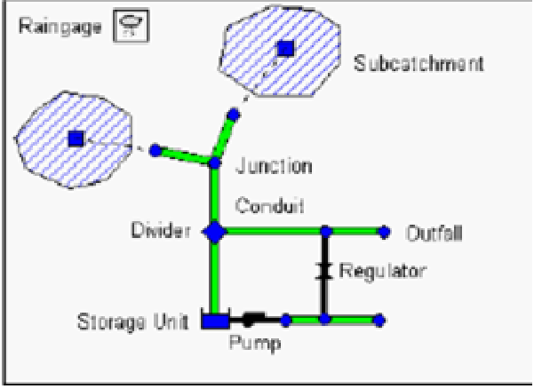

# Funen region in Denmark - Lab1

### Introduction and Objectives of the Climate Risk Assessment

#### Regional context

The [Vollsmose](https://en.wikipedia.org/wiki/Vollsmose) district, located in the city of [Odense](https://english.odense.dk/), Denmark, is a dense urban neighbourhood currently undergoing a major renewal programme. The area faces multiple water-related risks linked to changing **rainfall patterns, shallow groundwater, and diffuse surface pollution.**

<figure><figcaption></figcaption></figure>

High-intensity precipitation events frequently exceed the drainage system’s capacity, leading to pluvial flooding. Elevated groundwater levels reduce the effectiveness of sewers and increase flood susceptibility. Untreated runoff entering local water bodies contributes to water quality degradation, threatening aquatic habitats and urban livability.

The combination of urban densification, climate change, and existing infrastructure limitations makes Vollsmose a priority site for **testing integrated stormwater management approaches.** In this context, Nature-Based Solutions (NbS) and Blue-Green Infrastructure (BGI) are central to the urban renewal strategy, aiming to retain, store, and treat stormwater locally, while also delivering co-benefits such as biodiversity enhancement, reduced carbon footprint, and improved urban quality of life.

#### Scope of the tutorial

This tutorial describes a replicable Climate Risk Assessment (CRA) **workflow for urban stormwater managemen**t in the Vollsmose district. The focus is on two of the three interrelated hazards present in the area: **pluvial flooding and surface water quality degradation.**

The workflow combines high-resolution terrain and land-use datasets, precipitation and hydrological records, and drainage network data with modelling tools for runoff, drainage, and pollutant transport. It shows how to evaluate the effectiveness of Nature-Based Solutions (NbS) and Blue-Green Infrastructure (BGI) in retaining stormwater, reducing peak discharges, and improving water quality.

The approach is designed for transferability: it integrates both open European datasets (e.g. Copernicus) and local proprietary data (e.g. sewer network, utility monitoring) to ensure that similar assessments can be replicated in other urban contexts.


**Disclaimer**

This tutorial is intended as a general workflow example and does not replace software-specific documentation (e.g. GIS, hydrological, or urban drainage modelling tools user/technical manuals). Users should already be familiar with relevant geospatial data formats, data pre-processing techniques, and modelling concepts for stormwater and water quality assessment, as well as with the specific input/output requirements and functionalities of the modelling software before attempting to replicate this workflow.


#### CRA objectives

The Vollsmose CRA aims to:

* **Manage stormwater flooding** — Identify zones where high-intensity rainfall exceeds drainage capacity and assess retention needs.
* **Improve water quality** — Quantify pollutant loads in stormwater and identify NbS that can retain and treat runoff before entering the wider system.
* **Integrate NbS into planning** — Support the design of sustainable drainage infrastructure, including rainwater basins, swales, and permeable surfaces, aligned with the urban renewal process.
* **Promote multiple co-benefits** — Link stormwater management to broader goals such as biodiversity support, low-carbon urban design, and improved urban livability.
* **Enable scenario testing** — Provide a framework for comparing baseline and NbS-enhanced conditions under current and future climate scenarios.

#### Intended Users

This Climate Risk Assessment is intended for **urban planners and water managers** involved in the renewal of the Vollsmose district. It supports the technical departments of Odense Municipality and the local utility company VandCenter Syd in designing sustainable drainage infrastructure under changing rainfall conditions.

The workflow also assists **environmental consultants and landscape architects** in evaluating the performance of Nature-Based Solutions (NbS) for stormwater retention and water quality improvement. Public health authorities may use the outputs to identify areas where stormwater pollution intersects with vulnerable communities.

In this context, the CRA results guide the planning and siting of **stormwater storage basins and local retention/treatment systems**, as well as the creation of e**cological corridors and water-linked habitat**s. These NbS reduce peak flows, improve water quality, and generate co-benefits for biodiversity and urban livability.

### Flood Hazard – Pluvial stormwater mapping

#### Description and context

The first stage of the pluvial flooding assessment focuses on **mapping surface runoff and identifying critical accumulation areas under intense rainfall event**s. High-resolution topographic data are combined with rainfall statistics to simulate overland flow pathways, depressions, and temporary storage zones.

&#x20;Tools such as @@@ process LiDAR-derived Digital Elevation Models (DEM) to delineate flow paths, ponding areas, and stormwater storage potential. These outputs **highlight where rainfall volumes concentrate during extreme events**, providing a first screening of flood-prone zones within the urban fabric.

&#x20;This mapping step does not simulate the hydraulic performance of the sewer network, but it delivers decision-ready layers for urban planners. The results support the siting and preliminary sizing of Nature-Based Solutions (NbS), such as stormwater retention basins or open drainage features, and establish the baseline conditions for more detailed drainage modelling.

| Dimension                  | Indicator(s)                                                 | Unit  | Purpose                                                         |
| -------------------------- | ------------------------------------------------------------ | ----- | --------------------------------------------------------------- |
| Flood extent / water depth | Flooded area, maximum water depth (linked to rainfall event) | m², m | Identify flood-prone zones and evaluate NbS retention potential |
| Stormwater volume          | Retained or delayed runoff in stormwater basins/NbS          | m³    | Quantify capacity to attenuate peak flows                       |

Table 1 — Key indicators tracked — Pluvial stormwater mapping

#### Data sources and tools

The runoff mapping workflow in Vollsmose relies on a combination of topographic, hydrological, and land-use datasets. High-resolution elevation models form the basis for identifying depressions, flow paths, and potential storage zones across the urban landscape. Rainfall observations provide the forcing conditions to simulate surface accumulation during intense events. Land cover and soil information are used to distinguish impermeable from permeable areas, while building footprints refine the representation of urban morphology and its influence on water routing.

For replication outside Denmark, open European datasets such as Copernicus DEM, CORINE Land Cover, and ERA5 precipitation data offer alternative inputs, albeit at coarser resolution. These allow the workflow to be applied beyond the local context, ensuring comparability and transferability across regions.

| **Data type**                                              | **Source**                                                        | **Role in workflow**                                                                                            | **Open/EU alternative**                                                                                                                                                                                                                    |
| ---------------------------------------------------------- | ----------------------------------------------------------------- | --------------------------------------------------------------------------------------------------------------- | ------------------------------------------------------------------------------------------------------------------------------------------------------------------------------------------------------------------------------------------ |
| LiDAR-based Digital Terrain model (0.4 m grid)             | [GeoDanmark](https://dataforsyningen.dk/data/930)                 | Elevation base for flood modelling; identifies depressions and flow paths                                       | Copernicus DEM - Global and European Digital Elevation Model [(open – raster 30m, 10m for selected users)](https://dataspace.copernicus.eu/explore-data/data-collections/copernicus-contributing-missions/collections-description/COP-DEM) |
| Rainfall observations (10‑minute cumulative precipitation) | [DMI Open Data](https://opendatadocs.dmi.govcloud.dk/DMIOpenData) | Used as forcing input for both pluvial flood impact mapping and urban drainage modelling.                       | [ERA5-Land hourly data from 1950 to present](https://cds.climate.copernicus.eu/datasets/reanalysis-era5-land?tab=download)                                                                                                                 |
| Assigned return time Rainfall height statistics            |                                                                   | Models urban flood exposure under extreme rainfall events, input to flood models alternative to riverine floods | **ERA5** [**extreme precipitation indicators**](https://cds.climate.copernicus.eu/datasets/sis-european-risk-extreme-precipitation-indicators?tab=overview)                                                                                |
| Land use / land cover                                      | [GeoDanmark](https://dataforsyningen.dk/data/996)                 | Classification of flood-prone areas by land-use category for exposure and damage assessment                     | **Copernicus** [**Urban Atlas**](https://land.copernicus.eu/en/products/urban-atlas); [**CLCplus Backbone**](https://land.copernicus.eu/en/products/clc-backbone)                                                                          |
| Soil texture / permeability maps                           |                                                                   | Supports estimation of infiltration and runoff coefficients                                                     | **Soil texture classes (USDA system) for 6 soil depths (0, 10, 30, 60, 100 and 200 cm) at 250 m (**[**Version v02**](https://zenodo.org/records/2525817)**)**                                                                              |
| Building footprints                                        | [GeoDanmark](https://dataforsyningen.dk/data/2677)                | Refine flow routing and adjust storage estimation                                                               | OpenStreetMap building layer ([vector, global)](https://osmbuildings.org/)                                                                                                                                                                 |

Table 2 — Used data and alternative datasets to replicate the assessment outside the study area, when available

Surface runoff mapping in Vollsmose combines proprietary platforms and open-source GIS environments. Terrain-based **tools** process high-resolution LiDAR elevation data to identify runoff pathways, ponding areas, and potential stormwater storage volumes. These results provide rapid, visual outputs that help planners screen flood-prone areas and evaluate the effectiveness of preliminary Nature-Based Solutions (NbS).

Cloud-based services, frequently offered as proprietary solutions, allow quick interactive scenario testing under different rainfall events, while open-source GIS software coupled with desktop-based alternatives may support integration of hazard layers with land use and exposure datasets using open resources.

The combination ensures that outputs can be both locally precise and transferable to other contexts using alternative datasets and open tools:

| Tool                                                                     | Type        | Role in workflow                                                                                                            |
| ------------------------------------------------------------------------ | ----------- | --------------------------------------------------------------------------------------------------------------------------- |
| [Scalgo Live](https://scalgo.com/)                                       | Proprietary | Terrain-based analysis of runoff pathways, depressions, and storage volumes                                                 |
| [SaferPlaces](https://saferplaces.co/)                                   | Proprietary | Terrain-hydrodynamic based analysis of runoff pathways, depressions, and storage volumes; includes damage assessment option |
| [HEC-RAS](https://www.hec.usace.army.mil/software/hec-ras/download.aspx) | Open        | Direct simulation of rainfall over the surface domain; produces depth and velocity maps of pluvial flooding (Rain on Grid)  |
| [QGIS](https://qgis.org/)                                                | Open        | GIS analysis, visualization, and overlay of hazard and exposure datasets                                                    |

Table 3 — Tools and role in the Stormwater Mapping hazard workflow

#### Methodology



### Step 1 — Data acquisition and preparation

The first step in the runoff mapping workflow is to collect and prepare spatial and hydrological datasets. A high-resolution Digital Terrain Model (DTM), typically derived from LiDAR surveys, is required to represent depressions, flow paths, and storage zones across the urban landscape.


**Note on DEM resolution.**

When using very high-resolution LiDAR DEMs (e.g. 0.4 m), the data can become too heavy for hydraulic modelling. A practical solution is to down sample to 1–2 m resolution, which is still reasonable for flood modelling. This can be done through mosaicking and resampling in GIS software (e.g. QGIS) or by using command-line tools such as GDAL. For example:

gdalwarp --config GDAL\_NUM\_THREADS ALL\_CPUS -r bilinear -tr 1,2 1,2 -t\_srs EPSG:25832 -co COMPRESS=LZW -co BIGTIFF=YES -co PREDICTOR=2 c:/folder1/\*.tif c:/folder1/mosaic.tif

For further reference, see the GDAL [_gdalwarp documentation_](https://gdal.org/en/stable/programs/gdalwarp.html).


Building footprints can be overlaid on the terrain to include such obstacles, remove artificial depressions generated by LiDAR filtering algorithms and improve the accuracy of flow routing.

Rainfall time series are used to define design storm events for the mapping simulations. These can be derived from national meteorological services (e.g. DMI) or from European datasets (e.g. ERA5-Land) when local data are not available. Land use and land cover data are harmonized to distinguish impervious from pervious areas, supporting runoff estimates and NbS siting.

All datasets are then converted into GIS-compatible formats and spatially aligned. Terrain and land cover layers are prepared for input into flood mapping tools.

<figure><figcaption></figcaption></figure>

<figure><figcaption></figcaption></figure>

<figure><figcaption>
Figure 1 – example of Lidar DTM along the coast from GeoDanmark geoportal (down sampled @ 1,2 m, left) compared to satellite map (right) Obstacles such as buildings and trees are filtered from the terrain surface. Building overlay over original DTMs possible either by GIS raster operations or by embedded functionalities in cloud based platforms (lower image, courtesy of <a href="https://saferplaces.co/rimini-and-climate-change-the-added-value-of-the-sea-park-parco-del-mare/">SaferPlaces</a> platform).
</figcaption></figure>



### Step 2 — Model setup and run

In the surface runoff workflow, the pre-processed terrain and rainfall datasets are imported into dedicated mapping platforms to simulate how stormwater accumulates and spreads across the urban area during intense precipitation events. The core representation is based on the LiDAR-derived terrain, which defines depressions and flow paths, while design storms provide the forcing input. The model produces estimates of ponding areas, water depths, and storage zones, plus preferential flow direction downstream, offering an initial picture of pluvial flood exposure.

&#x20;Different levels of complexity can be applied depending on the platform. Some systems rely on simplified, zero-dimensional approaches where rainfall is converted into accumulated volumes within depressions without representing the dynamic propagation of flow. These methods are efficient for screening and for highlighting potential hot spots of flooding at the end of an event. More sophisticated approaches allow advanced dynamic modelling, where rainfall is applied continuously over the domain and surface routing is represented in time and space, capturing the dynamics of the rainfall flood event. This provides a more realistic simulation of flood wave propagation, flow velocities, and temporary storage, but requires greater computational effort and more detailed parameterisation. _In the following figures, we illustrate this difference for a small test area: the left image shows results from a static zero-dimensional model simulating a 100 mm rainfall event lasting two hours, while the right image shows the envelope of maximum water depth over six hours produced by a two-dimensional dynamic model_.

<figure><figcaption></figcaption></figure>

<figure><figcaption></figcaption></figure>

<figure><figcaption>
Figure 2 - Water depth maps from a static zero-dimensional model (left), simulating a 100 mm rainfall event lasting two hours, and from a two-dimensional dynamic model (right), showing the envelope of maximum water depth over six hours for the same rainfall event. The lower image shows the simplified topographic calculation of runoff accumulation watersheds and downstream linkages among them (courtesy of <a href="https://saferplaces.co/rimini-and-climate-change-the-added-value-of-the-sea-park-parco-del-mare/">SaferPlaces</a> platform).
</figcaption></figure>

The choice between static and dynamic approaches depends on the objectives of the analysis and the capacities of the modelling tool.

Both provide useful decision-ready layers for planning, ranging from rapid screening of vulnerable zones to detailed assessment of runoff dynamics under different rainfall scenarios.


**Note: role of land use/cover and soil properties**

_Depending on the modelling tool, soil properties and land cover can be included to represent infiltration processes and reduce the effective rainfall that generates runoff. Even basic information on soil texture classes allows approximate estimates of infiltration capacity. The way these data are introduced varies across modelling codes and should follow the specific tool’s requirements. As a precaution, extreme and short-duration rainfall events are often simulated assuming fully impervious surfaces, or by assigning conventional runoff fractions based on land cover type (e.g. 100% for sealed surfaces and lower values for permeable areas). This conservative assumption reflects the rapid saturation of soils and the limited capacity of urban drainage systems, providing a safety margin while remaining reasonably realistic._




### Step 3 — Analysis and interpretation

The outputs of the surface runoff simulations consist of water depth and flood extent maps that highlight low-lying areas and critical accumulation zones (Figure 2.). These layers are best interpreted in a GIS environment, where they can be overlaid with exposure datasets such as land cover, buildings, or redevelopment areas. This integration makes it possible to identify priority sites for stormwater retention and to evaluate the contribution of NbS to flood mitigation.

&#x20;In the example below, a flood depth map has been combined with a land cover layer. By applying simple zonal statistics, two key indicators can be derived: the fraction of each land use polygon affected by inundation, and the stormwater volume stored within each polygon. Such indicators provide direct evidence for ranking areas according to their vulnerability, and they support the siting of mitigation measures. This type of analysis aligns with the objectives of Lab1, where stormwater management and NbS integration are central to the Vollsmose renewal strategy.

<figure><figcaption>
Figure 3 – Figure X – Example of GIS overlay analysis combining flood water depth maps with land cover polygons. Zonal statistics allow the calculation of key indicators such as the fraction of each land use unit affected by inundation and the corresponding stormwater volume stored. These outputs support the ranking of vulnerable areas and the siting of Nature-Based Solutions in the Vollsmose district.
</figcaption></figure>

In addition to basic overlays with land cover, more advanced analyses can be performed depending on the capabilities of the platform or the availability of additional toolboxes. For example, flood depth layers can be intersected with building footprint data and linked to water depth–damage curves (\[1]). These curves are typically site-specific and differentiated by asset type (e.g. residential, commercial, industrial), providing an approximate estimation of potential economic losses.

While simplified, this approach illustrates how hazard maps can be translated into impact assessments, offering a proxy for the value of exposed assets and supporting the prioritization of protection and mitigation measures within the renewal project (Figure 4)

<figure><figcaption>
Figure 4 - Example of impact assessment using flood depth maps combined with building footprints and depth–damage curves (lower right). This overlay provides a proxy estimate of potential losses for different asset categories (e.g. residential, commercial, industrial), supporting the prioritization of mitigation measures, (courtesy of <a href="https://saferplaces.co/rimini-and-climate-change-the-added-value-of-the-sea-park-parco-del-mare/">SaferPlaces</a> platform).
</figcaption></figure>

\

***

\[1] [https://orbit.dtu.dk/files/130797720/IN\_PC956\_B4\_1\_Flood\_Damage\_web.pdf](https://orbit.dtu.dk/files/130797720/IN_PC956_B4_1_Flood_Damage_web.pdf)



### Step 4 — Testing of measures

In the surface‐runoff workflow, NbS options are tested by modifying the topographic or parametric representation of the urban surface and repeating the same design storms used for the baseline. In this Lab the focus is **on stormwater storage basins** and **local surface retention feature**s that delay and hold runoff before it reaches the wider system; habitat and corridor elements can be represented insofar as they act as open surface waterways guiding flow along preferred paths. This stage remains surface-based: sewer hydraulics and pollutant processes are addressed in the separate drainage and water-quality workflow.

Practically, interventions are emulated **by editing the analysis terrain and related layers**: inserting depressions to represent new storage basins; adding break lines or shallow channels to steer overland flow and connect storage cells; and, where supported, adjusting surface roughness or simple infiltration parameters to reflect retention performance. Each scenario is run under the same rainfall events as the baseline to foster comparison with/wo Nbs deployment.

**Outputs are interpreted with the same GIS procedures** used for the baseline: water-depth and accumulation maps are overlaid with planning layers to quantify changes in flooded extent, shifts in flow paths, and increases in temporary storage. Simple indicators—such as reduction in inundated area within redevelopment polygons and additional stormwater volume held in proposed basins—provide decision-ready evidence for siting and preliminary sizing of NbS within the Vollsmose renewal strategy.



### Flood Hazard – Urban drainage and water quality modelling

#### Description and context

This second part focuses on **stormwater management through simulation of the urban drainage system**. While surface runoff mapping provides a first screening based on topography, this step examines how rainfall is conveyed and stored within the sewer network and associated detention structures.

In Vollsmose, stormwater handling is a major concern for the renewal project. More frequent and **intense rainfall events increase the load on the drainage system**, while high groundwater levels reduce its effectiveness and contribute to local flooding. In parallel, **untreated surface runoff often reaches receiving waters, carrying nutrients and sediments that degrade water quality**. For this reason, retention and treatment of stormwater are central objectives alongside improved drainage capacity.

&#x20;**Urban drainage and water quality model**s provide a way to represent these processes explicitly. They describe the hydraulic behaviour of sewer pipes, basins, and outlets, simulate where surcharge or flooding may occur under extreme events, and estimate pollutant transport within the system. By assigning typical pollutant concentrations to inflows (e.g. nitrogen, phosphorus, suspended solids), it becomes possible to test how **NbS and alternative management options affect both hydraulic performance and water quality before discharge.**

&#x20;This modelling **complements surface-based analyses** (Flood Hazard – Pluvial stormwater mapping ) by showing how the drainage network functions under stress, and how interventions such as additional storage or treatment can reduce flood risk and improve water quality. It therefore provides further evidence base needed to integrate NbS into the Vollsmose renewal strategy.

| Dimension               | Indicator(s)                                                       | Unit | Purpose                                                                                           |
| ----------------------- | ------------------------------------------------------------------ | ---- | ------------------------------------------------------------------------------------------------- |
| Drainage network load   | Peak discharge flow rate at critical nodes of the drainage network | m³/s | Identify where and when the drainage system is overloaded and may benefit from mitigation systems |
| Pollutant concentration | Nitrogen (N), Phosphorus (P), Suspended Solids (TSS) in stormwater | mg/L | Assess impact of runoff on receiving waters and performance of treatment NbS                      |

Table 4 — Key indicators tracked — Urban drainage and water quality modelling

#### Data sources and tools

Drainage and water quality modelling requires, in addition to terrain and rainfall data already used for runoff mapping, **a set of operational and utility datasets that describe the structure and functioning of the sewer system**. These include pipe layouts, detention basins, outlet structures, and flow monitoring where available. Such information allows the construction of schematic hydraulic models that simulate surcharge, storage, and pollutant transport under heavy rainfall events.

&#x20;To address the **water quality dimension, typical inflow concentrations of pollutants** such as nitrogen, phosphorus, and suspended solids are required. These values may be obtained from local monitoring programs, utility databases, or national environmental data portals. Where direct measurements are not available, literature-based default values are often used as proxies for urban stormwater

&#x20;In addition to basic data listed in the previous workflow (Table 3) further specific data are needed to perform such kind of assessment, Because of the highly site-specific nature of urban drainage and water quality modelling, t**he datasets required do not have generic European counterparts**. This workflow can therefore only be implemented where detailed local utility and monitoring data are available.

| Data type                                                                            | Source                                                                      | Role in workflow                                                                                             |
| ------------------------------------------------------------------------------------ | --------------------------------------------------------------------------- | ------------------------------------------------------------------------------------------------------------ |
| Drainage network geometry and attributes (pipes, nodes, basins, outlets)             | Local utility (VandCenter Syd) or municipal databases                       | Core structural input for hydraulic modelling: topology, diameters, slopes, detention volumes                |
| Inflow allocation per catchment                                                      | Derived from high-resolution DEM + land cover                               | Connects surface runoff volumes to network nodes; ensures consistency between runoff mapping and sewer model |
| Water quality parameters (build-up/wash-off, pollutant concentrations for N, P, TSS) | Local monitoring programmes or literature/default values (e.g. SWMM manual) | Define pollutant inputs to simulate stormwater quality; allows testing of NbS impacts on loads               |
| Operational flow/level data                                                          | Utility SCADA or monitoring stations                                        | Calibration/validation of hydraulic simulations; verify surcharge, storage, pollutant routing                |

Table 5 — context specific, further used data in stormwater management drainage system related workflow


**Note:**

_In absence of local water quality monitoring data, suitable ranges for pollutant input parameters can be sourced from standard modelling references. The_ [_SWMM 5.2 User Manual_](https://www.epa.gov/system/files/documents/2022-04/swmm-users-manual-version-5.2.pdf)_, for example , provides_ [_indications_ ](https://swmm5.org/2017/11/06/epa-swmm-5-water-quality/)_on default build-up and washoff functions as well as typical values for pollutant concentrations (rain, dry weather, initial system) and decay coefficients, clarifying required input fields, including inflow pollutant concentrations and decay rates._

_For urban catchment contexts,_ [_examples_ ](https://swmm5.org/2017/10/12/example-5-runoff-water-quality-for-swmm5-and-infoswmm-from-the-epa-applications-manual/)_using EMCs or exponential wash-off functions illustrate common implementations._

_If regional (e.g. Danish or Nordic-specific) data are needed, literature shall be searched ( e.g._ [_de Wit et al. 2020_](https://oulurepo.oulu.fi/bitstream/handle/10024/28855/nbnfi-fe202101212289.pdf?sequence=1\&isAllowed=y)_) reports typical nitrogen and phosphorus concentrations in headwater catchments across the Nordic region._


For the simulation of sewer hydraulics and stormwater quality, **dedicated urban drainage modelling platforms are required**. Unlike surface runoff mapping, these tools represent explicitly the hydraulic behaviour of the sewer network, including pipe surcharge, storage in detention basins, and pollutant routing.

&#x20;In this workflow, we mention some reference models which allows the schematic representation of catchments, nodes, conduits, and outlets, together with the assignment of inflow hydrographs and pollutant concentrations. They support both hydraulic calculations (e.g. flow, surcharge, water levels) and water quality simulation (e.g. nitrogen, phosphorus, suspended solids) under rainfall forcing.

&#x20;These tools rely on (usually) georeferenced base data and standard GIS tools already introduced in the runoff mapping workflow for catchment delineation and spatial integration with other thematic layers. Their added value is in the dynamic simulation of hydraulic and quality processes within the sewer network, providing evidence to assess vulnerabilities and test NbS interventions in the Vollsmose renewal project.

| Tool                                                                                                            | Function                                                                                                            | Role in workflow                                                                                                                                                                                                                                                                                  |
| --------------------------------------------------------------------------------------------------------------- | ------------------------------------------------------------------------------------------------------------------- | ------------------------------------------------------------------------------------------------------------------------------------------------------------------------------------------------------------------------------------------------------------------------------------------------- |
| [SWMM](https://www.epa.gov/water-research/storm-water-management-model-swmm) (EPA Storm Water Management Model) | Open-source model for rainfall–runoff transformation, hydraulic routing, pollutant build-up and wash-off simulation | Provide the core environment to represent sewer hydraulics and stormwater quality. Allow users to test network performance under extreme rainfall, identify surcharge and storage issues, and evaluate how NbS and other mitigation measures reduce flooding and pollutant loads before discharge |
| [MIKE URBAN](https://www.dhigroup.com/upload/campaigns/mike-urban-plus/MIKE-URBAN-Plus-highlight-flyer.pdf)     | Commercial software for detailed sewer network modelling, calibration with monitoring data, scenario testing        | Provide the core environment to represent sewer hydraulics and stormwater quality. Allow users to test network performance under extreme rainfall, identify surcharge and storage issues, and evaluate how NbS and other mitigation measures reduce flooding and pollutant loads before discharge |

Table 6 – used tools and role in the workflow, when available a free similar alternative to proprietary solutions is provided.

#### Methodology



### Step 1 — Data acquisition and preparation

The first step in network-based stormwater modelling is to assemble the datasets that describe both the physical infrastructure and the boundary conditions driving its operation. Sewer system geometry is required to define the hydraulic layout: pipes, nodes, manholes, detention basins, and outlets form the skeleton of the model. These elements are complemented by attributes such as pipe diameters, slopes, invert levels, and basin storage capacities, typically obtained from utility records or municipal databases (Figure 5).

<figure><figcaption>
Figure 5 - Physical objects used to model a drainage system, source <a href="https://www.epa.gov/system/files/documents/2022-04/swmm-users-manual-version-5.2.pdf">SWMM 5.2 User Manual</a>
</figcaption></figure>


&#x20;**Note:**

\
&#xNAN;_&#x54;he definition of sub catchments for sewer inflows can follow different levels of detail depending on data availability. Where high-resolution terrain data are available, sub catchments can be delineated morphologically using the same topographic approach already introduced for the zero-dimensional runoff previous workflow (_&#x46;igure &#x32;_). Alternatively, simplified methods may be applied, such as Thiessen polygons or simple GIS-based inference areas around network inlets, using the sewer node locations as the source points. This ensures consistency between surface runoff mapping and network-based simulations while keeping the delineation procedure adaptable to the available data._


Rainfall time series represent the main forcing for the hydraulic simulations. For design events, synthetic storms of predefined duration and depth can be applied to test network response under critical conditions. For long-term analyses, however, continuous time series over several months can be used to capture the cumulative effects of repeated storm events, seasonal variability, and groundwater interactions.

&#x20;Given the relatively small scale of most urban drainage studies (single neighbourhoods or sub-catchments), it is generally sufficient to rely on one or a few nearby meteorological stations. For example In Denmark, the Danish Meteorological Institute (DMI) provides access to [Meteorological Observation Data](https://opendatadocs.dmi.govcloud.dk/en/Data/Meteorological_Observation_Data) and Climate Data that have undergone quality control.

<figure><figcaption>
Figure 6 - Image of synop station from DMI Meteorological Observation Data system, source DMI Open Data.
</figcaption></figure>

Data may be downloaded and prepared as time series (typical standard format like .csv) of hourly/sub hourly time steps depending on station data recording capabilities.

&#x20;For water quality assessment, pollutant input parameters shall be prepared. These include typical concentrations of nitrogen, phosphorus, and suspended solids in stormwater inflows. When local monitoring data are missing, literature-based default values or regulatory guidelines may serve as proxies ( see Note:) In either case, pollutant inflows are assigned to sub catchments or specific nodes, depending on model requirements , enabling the model to simulate pollutant routing and treatment performance under heavy rainfall scenarios.

&#x20;As a reference, Denmark provides open access to environmental monitoring data through the [Kemidata portal](https://kemidata.miljoeportal.dk/), which compiles information on chemical and ecological status of surface waters. Such datasets can serve as benchmarks for calibrating or validating simulated pollutant concentrations and for assessing whether stormwater treatment measures help meet water quality objectives. The following figure illustrates an example of surface water monitoring data available from Kemidata, which can be integrated into the analysis as an external point of comparison.

<figure><figcaption>
Figure 7 - Example of surface water monitoring data available from the Danish Kemidata portal
</figcaption></figure>

This structured preparation allows the transition from a purely terrain-based representation of stormwater to a full network model, where hydraulic loads, surcharge risks, and pollutant transport can be quantified in detail.



### Step 2 — Model setup and run

In the drainage and water quality workflow, the **schematic representation of the sewer system** is built from local utility datasets. Pipes, manholes, detention basins, and outlets are represented as nodes and links, while sub catchments are connected to the network through inflow locations. Rainfall time series, either design storms or continuous observations, are then assigned to each sub catchment to generate inflows.

&#x20;**Hydraulic routing** is usually performed by solving the Saint-Venant equations or simplified kinematic/dynamic wave formulations, depending on the modelling tool. This allows the simulation of surcharge, pressurised flow, and storage in detention basins.

At the same time, **pollutant loads** (e.g. nitrogen, phosphorus, suspended solids) are assigned to inflows through build-up and washoff functions or typical event mean concentrations. These pollutants are then routed with the water flow, enabling an evaluation of how volumes and concentrations evolve across the network and at the outlets (Figure 8).

The model setup requires careful parameterization of catchment properties, conveyance elements, and boundary conditions. Calibration against observed flow or level data, where available, is strongly recommended to ensure reliability. Once established, the model can be run under multiple rainfall scenarios to test both hydraulic performance and water quality outcomes of the network.

&#x20;The following figures illustrate the conceptual modelling of an urban drainage network, including sub catchments, hydraulic conduits (pipes), and key junctions. For selected nodes or links, both hydraulic inflows and water quality parameters (e.g. Total Suspended Solids – TSS) can be simulated under different design or land-use scenarios. These visualisations, adapted from the SWMM manual, show how network models can assess stormwater volumes and pollutant loads, supporting the comparison between conventional infrastructure and Nature-based Solutions (NbS) in reducing peak flows and improving water quality.

<figure><figcaption>
Figure 8 – Example outputs from urban drainage simulation tools (adapted from <a href="https://www.epa.gov/system/files/documents/2022-04/swmm-users-manual-version-5.2.pdf">SWMM 5.2 User Manual</a>)
</figcaption></figure>




### Step 3 — Analysis and interpretation

The results of the drainage and water quality simulations provide **quantitative information on how the system responds to rainfall events**. Hydraulic outputs such as flow rates, water levels, and surcharge frequencies at critical nodes indicate where the sewer system is most vulnerable to overload. These metrics can be used to identify bottlenecks in the network and to prioritise locations were additional storage, increased pipe capacity, or NbS interventions may be most effective.

&#x20;On the water quality side, pollutant concentrations and loads (e.g. nitrogen, phosphorus, suspended solids) at outlets or detention basins highlight the potential impact on receiving waters. **By comparing results under different rainfall scenarios or land-use conditions**, the model can show both the magnitude and timing of pollutant discharges, supporting the design of measures for stormwater treatment.

&#x20;Interpretation should therefore focus on linking hydraulic stress points and pollutant loads to planning and management decisions. T**his may involve ranking vulnerable nodes, estimating exceedance probabilities, or assessing the reduction of pollutant export achieved by NbS.** When combined with GIS-based overlays of land use or sensitive receptors, the results provide an integrated basis for decision-making on flood mitigation and water quality improvement in urban environments.

_For example, results may show that a critical junction in the sewer system experiences surcharging once every two years under a 20-year return period storm, or that installing a detention basin reduces peak flow at node X by 25%. Similarly, simulations may indicate that average TSS concentrations at the outlet decrease from 90 mg/L to 60 mg/L when green infrastructure is introduced in upstream sub catchments. Such indicators make it possible to quantify both hydraulic and ecological benefits of proposed interventions, supporting their prioritisation in the planning process._


**Note:**

_Model outputs such as node surcharge or overflow volumes can be directly exported and visualised in a GIS environment. By mapping critical nodes with associated overflow volumes, it is possible to highlight areas of recurrent flooding risk and identify priorities for intervention. This type of representation supports decision-making by linking hydraulic model results to spatial planning, for example by locating where NbS measures (e.g. local retention, infiltration areas, or disconnection of impervious surfaces) could be most effective in mitigating surcharges._

_The figure below illustrates such an application: sewer nodes are coloured according to the maximum overflow volume computed during the simulation, providing a spatially explicit overview of critical locations in the drainage system_


<figure><figcaption>
Figure 9 – example of m maximum overflow volumes [m3] per sewer node under a design storm scenario, visualised as point features in a GIS environment. Node size and colour scale reflect the simulated overflow volume (m³), highlighting critical areas of surcharge that may guide the prioritisation of NbS interventions and network upgrades.
</figcaption></figure>




### Step 4 — Testing of measures

In this final step, the drainage and water quality model are used to evaluate the **performance of Nature-Based Solutions (NbS)** that have been identified for the Vollsmose renewal project. The focus is on solutions that both mitigate flooding and improve water quality, while also contributing to ecological and urban liveability goals.

&#x20;**Stormwater retention and storage structures**, such as **detention basins or green areas**, can be introduced into the network schematics to absorb peak inflows and delay discharges. By rerunning the hydraulic simulations with these features activated, differences in surcharge volumes at critical nodes and reductions in peak flow rates can be quantified.

In parallel, **treatment-oriented NbS, such as vegetated retention areas or biofiltration units**, can be represented as additional storage nodes with pollutant removal functions. This allows the model to simulate reductions in nitrogen, phosphorus, and suspended solids at the outlets, providing insight into the contribution of NbS to water quality improvements.

&#x20;Where shallow groundwater is a concern, measures that enhance infiltration or relieve pressure on the drainage system can also be tested, though their representation depends on available data and tool capabilities.

The effectiveness of these measures can be assessed by comparing key indicators from baseline and intervention scenarios, including:

* peak discharge flow rate at critical nodes,
* pollutant concentrations (N, P, TSS) at selected outlets,
* and overall stormwater retention volumes.

By systematically applying Steps 2 and 3 to both baseline and NbS-enhanced scenarios, the workflow provides evidence of how NbS can reduce flood risk, lower pollutant loads, and generate co-benefits for habitat creation and urban resilience.



#### References and supporting material

Reference

1. https://orbit.dtu.dk/files/130797720/IN\_PC956\_B4\_1\_Flood\_Damage\_web.pdf

(See SWMM 5.2 User Manual and cited documents in-text for further technical guidance.)

