# cro krapina zagorje draft2

### Introduction and Objectives of the Climate Risk Assessment

#### Regional context

The [Krapina-Zagorje County](https://en.wikipedia.org/wiki/Krapina-Zagorje_County), in northwestern Croatia near the Slovenian border, is predominantly rural with dispersed settlements, agricultural land, and forested hills, alongside small urban centres providing regional services. Two Innovation Labs serve as focal points for local experimentation with Nature-Based Solutions (NbS): the City of Zabok (urban greening and the reGENERATOR cultural hub) and the Hum na Sutli – Pregrada – Desinić area (slope stabilisation and erosion prevention in landslide-prone terrain).

<figure>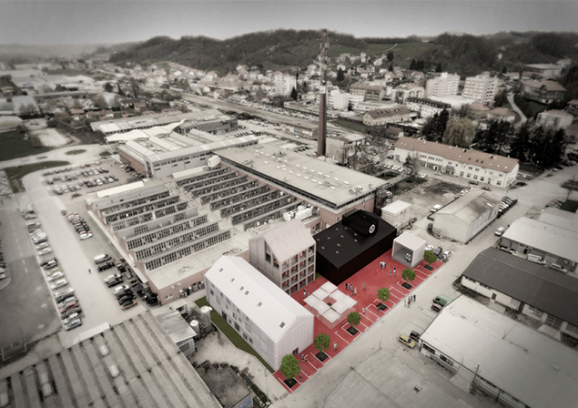<figcaption>
<em>Figure 1 Center for urban culture reGENERATOR in the City of Zabok, (c)</em> <a href="https://www.zabok.hr/re-generator/"><em>Grad Zabok</em></a>
</figcaption></figure>

[Zagreb](https://en.wikipedia.org/wiki/Zagreb), Croatia’s capital and largest urban area, provides a contrasting metropolitan context. With dense urban development, critical infrastructure, and strong demographic and economic dynamics, the Zagreb Innovation Lab addresses **NbS for urban microclimate regulation, stormwater management, and resilience of public spaces**. Its focus complements the more rural and small-town setting of Krapina-Zagorje, together illustrating the diversity of regional challenges.

<figure><figcaption>
<em>Figure 2 Therapeutic garden established as part of the proGIreg project at the co-Innovation lab Sljeme, Sesvete, (c)</em> <a href="https://progireg.eu/fileadmin/user_upload/Zagreb/ProGIreg_NBS3_Therapy_Garden_Zagreb.pdf"><em>proGIreg</em></a>
</figcaption></figure>

<figure><figcaption>
<em>Figure 3 Former slaughterhouse and livestock market Zagrepčanka, City of Zagreb, (c)</em> <a href="https://www.zagreb.hr/zagrepcanka/173671"><em>Grad Zagreb</em></a>
</figcaption></figure>

Climatic conditions across both regions reflect continental patterns with marked seasonality in temperature and precipitation. Historical records highlight variability in rainfall intensity, heat extremes, and local wind events, while flood hazard maps delineate areas vulnerable to riverine and pluvial flooding.

The Climate Risk Assessment (CRA) presented here focuses on **three main hazards—floods, heatwaves, and windstorms**—to illustrate the methodology through a simplified tutorial example. These hazards were selected because they capture some of the most relevant interactions with demographic, infrastructural, and environmental vulnerabilities, and can be consistently assessed with harmonized datasets. However, this does **not exhaust the full range of climate hazards** relevant to the Krapina-Zagorje and Zagreb regions. As highlighted in the original CRA documents and the IVAVIA methodology, additional hazards such as droughts, fires, erosion, and impacts on biodiversity, health, tourism, and infrastructure may also play a critical role and should be considered in comprehensive regional assessments.

<figure>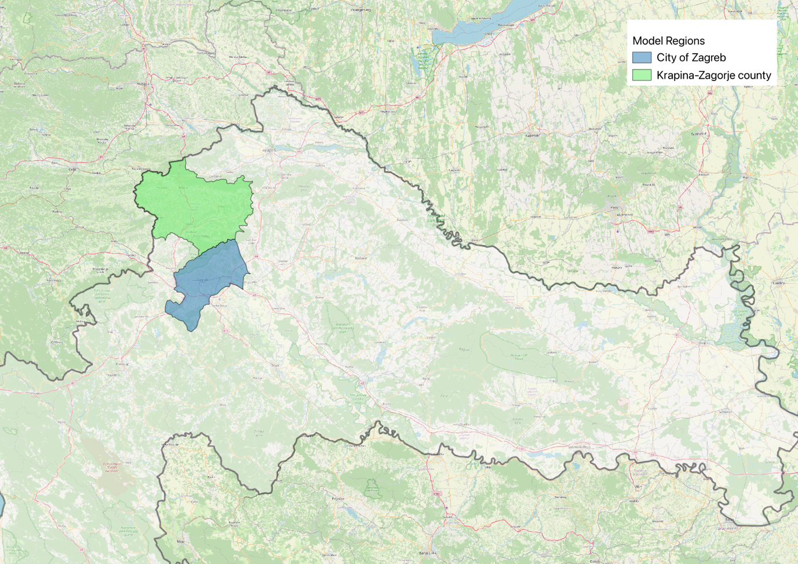<figcaption>
<em>Figure 4 - model regions and the Krapina-Zagorje and Zagreb area.</em>
</figcaption></figure>

#### Scope of the tutorial

This tutorial presents a simplified and replicable Climate Risk Assessment (CRA) workflow for two Croatian regions—**Krapina-Zagorje County** and the **City of Zagreb**—as part of broader climate change mitigation and adaptation efforts. For demonstration purposes, the CRA focuses on **three hazards of cross-regional relevance: floods, heatwaves, and windstorms**.

The workflow combines meteorological time series, European climate indicators (Copernicus), regional modelling outputs (RegCM4), and flood probability maps from the Joint Research Centre. While applied here to selected local contexts (urban and rural), the approach is t**ransferable**: regions can reproduce the steps by substituting local datasets and adjusting parameters to their hazard profile.


Disclaimer

This tutorial is a **didactic example** and does not replace software-specific documentation (e.g., GIS, hydrological or climate modelling tools). Users should be familiar with basic geospatial data formats, pre-processing techniques, and modelling concepts. The workflow illustrates methodological steps rather than exhaustive operational guidance; comprehensive assessments should integrate additional hazards and sectoral indicators in line with the **IVAVIA methodology** and stakeholder priorities.


#### CRA objectives

The CRA developed for the **Krapina-Zagorje** and **Zagreb** regions aims to characterize risks associated with **floods, heatwaves, and windstorms** using historical meteorological data, European climate indicators, and regional hazard mapping.

Main objectives:

* Identify and analyse the key climate threats affecting the regions.
* Assess risks as the combination of hazard probability and potential adverse impacts on exposed populations, infrastructures, and buildings.
* Provide a structured, evidence-based foundation for regional decision-making and adaptation planning.
* Support the integration of climate risk considerations into policies and strategies at local and regional level.

Unlike other tutorials that focus primarily on **Nature-Based Solutions (NbS) design and evaluation**, this workflow is explicitly cantered on **Climate Risk Assessment as a first step.** The emphasis is on producing **robust evidence of climate threats and vulnerabilities**, which can then serve as a baseline to inform, prioritize, and later complement NbS design.

The CRA applies the [IVAVIA methodology](https://www.researchgate.net/publication/330005248_IVAVIA_Impact_and_Vulnerability_Analysis_of_Vital_Infrastructures_and_Built-Up_Areas_13th_International_Conference_CRITIS_2018_Kaunas_Lithuania_September_24-26_2018_Revised_Selected_Papers), integrating hazard, exposure, sensitivity, and adaptive capacity into a clear and replicable framework.

#### Intended users

The Climate Risk Assessment (CRA) developed for the **Krapina-Zagorje** and **Zagreb** regions is designed for a broad spectrum of users involved in climate adaptation and risk management.

Regional and municipal authorities can use the results to integrate climate risks into **spatial planning, infrastructure development, and local policies. Civil protection agencies** benefit from the outputs to enhance preparedness and emergency response capacity, while **policymakers** at county and city levels gain an evidence base for designing long-term adaptation strategies.

The CRA is also relevant for **environmental organizations, research institutions, and NGOs**, which can apply the findings to support conservation, sustainability initiatives, and the promotion of nature-based approaches. In both urban (Zagreb) and rural (Krapina-Zagorje) contexts, the CRA provides a **structured, data-driven foundation** for decision-making, ensuring that adaptation measures are tailored to the vulnerabilities and priorities of the regions.

***

### Integrated Multi-Hazard Climate Risk Assessment Workflow (IVAVIA-based)

#### Description and context

The Integrated Multi-Hazard Climate Risk Assessment Workflow (IVAVIA-based) presented here covers both the **Krapina-Zagorje** and **Zagreb** regions. While the former is a predominantly rural inland county with dispersed settlements, agricultural land, and forested hills, and the latter a major urban centre with dense built-up areas and critical infrastructures, both regions are increasingly exposed to climate-related risks.

In this tutorial, the Climate Risk Assessment (CRA) focuses on three hazards of primary concern: **floods, heatwaves, and windstorms**.  These hazards interact with local vulnerabilities in demographic, infrastructural, and environmental systems, shaping overall exposure and risk. The workflow provides a structured basis for integrating climate data with socio-economic information to support adaptation planning.

&#x20;The table below summarizes the **key indicators** selected for illustrative purposes at this stage. It serves as an introductory overview; the detailed calculation of each indicator is developed in the methodology section of the workflow.

***

| Dimension    | Indicator(s)                                            | Unit                                  | Purpose                                                             |
| ------------ | ------------------------------------------------------- | ------------------------------------- | ------------------------------------------------------------------- |
| Flood hazard | Flood probability zones (fluvial/pluvial)               | Map classes / % area                  | Identify areas exposed to flooding; provide spatial hazard baseline |
| Heatwave     | Number of hot days / temperature extremes               | Days per year / °C                    | Capture intensity and frequency of extreme heat events              |
| Windstorm    | Maximum wind speed (daily/monthly)                      | m/s                                   | Characterize occurrence and magnitude of damaging wind events       |
| Exposure     | Population density in hazard-prone areas                | Inhabitants/km²                       | Quantify people and assets potentially affected                     |
| Exposure     | Built environment (building footprints, infrastructure) | Count, km², or km (depending dataset) | Identify physical assets and infrastructure at risk                 |

_Table 1 – key indicators tracked — multi-hazard CRA_

#### Data sources and tools

The Climate Risk Assessment (CRA) for the Krapina–Zagorje and Zagreb regions relies on a combination of **meteorological observations, hazard maps, and geospatial datasets** describing exposure and vulnerability.

**Historical climate data** are provided by the Croatian Meteorological and Hydrological Service (DHMZ), with daily and monthly values of temperature, precipitation, and wind speed. These allow the derivation of indicators such as hot days, extreme precipitation, and windstorm intensity. (Figure 3)

**Flood hazard information** is supported by national flood probability maps, complemented—where local access is restricted—by European-scale products from JRC and Copernicus.

&#x20;**Exposure layers** include **population density grids** (from census or global datasets such as World Pop) and **building footprints** (from the DGU portal or OpenStreetMap). Administrative boundaries from national registries or global sources (e.g., GADM) delineate the study areas.

In line with the IVAVIA methodology, vulnerability is addressed through socio-economic indicators and adaptive capacity proxies, **though in this tutorial only simplified examples are included**.

<figure>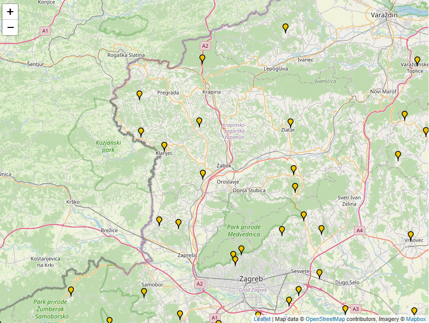<figcaption>
<em>Figure 5 – example of precipitation monitoring statins network in the area , source</em> <a href="https://meteo.hr/infrastruktura_e.php?section=mreze_postaja&#x26;param=pmm&#x26;el=kisomjerne"><em>DMZH</em></a>
</figcaption></figure>

Datasets for a hybrid workflow:


**Datasets for a hybrid workflow**

The tutorial adopts a hybrid workflow, combining GIS-based spatial layers (e.g., flood maps, population, buildings) with non-spatial outputs such as composite indicators, charts, and time series. For replicability, most examples are based on openly available European datasets (e.g., Copernicus climate indicators, ERA5-Land), while national datasets—when available—should replace them for higher accuracy.


| Data type / Dimension        | Source (local / national)                                                                                                                                                                                                          | Role in workflow                                                          | Open/EU alternative                                                                                                                                                                                                                                          |
| ---------------------------- | ---------------------------------------------------------------------------------------------------------------------------------------------------------------------------------------------------------------------------------- | ------------------------------------------------------------------------- | ------------------------------------------------------------------------------------------------------------------------------------------------------------------------------------------------------------------------------------------------------------ |
| Flood hazard                 | Flood probability maps (national agencies, e.g., DGU)                                                                                                                                                                              | Define areas exposed to riverine and pluvial flooding                     | [River flood hazard maps for Europe and the Mediterranean Basin region](https://data.jrc.ec.europa.eu/dataset/1d128b6c-a4ee-4858-9e34-6210707f3c81) (fluvial flood only), see note after the table                                                           |
| Precipitation extremes       | 
<a href="https://meteo.hr/index_en.php">DHMZ </a>– Krapina Main Meteorological Station (1994–2020, daily/monthly precipitation, extremes)

(upon request)
                                                              | Input for flood hazard (pluvial flooding) and standalone hazard indicator | 
<a href="https://cds.climate.copernicus.eu/datasets/reanalysis-era5-land?tab=download">ERA5-Land hourly data from 1950 to present</a>

(5 km)
                                                                                                    |
| Precipitation extremes       | [RegCM4 ](https://repozitorij.meteo.hr/en/islandora/object/meteo%3A11)baseline grid 12.5 km (HPC Velebit, EURO-CORDEX downscaled reanalysis) Include climate projections (see note after the table)                                | Input for flood hazard (pluvial flooding) and standalone hazard indicator | [Climate indicators for Europe from 1940 to 2100](https://cds.climate.copernicus.eu/datasets/sis-ecde-climate-indicators?tab=overview) derived from reanalysis and climate projections (0.25°)                                                               |
| Precipitation extremes       | [DHMZ ](https://meteo.hr/index_en.php)– Krapina Main Meteorological Station (temperature, hot days, extremes, 1994–2020)                                                                                                           | Input for flood hazard (pluvial flooding) and standalone hazard indicator | 
<a href="https://cds.climate.copernicus.eu/datasets/reanalysis-era5-land?tab=download">ERA5-Land hourly data from 1950 to present</a>

(5 km)
                                                                                                    |
| Heatwave hazard              | [RegCM4 ](https://repozitorij.meteo.hr/en/islandora/object/meteo%3A11)baseline grid 12.5 km (HPC Velebit, EURO-CORDEX downscaled reanalysis) Include climate projections (see note after the table)                                | Derive indicators of extreme heat and heatwaves                           | [Climate indicators for Europe from 1940 to 2100](https://cds.climate.copernicus.eu/datasets/sis-ecde-climate-indicators?tab=overview) derived from reanalysis and climate projections (0.25°)                                                               |
| Windstorm hazard             | [DHMZ ](https://meteo.hr/index_en.php)– Krapina Main Meteorological Station (wind speed, 1994–2020)                                                                                                                                | Characterize occurrence and intensity of wind hazards                     | 
<a href="https://cds.climate.copernicus.eu/datasets/reanalysis-era5-land?tab=download">ERA5-Land hourly data from 1950 to present</a>

(5 km)
                                                                                                    |
| Windstorm hazard             | 
<a href="https://repozitorij.meteo.hr/en/islandora/object/meteo%3A11">RegCM4 </a>baseline grid 12.5 km (HPC Velebit, EURO-CORDEX downscaled reanalysis)

 

Include climate projections (see note after the table
 | Characterize occurrence and intensity of wind hazards                     | [Climate indicators for Europe from 1940 to 2100](https://cds.climate.copernicus.eu/datasets/sis-ecde-climate-indicators?tab=overview) derived from reanalysis and climate projections (0.25°)                                                               |
| Exposure – Population        | Local statistical datasets (county census; Croatian) may be restricted                                                                                                                                                             | Quantify people potentially affected                                      | 
<a href="https://dx.doi.org/10.5258/SOTON/WP00646">World pop Hub</a> (raster 100m)  

<a href="https://data.humdata.org/dataset/croatia-high-resolution-population-density-maps-demographic-estimates">The Humanitarian Data Exchange</a>
 |
| Exposure – Built environment | [DGU GIS portal](https://geoportal.dgu.hr/?utm_source=chatgpt.com#/menu/podaci-i-servisi) (may be limited to registered users)                                                                                                     | Identify exposed assets and infrastructure                                | OpenStreetMap building layer ([vector, global)](https://osmbuildings.org/)                                                                                                                                                                                   |
| Administrative boundaries    | [DGU GIS portal](https://geoportal.dgu.hr/?utm_source=chatgpt.com#/menu/podaci-i-servisi) (may be limited to registered users)                                                                                                     | Isolate area/city of interest                                             | [gadm.org](https://gadm.org/download_country.html)                                                                                                                                                                                                           |

_Table 2 – used data, alternative datasets to replicate the assessment outside the study area_


**⮚   Climate change effects**

_Future risk assessment integrates climate projections from_ [_RegCM4_ ](https://repozitorij.meteo.hr/en/islandora/object/meteo%3A11) _(12.5 km resolution, EURO-CORDEX/Med-CORDEX) and Copernicus climate indicators (0.25°). These provide annual indicators and time series under RCP 4.5 and RCP 8.5 for the near future (2011–2040) and mid-century (2041–2070). While national datasets (e.g., RegCM4) provide finer spatial and temporal detail, European datasets offer pre-aggregated indicators, simplifying their direct use in CRA workflows_



<mark style="color:$warning;">**Note – Flood hazard maps**</mark>\
&#xNAN;_<mark style="color:$warning;">**The flood hazard component here relies on large-scale European products, which mainly represent fluvial flooding at coarse resolution. More accurate pluvial and riverine flood risk maps should be included whenever available from national or regional agencies. Users seeking high-resolution analysis can refer to dedicated tutorials on flood modelling, which use local DEMs and hydrological data.**</mark>_

&#x20;


Given the orientation of this tutorial toward climate risk assessment based on time-series and geospatial data, the main operational requirement is a GIS platform. In practice, beyond the use of standard office suites or spreadsheets for tabular data management, GIS is the only tool strictly necessary to implement the workflow described here.

Some operations (e.g., raster aggregation, downscaling, or customized indicator computation from high-frequency data) can be automated through simple scripting using libraries such as GDAL or CDO. However, such tasks fall outside the scope of this tutorial, which focuses on demonstrating the CRA workflow through existing, user-friendly tools.

<figure>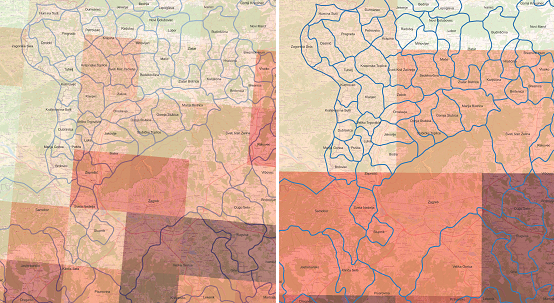<figcaption>
<em>Figure 6 - Comparison of spatial resolution and processing level between national and European datasets. Left: near-surface air temperature (TAS, 2 m) from the Croatian RegCM4 regional climate model at ~12.5 km resolution, shown here as a raw climate variable with sub-daily (3-hourly) time steps. Right: annual hot days indicator (number of days with Tmax > 30 °C) from the Copernicus Climate Indicators dataset at 0.25° resolution (~25 km). The figure highlights both the finer spatial detail of the national dataset and the advantage of the European dataset in providing pre-aggregated annual indicators ready for risk assessment. (note that also EU based dataset like ERA5-Land hourly data may provide higher resolution).</em>
</figcaption></figure>

Tools:

| Tool                      | Type | Role                                                                                                                            |
| ------------------------- | ---- | ------------------------------------------------------------------------------------------------------------------------------- |
| [QGIS](https://qgis.org/) | Open | Core platform for loading datasets, overlaying hazard and exposure layers, computing zonal statistics, and visualizing results. |

_Table 3 – used tools and role in the Multi-Hazard CRA Workflow_

***

#### Methodology



### Step 1 — Data acquisition and preparation

*   In this step we focus on climate indicators available in harmonized European datasets that correspond directly to those recommended by the IVAVIA methodology.

    The workflow begins by loading into a GIS platform the multiband raster file containing annual climate indicators of interest. Although provided on a relatively coarse 0.25° grid, these datasets already deliver pre-computed annual statistics such as yearly counts (e.g., number of hot days), annual maxima (e.g., maximum 5-day precipitation), or annual extremes (e.g., extreme wind speed days). Each band represents a year, allowing the raster to be handled as a temporal stack. Importantly, these are not long-term means, but annual statistics derived from daily climate data, making them consistent with IVAVIA’s requirements.

    Raster layers are then clipped to the study area using administrative boundaries (from national or open European shapefiles). For this tutorial, four indicators have been selected among the many available and indicated in the IVAVIA guidelines just for the sake of two illustrating the methodology:

    &#x20;

    ●    Heat hazard → Hot days (days with Tmax > 30 °C)

    ●    Precipitation hazard → Extreme precipitation days (days above the 95th percentile, 1981–2010)

    ●    Wind hazard → Extreme wind speed days (days above the 98th percentile, 1981–2010)

    ●    Flood hazard → River flood depth maps from JRC datasets (e.g., 100-year return period)

    &#x20;

    These indicators are extracted as time series for any pixel of interest (e.g., the area covering Hum na Sutli or Zagreb or another area ) and can be exported to CSV format directly from QGIS using available plugins such as [_Value Tool_](https://plugins.qgis.org/plugins/valuetool/). Figure 5 shows an example of population density grids and building footprints overlaid with flood hazard data, while Figure 6 illustrates time series extracted from current and projected climate datasets.

<figure>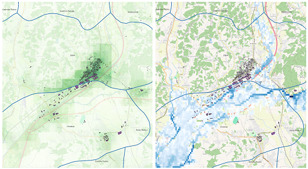<figcaption>
<em>Figure 7 – Example of exposure and flood hazard integration. Left: raster map of population density for a selected age group (100 m resolution) overlaid with building footprint polygons in an urban area of the Krapina–Zagorje region. Right: building footprint polygons overlaid with the 100-year flood extent from the JRC European river flood hazard dataset. Together, these maps illustrate how demographic, structural, and hazard layers can be combined in GIS to represent exposure to climate risks, in line with the IVAVIA methodology.</em>
</figcaption></figure>

<figure><figcaption></figcaption></figure>

<figure>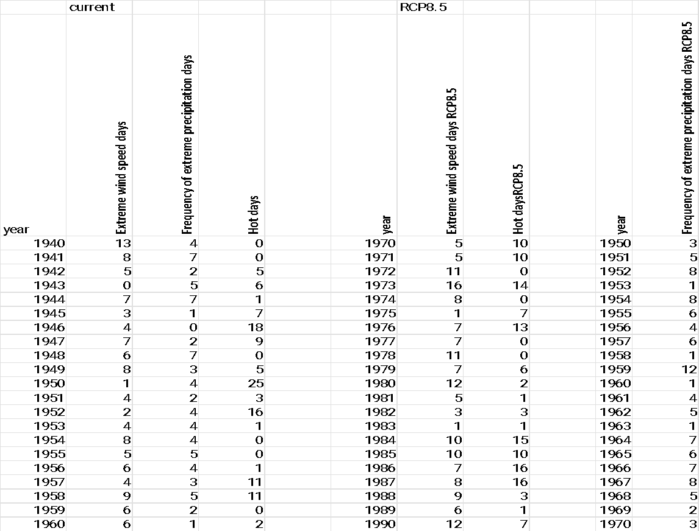<figcaption>
<em>Figure 8 – Extracted time series of meteorological indicators in current and climate change projection (example of extracted time series in the lower table)</em>
</figcaption></figure>


**⮚   Note – high-frequency/resolution geographical datasets. Scripting processing**

When national or European data are available at higher spatial/temporal resolution (e.g., RegCM4 outputs, hourly ERA5-Land data), indicators must be derived from sub-daily rasters rather than pre-aggregated annual layers. This usually requires simple scripting (e.g., with [GDAL ](https://gdal.org/en/stable/)or [CDO](https://code.mpimet.mpg.de/projects/cdo/wiki/tutorial)) rather than standard GIS tools. Script construction is beyond the scope of this tutorial but remains a valid option for advanced users.



**⮚   Note – local data.**

While this tutorial uses widely available European datasets, the same procedure applies to local station data (e.g., from DHMZ in Croatia), either for single stations or as averages of multiple stations.





### Step 2 — Indicators and normalization

Following the IVAVIA methodology (Appendix D), meteorological hazard indicators were normalised with the min–max method, using the minimum and maximum across the full series (baseline + RCP8.5 projections). Annual values were aggregated into 30-year climatological windows (1991–2020, 2021–2050, 2041–2070, 2071–2100), and the mean

<figure>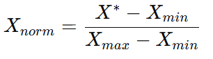<figcaption></figcaption></figure>

within each window was normalised as:

where X∗ is the 30-year mean, and Xmin, Xmax​ are the minimum and maximum values of the full historical + projected series.


**⮚     Note – normalization.**

_Dataset-derived minima and maxima spread values across \[0,1], but may misrepresent extremes if observed values cover only part of the plausible range. In such cases, thresholds from literature or records should be applied, with stakeholder agreement and documentation._


Example of the 3-time series like indicators once normalized for one of the areas of interest are reported in the following table.

<figure>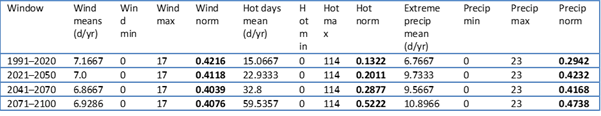<figcaption></figcaption></figure>

Table 4 - thirty-year mean values and normalised scores of hazard indicators (wind, heat, precipitation) for the baseline period (1991–2020) and three future climate windows under RCP8.5.

For this tutorial, time-series indicators are assumed spatially uniform over the study area—i.e., one pixel represents the whole exposed population/assets. This is a simplification: local topography or drainage strongly modulates impacts. More advanced assessments would convert time-series indicators into pluvial flood or urban heat island maps (see dedicated tutorials ).

In the next section, we address hazard indicators that are **spatially distributed**, focusing in this tutorial on flood hazard maps.

&#x20;

**Hazard – flood (map)**

Flood hazard is derived from raster water-depth maps (e.g., 100-year return period). The raster is clipped to the study polygon, and zonal statistics provide mean, minimum, and maximum depths.

&#x20;The mean depth is then normalised as:

<figure>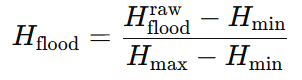<figcaption></figcaption></figure>

where:

●        Hfloodraw ​ = mean depth (m) in the polygon,

●        Hmin ​ = reference minimum (0 m),

●        Hmax ​ = reference maximum (either the maximum observed depth across a larger domain or a fixed threshold from literature/experts, e.g. 2 m).

_Example over one of the areas of interest_ mean = 0.97 m, min = 0.11 m, max = 2.55 m → Hflood​=0.37.

**Sensitivity**

According to the IVAVIA methodology, sensitivity describes the intrinsic characteristics of exposed elements that determine how strongly they are affected by hazards. It is independent of hazard extent and instead reflects the fragility of people, infrastructure, or systems. In this workflow, **illustrative sensitivity indicators are proposed for each hazard**, based on available demographic and structural data.

&#x20;●        **Heat hazard (Hot days)**: sensitivity expressed by the demographic structure, with the share of elderly (>65) and children (<15) serving as a proxy for groups more vulnerable to heat impacts.

●      **Wind hazard (Extreme wind speed days)**: sensitivity linked to building fragility; in absence of detailed data, the density of residential buildings is used as a proxy.

●        **Precipitation hazard (Extreme precipitation days)**: sensitivity reflecting the capacity of the urban environment to manage intense rainfall. A practical proxy adopted here is the share of impermeable surfaces, which increases susceptibility to pluvial flooding.

●        **Flood hazard (River flood depth maps**): sensitivity expressed by the structural fragility of buildings; in the absence of detailed attributes, a proxy is the share of ground-floor residential area within the total building footprint.

&#x20;All sensitivity indicators can be derived with standard GIS overlays and zonal statistics. To keep the tutorial concise, no full implementation is provided; instead, normalized values (0–1) are assumed for illustrative purposes.


**⮚     Note – Methodological caveat:**

The indicators shown here are only operational examples. IVAVIA (see Appendix on sensitivity indicators) recommends defining context-specific indicators based on local data and hazard characteristics. Possible alternatives include socio-economic status, critical infrastructure, or health service coverage. **Because sensitivity is highly context-dependent, indicator selection should be validated with stakeholders and supported by reliable evidence.**

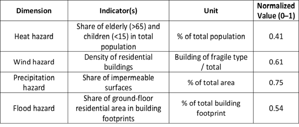

Table 5 - Proposed illustrative sensitivity indicators for the four hazards considered. These indicators are derived from demographic and structural datasets and serve as operational examples for this workflow. According to IVAVIA, final indicator selection should be adapted to local data availability and validated with stakeholder&#x73;_._

To visually illustrate how sensitivity interacts with exposure and adaptive capacity, the IVAVIA methodology provides impact chains that link climate hazards to sectoral impacts. For example, the impact chain for heatwaves and public health (IVAVIA Guideline, Appendix C) shows how demographic characteristics such as the proportion of elderly or children, combined with coping capacity factors like availability of health services, shape the final vulnerability of a community. This schematic representation supports the interpretation of the simplified sensitivity indicators adopted in this tutorial.


<figure>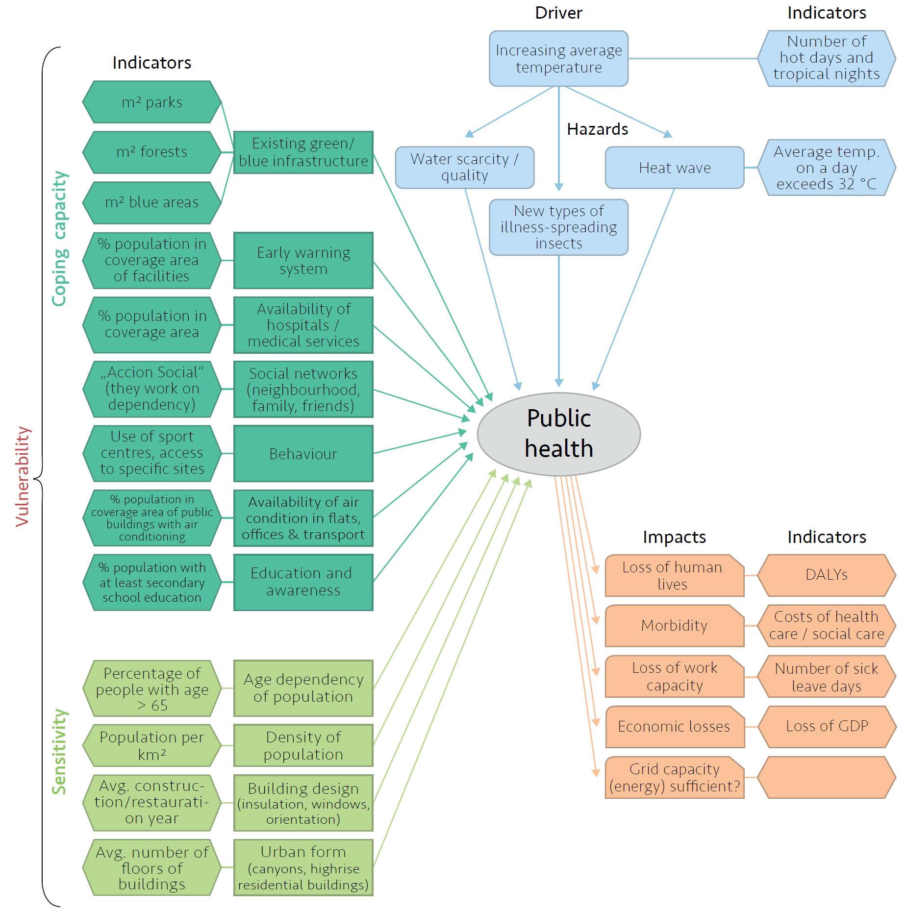<figcaption>
<em>Figure 9 - Example of an IVAVIA impact chain for heatwaves and public health. The diagram illustrates how hazard indicators (e.g., frequency of heatwaves) interact with sensitivity factors (e.g., share of elderly population, population density, building typologies) and adaptive capacity elements (e.g., health services, early warning systems) to determine the overall level of vulnerability and impacts on public health. Source: IVAVIA Guideline v3, Appendix C</em>
</figcaption></figure>

**Exposure**

According to the IVAVIA methodology, exposure refers to the presence and distribution of people, buildings, or infrastructures located within areas potentially affected by climate hazards. Unlike sensitivity, which captures intrinsic fragility, exposure quantifies how many assets are actually situated in hazard zones.


**⮚      Note – Methodological caveat:**

_In this tutorial, exposure indicators are derived from a limited set of available datasets—population density grids (100 m resolution) and building footprint polygons. The approach varies by hazard type and is presented here for didactic purposes only. The IVAVIA guidelines provide broader examples, validated with stakeholders, for tailoring exposure assessment to local contexts._

&#x20;

●        **Heat, Wind, and Precipitation hazards**: Since these indicators are represented as uniform time-series values across the study area, exposure is assumed to be total (value = 1), meaning all population and buildings are equally affected.

&#x20;

●       **Flood hazard:** Exposure is spatially differentiated and calculated by intersecting the flood depth map with building footprints and population grids. Metrics such as the share of residential floor area or population within the 100-year floodplain can be used. In this example, the normalized exposure index is estimated at ≈ 0.25.


As with sensitivity, exposure can be derived through standard GIS overlay and zonal statistics, without requiring advanced examples here. Population exposure is obtained by summing grid values within hazard zones, while building exposure is calculated from the footprint area intersecting the hazard extent.

**Adaptation Capacity**

According to the IVAVIA methodology, adaptation capacity refers to the ability of institutions, infrastructure, and communities to anticipate, absorb, and recover from climate hazard impacts. Unlike sensitivity or exposure, which can be measured with demographic or structural datasets, adaptation capacity is context-specific and often linked to governance quality, preparedness, and technical measures.


**⮚     Note – Methodological caveat:**\
In this workflow, adaptation capacity indicators are introduced only as hypothetical examples, since robust local data (e.g., levee length, drainage network capacity, emergency planning) are not readily available for either Krapina–Zagorje or Zagreb. As underlined in IVAVIA (Section 4.2), qualitative or categorical indicators—such as the presence of early-warning systems, enforcement of building codes, or stakeholder perceptions—can also be used. In practice, **these indicators should be locally validated, but here simplified values are applied to complete the Climate Risk Assessment framework.**

&#x20;

●        **Heat hazard (hot days):** Capacity may include health services, social support, cooling shelters, or urban greening. Example value: 0.6 (moderate preparedness).

●        **Wind hazard (extreme wind speed days**): Linked to building standards, warning systems, and civil protection readiness. Example value: 0.5 (partial preparedness).

●       **Precipitation hazard (extreme precipitation days)**: Reflects drainage and green infrastructure performance. Example value: 0.4 (limited capacity).

●       **Flood hazard (river flood depth maps)**: Based on structural defences, contingency planning, and operational readiness. Example value: 0.3 (low preparedness).


These values are purely illustrative. In operational settings, IVAVIA recommends a mix of quantitative metrics (e.g., kilometres of levees, share of urban green areas) and qualitative indicators (e.g., presence of emergency plans), depending on hazard type and data availability.



### Step 3 — **Risk Aggregation and Results**

According to the IVAVIA methodology, the final risk score is obtained by integrating hazard (H), exposure (EX), and vulnerability (V) into a composite index. Vulnerability itself is calculated as a function of sensitivity (SE) and adaptive capacity (AC), following the aggregation approaches described in Section 5.2 of the guidelines:

<figure>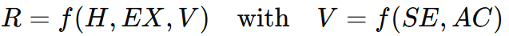<figcaption></figcaption></figure>

Several methods for combining SE and AC are provided in IVAVIA, ranging from additive models to compensatory approaches. For the sake of clarity and didactic value, this tutorial applies the first aggregation method suggested by IVAVIA—the weighted arithmetic mean—under the simplifying assumption of unitary weights. In this configuration, sensitivity and adaptive capacity contribute equally to vulnerability, and hazard, exposure, and vulnerability contribute equally to the final risk score:

<figure>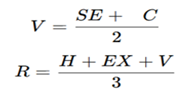<figcaption></figcaption></figure>

With C=(1-AC) .

This choice ensures consistency with IVAVIA while keeping the workflow simple and transparent. In real-world applications, the relative weights of the components should be carefully defined and validated with local stakeholders, as recommended by the methodology.

&#x20;The following tables report the illustrative normalized values used for each of the four hazards in the example area. These values are not observed or refined values, but didactic approximations introduced to demonstrate the workflow:

<table data-header-hidden><thead><tr><th valign="top">Dimension</th><th valign="top">Indicator</th><th valign="top">Normalized Value</th><th valign="top">Composite Score</th></tr></thead><tbody><tr><td valign="top">Hazard</td><td valign="top">Number of hot days</td><td valign="top">0.52</td><td valign="top">H = 0.52</td></tr><tr><td valign="top">Sensitivity</td><td valign="top">Share of elderly and children in population</td><td valign="top">0.41</td><td valign="top"> </td></tr><tr><td valign="top">Adaptive Capacity</td><td valign="top">Health/social systems, greening programs (assumed)</td><td valign="top">0.60</td><td valign="top">V = (0.41+(1-0.60))/2 = 0.41</td></tr><tr><td valign="top">Exposure</td><td valign="top">Population and buildings (area-wide)</td><td valign="top">1.00</td><td valign="top">EX = 1.00</td></tr><tr><td valign="top">Risk</td><td valign="top">Composite Risk Score</td><td valign="top"> </td><td valign="top">R = (0.52+0.41+1.00)/3 = 0.643</td></tr></tbody></table>

_Table 6 - Heat Hazard (Hot Days)_

<table data-header-hidden><thead><tr><th valign="top">Dimension</th><th valign="top">Indicator</th><th valign="top">Normalized Value</th><th valign="top">Composite Score</th></tr></thead><tbody><tr><td valign="top">Hazard</td><td valign="top">Extreme wind speed days</td><td valign="top">0.41</td><td valign="top">H = 0.41</td></tr><tr><td valign="top">Sensitivity</td><td valign="top">Density of residential buildings</td><td valign="top">0.61</td><td valign="top"> </td></tr><tr><td valign="top">Adaptive Capacity</td><td valign="top">Building standards, warning systems (assumed)</td><td valign="top">0.50</td><td valign="top">V = (0.61+(1-0.50))/2 = 0.555</td></tr><tr><td valign="top">Exposure</td><td valign="top">Population and buildings (area-wide)</td><td valign="top">1.00</td><td valign="top">EX = 1.00</td></tr><tr><td valign="top">Risk</td><td valign="top">Composite Risk Score</td><td valign="top"> </td><td valign="top">R = (0.41+0.555+1.00)/3 = 0.655</td></tr></tbody></table>

_Table 7 - Wind Hazard (Extreme Wind Speed Days)_

<table data-header-hidden><thead><tr><th valign="top"></th><th valign="top"></th><th valign="top"></th><th valign="top"></th></tr></thead><tbody><tr><td valign="top">Dimension</td><td valign="top">Indicator</td><td valign="top">Normalized Value</td><td valign="top">Composite Score</td></tr><tr><td valign="top">Hazard</td><td valign="top">Extreme precipitation days</td><td valign="top">0.47</td><td valign="top">H = 0.47</td></tr><tr><td valign="top">Sensitivity</td><td valign="top">Share of impermeable surfaces</td><td valign="top">0.75</td><td valign="top"> </td></tr><tr><td valign="top">Adaptive Capacity</td><td valign="top">Drainage/green infrastructure (assumed)</td><td valign="top">0.40</td><td valign="top">V = (0.75+(1-0.40))/2 = 0.675</td></tr><tr><td valign="top">Exposure</td><td valign="top">Population and buildings (area-wide)</td><td valign="top">1.00</td><td valign="top">EX = 1.00</td></tr><tr><td valign="top">Risk</td><td valign="top">Composite Risk Score</td><td valign="top"> </td><td valign="top">

R = (0.47+0.675+1.00)/3 = 0.715
</td></tr></tbody></table>

_Table 8 - Precipitation Hazard (Extreme Precipitation Days)_

<table data-header-hidden><thead><tr><th valign="top"></th><th valign="top"></th><th valign="top"></th><th valign="top"></th></tr></thead><tbody><tr><td valign="top">Dimension</td><td valign="top">Indicator</td><td valign="top">Normalized Value</td><td valign="top">Composite Score</td></tr><tr><td valign="top">Hazard</td><td valign="top">Mean flood depth (100-yr return period)</td><td valign="top">0.37</td><td valign="top">H = 0.37</td></tr><tr><td valign="top">Sensitivity</td><td valign="top">Share of ground-floor residential area</td><td valign="top">0.54</td><td valign="top"> </td></tr><tr><td valign="top">Adaptive Capacity</td><td valign="top">Flood defences, emergency readiness (assumed)</td><td valign="top">0.30</td><td valign="top">V = (0.54+(1-0.30))/2 = 0.62</td></tr><tr><td valign="top">Exposure</td><td valign="top">Share of population/buildings in flood zone</td><td valign="top">0.25</td><td valign="top">EX = 0.25</td></tr><tr><td valign="top">Risk</td><td valign="top">Composite Risk Score</td><td valign="top"> </td><td valign="top">R = (0.37+0.62+0.25)/3 = 0.413</td></tr></tbody></table>




***

#### Outputs and visualizations

In addition to tabular calculations, this CRA workflow highlights the importance of **visual outputs for effective communication of results.** Graphs and maps make trends and spatial patterns accessible to both experts and non-specialist stakeholders, bridging the gap between technical analysis and decision-making.

&#x20;**Time-series** plots illustrate the temporal evolution of hazard indicators (e.g., hot days, extreme precipitation days, wind extremes) under historical and RCP8.5 scenarios. They enable comparison of baseline and projected conditions, making the dynamics of climate risk more tangible. In this example, two indicators—frequency of extreme precipitation days and hot days—show a marked upward trend, underlining the urgency of adaptation and mitigation measures.

&#x20;**Geospatial maps** complement this temporal perspective by showing the spatial distribution of risks. Flood hazard maps combined with exposure layers (e.g., population grids or building footprints) identify vulnerable hotspots, supporting emergency preparedness and prioritization of adaptation measures. More complex composite maps can integrate multiple hazards, sensitivity, and adaptive capacity, helping to capture cross-sectoral vulnerabilities.

&#x20;


**⮚     Adjusting climate trends with local data**

Many global or regional reanalysis or observational datasets (e.g., ERA5) overlap in time with future model projections (e.g., CMIP6). This overlap allows for statistical downscaling — particularly, quantile mapping techniques — to adjust large-scale datasets to local contexts while preserving climate change signals and extreme tails. Recent studies using _Quantile Delta Mapping (QDM)_ and models like _Quantile-Preserving Localized-Analog Downscaling (QPLAD)_ demonstrate that it is possible to correct biases and downscale climate variables without distorting trends in extremes( see also [Gergel, D. R. et. Ala, 2024](https://gmd.copernicus.org/articles/17/191/2024))


<figure>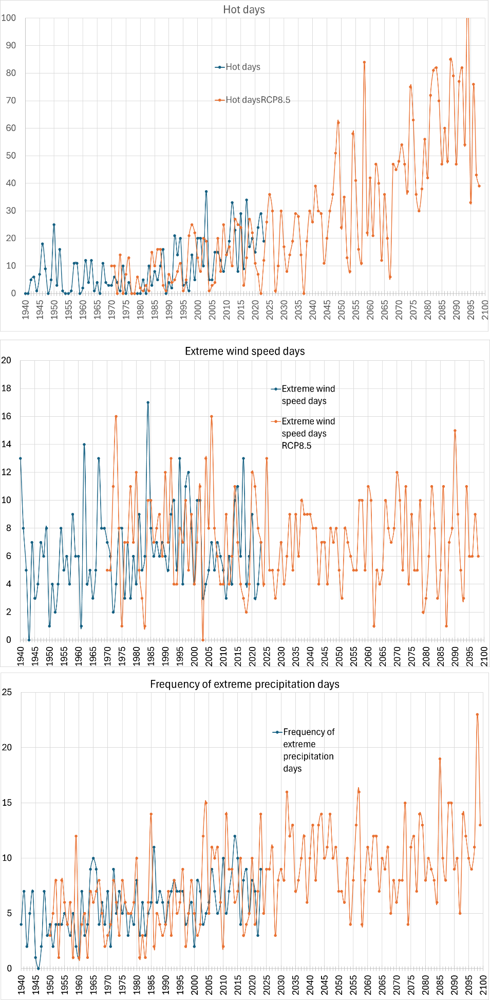<figcaption>
<em>Figure 10 - Combined plots of Hot Days (top), Extreme Wind Speed Days (middle), and Frequency of Extreme Precipitation Days (bottom), comparing historical reanalysis data with climate change projections under RCP 8.5 (Copernicus datasets). The shaded rectangle highlights the temporal overlap between reanalysis and projection datasets, which can be exploited for statistical downscaling methods (e.g., quantile mapping). The figures show a clear upward trend for heat- and precipitation-related indicators, supporting the need for targeted adaptation strategies.</em>
</figcaption></figure>

<figure>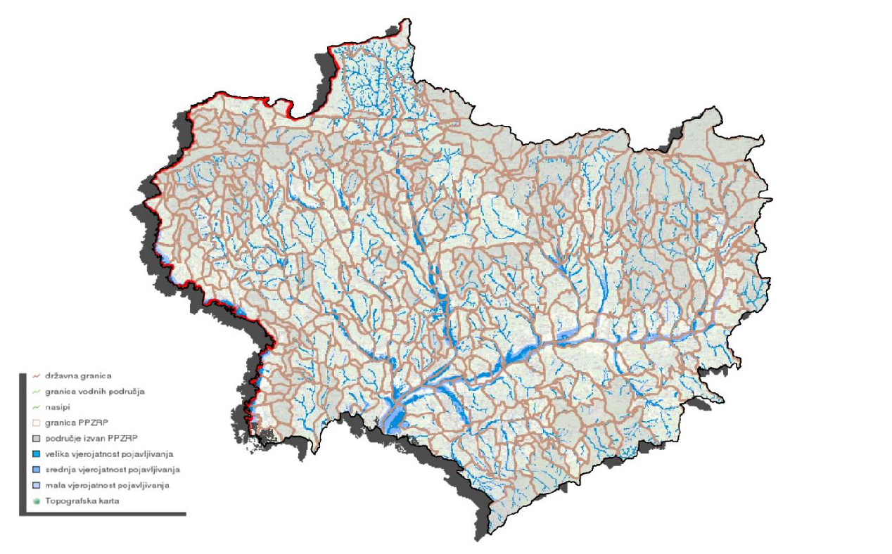<figcaption>
<em>Figure 11- example of geospatial map Displaying hazard zones such as flood risk maps</em>
</figcaption></figure>

<figure>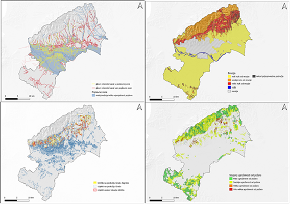<figcaption>
<em>Figure 12 - Example maps: flood, erosion, fire, landslide risk.</em>
</figcaption></figure>

***

### Annex — Sectoral Climate Risk Models (Zagreb case study examples)

This annex reports sectoral examples of climate hazard and risk models as developed in the Zagreb Climate Risk Assessment, based on the IVAVIA methodology (RESIN project). These examples illustrate how hazard, exposure, sensitivity, and adaptive capacity indicators can be combined into composite vulnerability and risk indices.

&#x20;The tables reproduced here summarize, for each sector, examples of relevant indicators of **hazard (H), exposure (EX), sensitivity (SE), and adaptive capacity (AC)**. Their aggregation into **vulnerability (V)** and final **risk (R)** scores follows the methodological framework described in Chapter 5 of the IVAVIA guidelines.

&#x20;The annexed tables are provided as illustrative examples and complement the simplified tutorial workflow developed for the Krapina–Zagorje and Zagreb regions. They show how sectoral detail can be introduced in operational CRAs when more granular datasets and local expertise are available.


**⮚     Example: Water Management – Flood Risk and Vulnerability**

The final table attached in this annex presents a structured example of calculation for the Water Management sector, focused on flood hazard. Normalized values are shown for hazard, sensitivity, adaptive capacity, and exposure indicators, together with the composite vulnerability score and overall risk rating.

This structured calculation demonstrates the logic of the IVAVIA framework:

●        Hazard intensity (frequency of extreme rainfall, maximum daily precipitation) is quantified and normalized.

●        Sensitivity includes past flood occurrences and infrastructure fragility.

●        Adaptive capacity reflects the state of flood defenses, drainage, and preparedness of services.

●        Exposure measures the density of population and infrastructure within the flood-prone area.

●        Vulnerability is aggregated as a function of sensitivity and coping capacity.

●        The final risk rating integrates hazard, exposure, and vulnerability.


<table data-header-hidden><thead><tr><th valign="top"></th><th valign="top"></th><th valign="top"></th></tr></thead><tbody><tr><td valign="top">RISK ELEMENTS</td><td valign="top">DESCRIPTION</td><td valign="top">INDICATORS</td></tr><tr><td valign="top">Threat (hazard)</td><td valign="top">
●        Drought

●        Flood

●        Storm

●        Heatwave

●        Fire
</td><td valign="top">
IPCC Scenarios: RCP 4.5 and RCP8.5 for the period 2040–2070 compared to the period 1980–2010.

●        Change in mean maximum temperature (°C)

●        Change in the number of warm nights (Tmin ≥ 20 °C)

●        Change in the number of very hot days (Tmax ≥ 30 °C)

●        Change in the number of consecutive dry days (precipitation &#x3C; 1 mm)

●        Change in the number of consecutive rainy days (precipitation > 1 mm)

●        Change in the number of days with heavy precipitation (> 20 mm)

●        Change in the maximum 1-day precipitation (Rx1d)

●        Erosion
</td></tr><tr><td valign="top">Exposure</td><td valign="top">Exposure of people and infrastructure to potential future climate impacts.</td><td valign="top">
●        Population density in settlements

●        Road and railway infrastructure                  

●        Hospitals and health center

●        Industrial facilities

●        Waste disposal sites
</td></tr><tr><td valign="top">Sensitivity</td><td valign="top">Socio-economic data that may be affected by climate change hazards. Indicators should reflect changes over time.</td><td valign="top">
●        Number of inhabitants

●        Youth population

●        Elderly population

●        Settlement density

●        Projected changes in population and migration
</td></tr><tr><td valign="top">Adaptation capacity</td><td valign="top">Data related to the capacity to adapt to the occurrence of hazards, which can reflect changes over time.</td><td valign="top">
●        Number of hospitals/doctors per capita

●        Proportion of green areas in cities

●        Length of built levees

●        Level of public education

●        GDP per capita
</td></tr></tbody></table>

Table 10 - an example of risk elements and indicators that were used in the CRA

Below are the models that were used in the CRA for analyzed sectors:

**WATER MANAGMENT**

<table data-header-hidden><thead><tr><th></th><th valign="top"></th></tr></thead><tbody><tr><td>HAZARD: FLOODS</td><td valign="top">
●        Maximum 1-day precipitation (Rx1d)

●        Number of days with heavy rainfall (> 20 mm)

●        Number of consecutive rainy days (precipitation > 1 mm)
</td></tr><tr><td>EXPOSURE</td><td valign="top">
●        population density (number of inhabitants/km²)

●        number of water supply connections

●        length of the public drainage network in the area affected by flooding
</td></tr><tr><td>SENSITIVITY</td><td valign="top">
●        occurrence of floods in the area of the City of Zagreb

●        safety of water intended for human consumption

●        percentage of households without a water supply network
</td></tr><tr><td>ADAPTATION CAPACITY</td><td valign="top">
●        flood defense system

●        assessment of the readiness of flood protection services

●        functionality of the public drainage system

●        integrated approach to managing urban stormwater drainage
</td></tr></tbody></table>

<table data-header-hidden><thead><tr><th></th><th valign="top"></th></tr></thead><tbody><tr><td>HAZARD: DROUGHT</td><td valign="top">
●        average maximum daily air temperature

●        number of very hot days (Tmax ≥ 30 °C)

●        number of consecutive dry days (precipitation &#x3C; 1 mm)
</td></tr><tr><td>EXPOSURE</td><td valign="top">
●        population density (number of inhabitants/km²)

●        number of water supply connections

●        increase in the number of water consumers during peak summer tourist months
</td></tr><tr><td>SENSITIVITY</td><td valign="top">
●        average annual water consumption

●        losses in the water supply network

●        quantitative status of groundwater
</td></tr><tr><td>ADAPTATION CAPACITY</td><td valign="top">
●        level of education of the population

●        sustainable water management

●        regulations on water use restrictions
</td></tr></tbody></table>

**AGRICULTURE**

<table data-header-hidden><thead><tr><th></th><th valign="top"></th></tr></thead><tbody><tr><td><mark style="background-color:$warning;">HAZARD: DROUGHT</mark></td><td valign="top">
●        average maximum daily air temperature

●        number of very hot days (Tmax ≥ 30 °C)

●        number of consecutive dry days (precipitation &#x3C; 1 mm)
</td></tr><tr><td>EXPOSURE</td><td valign="top">
●        number of agricultural holdings

●        share of ARKOD areas in the total area of the City

●        share of employees in the agriculture sector relative to total employment
</td></tr><tr><td>SENSITIVITY</td><td valign="top">
●        structure of agricultural land and distribution of drought-sensitive crops

●        soil quality, i.e., the percentage of humus content in the soil

●        estimated material damage in the economy as a percentage of the budget
</td></tr><tr><td>ADAPTATION CAPACITY</td><td valign="top">
●        availability of water for irrigation

●        institutional and financial support for farmers

●        level of education of farmers

●        age structure of farmers

●        GDP per capita (financial capacity for using modern technologies)
</td></tr></tbody></table>

<table data-header-hidden><thead><tr><th></th><th valign="top"></th></tr></thead><tbody><tr><td><mark style="background-color:blue;">HAZARD: FLOODS</mark></td><td valign="top">
●        number of consecutive rainy days (precipitation > 1 mm)

●        number of days with heavy precipitation (> 20 mm)

●        highest 1-day precipitation amount (Rx1d)
</td></tr><tr><td>EXPOSURE</td><td valign="top">
●        area of agricultural land at risk of flooding

●        area of agricultural land at risk of erosion

●        number of agricultural holdings
</td></tr><tr><td>SENSITIVITY</td><td valign="top">
●        estimated material damage in the economy (%)

●        soil water retention capacity
</td></tr><tr><td>ADAPTATION CAPACITY</td><td valign="top">
●        existing flood defense systems

●        existing green infrastructure

●        drainage systems
</td></tr></tbody></table>

**FORESTRY**

<table data-header-hidden><thead><tr><th></th><th valign="top"></th></tr></thead><tbody><tr><td>HAZARD: FIRE</td><td valign="top">
●        average daily maximum air temperature

●        number of very hot days (Tmax ≥ 30 °C)

●        number of consecutive dry days (precipitation &#x3C; 1 mm)
</td></tr><tr><td>EXPOSURE</td><td valign="top">
●        areas covered by forest land and urban parks

●        share of employees in forestry relative to total employment
</td></tr><tr><td>SENSITIVITY</td><td valign="top">
●        SSR index of average seasonal fire severity

●        area of forests affected by a high level of fire danger (ha)

●        age of forests (ha)

●        burned area in the recent period (ha)

●        forest management
</td></tr><tr><td>ADAPTATION CAPACITY</td><td valign="top">
●        existence of institutional and technical capacity for preventing, managing, and restoring forest fires

●        sufficient spatial density of firebreaks

●        existence of an annual forest and urban park fire protection plan
</td></tr></tbody></table>

<table data-header-hidden><thead><tr><th></th><th valign="top"></th></tr></thead><tbody><tr><td>HAZARD: STORM</td><td valign="top">●        increase in the number of storm events</td></tr><tr><td>EXPOSURE</td><td valign="top">●        areas covered by forest land, urban forests, city parks, tree-lined avenues, gardens, and individual trees</td></tr><tr><td>SENSITIVITY</td><td valign="top">
●        age of the forest

●        health condition of the forest

●        biodiversity of the forest

●        tree species present

●        forest stand density
</td></tr><tr><td>ADAPTATION CAPACITY</td><td valign="top">
●        forest maintenance (private/state)

●        planting plan (particularly regarding tree species selection) and management of urban forests
</td></tr></tbody></table>

**HEALTH**

<table data-header-hidden><thead><tr><th></th><th valign="top"></th></tr></thead><tbody><tr><td>HAZARD: HEATHWAVE</td><td valign="top">
●        average daily air temperature

●        number of hot days (Tmax ≥ 30 °C)

●        number of tropical nights (Tmin > 20 °C)
</td></tr><tr><td>EXPOSURE</td><td valign="top">
●        average population density (number of inhabitants/km²)

●        number of employees in occupations exposed to atmospheric influences (agriculture, forestry, construction)

●        sensitive institutions in areas with elevated temperatures (urban heat islands)
</td></tr><tr><td>SENSITIVITY</td><td valign="top">
●        built-up area of settlements (km²)

●        share of population in sensitive age groups (%) (&#x3C;18, >65)

●        share of vulnerable population (%) (disabled, pregnant women)
</td></tr><tr><td>ADAPTATION CAPACITY</td><td valign="top">
●        share of urban green and blue infrastructure in the urban area of the city (%)

●        availability of healthcare services

●        coverage of the area by emergency services

●        level of education of the population

●        system for warning residents about the occurrence of heatwaves

●        share of non-compliant results (according to health and environmental criteria) in urban environment monitoring (air, water, soil, food)
</td></tr></tbody></table>

**TOURISM**

<table data-header-hidden><thead><tr><th></th><th valign="top"></th></tr></thead><tbody><tr><td>HAZARD: HEATHWAVE</td><td valign="top">
●        average daily air temperature

●        number of hot days (Tmax ≥ 30 °C)

●        number of tropical nights (Tmin > 20 °C)
</td></tr><tr><td>EXPOSURE</td><td valign="top">
●        number of employees in the accommodation and food preparation and service sectors

●        increase in the number of residents during peak tourist months
</td></tr><tr><td>SENSITIVITY</td><td valign="top">
●        tourism development index

●        tourism intensity indicator
</td></tr><tr><td>ADAPTATION CAPACITY</td><td valign="top">
●        development of diversified tourism offers

●        investment in marketing

●        planning and development documents for the tourism sector that consider climate change

●        greenery and water availability
</td></tr></tbody></table>

**BIODIVERSITY**

<table data-header-hidden><thead><tr><th></th><th valign="top"></th></tr></thead><tbody><tr><td>HAZARD: TEMPERATURE AND PERCIPITATION CHANGE</td><td valign="top">
●        average daily air temperature

●        number of hot days (Tmax ≥ 30 °C)

●        number of tropical nights (Tmin > 20°C)

●        number of consecutive rainy days (precipitation > 1 mm)

●        number of days with heavy precipitation (> 20 mm)

●        highest 1-day precipitation amount (Rx1d)
</td></tr><tr><td>EXPOSURE</td><td valign="top">●        share of rare and endangered habitats</td></tr><tr><td>SENSITIVITY</td><td valign="top">
●        sensitive species

●        share of sensitive habitats
</td></tr><tr><td>ADAPTATION CAPACITY</td><td valign="top">
●        share of protected areas

●        ecological network

●        development of urban biodiversity
</td></tr></tbody></table>

BUILDINGS

<table data-header-hidden><thead><tr><th></th><th valign="top"></th></tr></thead><tbody><tr><td>HAZARD: FLOODS</td><td valign="top">
●        number of consecutive rainy days (precipitation > 1 mm)

●        number of days with heavy precipitation (> 20 mm)

●        highest 1-day precipitation amount (Rx1d)
</td></tr><tr><td>EXPOSURE</td><td valign="top">●        level of area development (%)</td></tr><tr><td>SENSITIVITY</td><td valign="top">
●        share of buildings in flood-prone areas

●        share of buildings in areas exposed to erosion

●        share of buildings in landslide-prone areas
</td></tr><tr><td>ADAPTATION CAPACITY</td><td valign="top">
●        existing flood protection system

●        readiness of operational forces for flood protection

●        functionality of the public drainage system

●        share of urban green and blue infrastructure in the urban area of the city (%)
</td></tr></tbody></table>

<table data-header-hidden><thead><tr><th></th><th valign="top"></th></tr></thead><tbody><tr><td>HAZARD: STORM</td><td valign="top">●        increase in the number of storm events</td></tr><tr><td>EXPOSURE</td><td valign="top">●        share of buildings in the developed part of the construction area</td></tr><tr><td>SENSITIVITY</td><td valign="top">●        number or percentage of (public/residential) buildings damaged due to extreme weather conditions/events</td></tr><tr><td>ADAPTATION CAPACITY</td><td valign="top">
●        level of education of the population

●        implementation of guidelines for building climate-resilient infrastructure into building regulations and spatial plans
</td></tr></tbody></table>

**TRANSPORT**

<table data-header-hidden><thead><tr><th></th><th valign="top"></th></tr></thead><tbody><tr><td>HAZARD: FLOODS</td><td valign="top">
●        number of consecutive rainy days (precipitation > 1 mm)

●        number of days with heavy precipitation (> 20 mm)

●        highest 1-day precipitation amount (Rx1d)
</td></tr><tr><td>EXPOSURE</td><td valign="top">●        share of transport surfaces in the city</td></tr><tr><td>SENSITIVITY</td><td valign="top">
●        share of transportation routes at risk of flooding

●        assessment of transportation routes at risk

●        transportation routes in areas exposed to erosion

●        transportation routes in landslide-prone areas
</td></tr><tr><td>ADAPTATION CAPACITY</td><td valign="top">
●        existing flood protection system

●        functionality of the public drainage system

●        readiness of operational forces for flood protection

●        share of urban green and blue infrastructure in the urban area of the city (%)
</td></tr></tbody></table>

ENERGETICS

<table data-header-hidden><thead><tr><th></th><th valign="top"></th></tr></thead><tbody><tr><td>HAZARD: HEATHWAVE</td><td valign="top">
●        average daily air temperature

●        number of hot days (Tmax ≥ 30 °C)

●        number of tropical nights (Tmin > 20 °C)
</td></tr><tr><td>EXPOSURE</td><td valign="top">
●        total number of network users

●        total length of overhead power lines (km)
</td></tr><tr><td>SENSITIVITY</td><td valign="top">●        number of power outages per network user</td></tr><tr><td>ADAPTATION CAPACITY</td><td valign="top">
●        implemented systems and procedures in case of power outages

●        connectivity of the electricity network in the City of Zagreb

●        number of connected solar power plants

●        energy efficiency of buildings
</td></tr></tbody></table>

<figure>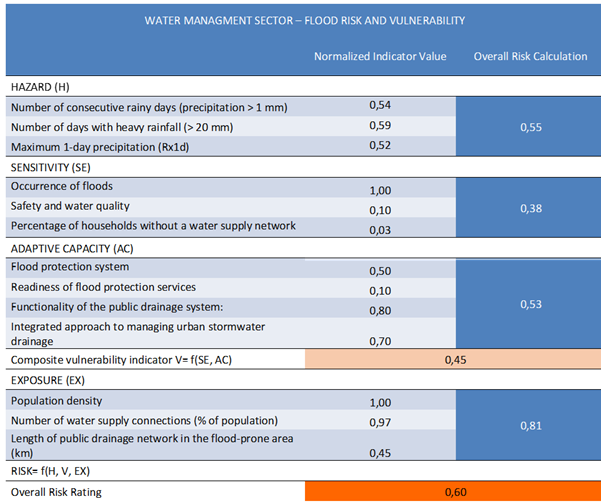<figcaption></figcaption></figure>

Table 11 - Example of composite risk calculation following the IVAVIA methodology. The table reports normalized values for hazard (precipitation-based indicators), sensitivity (flood occurrence and infrastructure fragility), adaptive capacity (defense systems, drainage functionality, and preparedness), and exposure (population and infrastructure in flood-prone areas). These elements are combined to derive the composite vulnerability indicator and the final overall risk rating.

***
