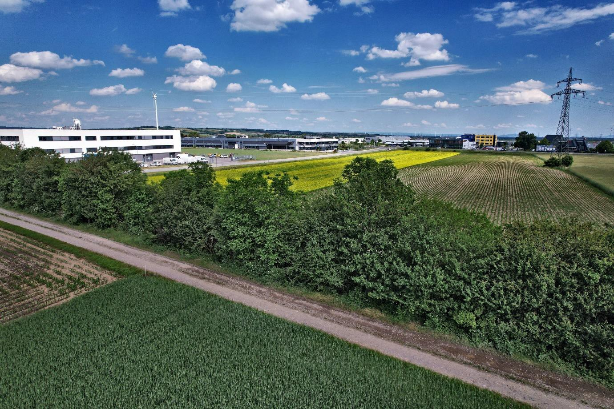
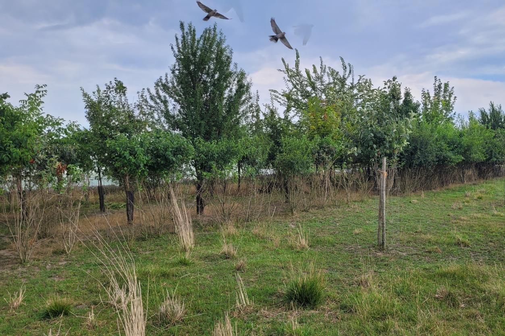
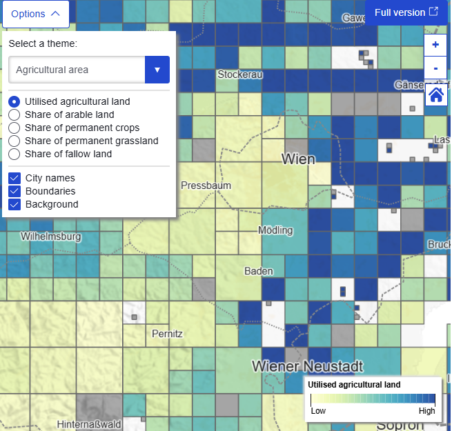
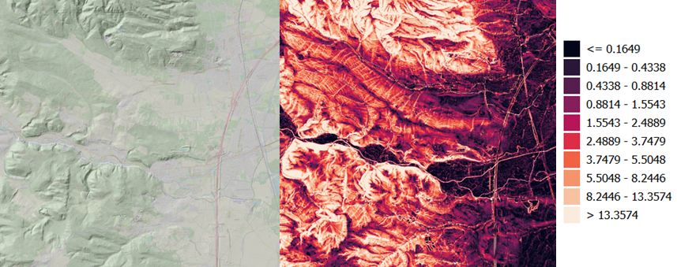
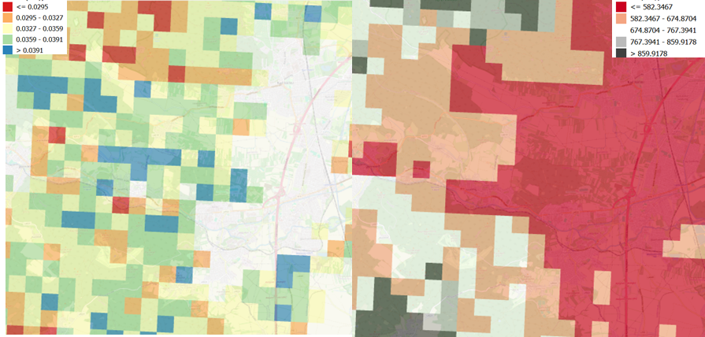
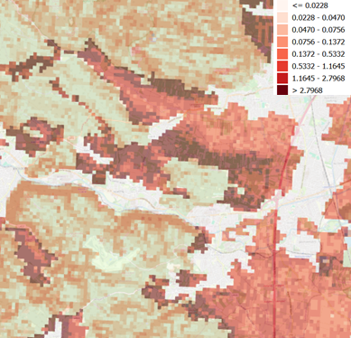
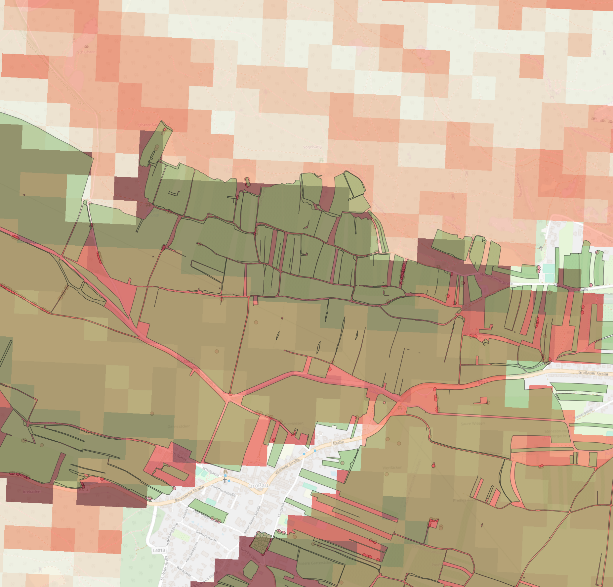

# aut lab1 er dr draft2

### Introduction and Objectives of the Climate Risk Assessment

#### Regional context

[Lower Austria](https://en.wikipedia.org/wiki/Lower_Austria) is a predominantly rural, arable landscape where agriculture is the primary exposure unit for climate risk analysis. The regional CRA focuses on **agricultural areas and evaluates risks at municipal and state scales.**

Innovation Lab 1 addresses water-related extremes—intense precipitation and drought—framed as **“too little and too much water.” Nb**S such as [multifunctional hedgerows](https://resist-project.eu/story/nature-based-solutions-in-rural-areas-hedgerows-and-traditional-bocages/) are considered to reduce **water-induced soil erosion and drought impacts** in crop areas.

<figure><figcaption>
Figure 1 - physical map of Lower Austria. Source: https://maps-austria.com/lower-austria-map
</figcaption></figure>

Under **future climate conditions**, both hazards are expected to intensify. The CRA therefore couples climate projections with exposure and vulnerability in farmland to quantify changing erosion and drought risks.

<figure><figcaption>
Figure 2 – example of existing hedges which have not been removed but included and extended in the ecoplus business park Wolkersdorf. Picture by ecoplus
</figcaption></figure>

The assessment is co-developed with regional partners to support evidence-based adaptation, informing state-level strategy and coordination of local measures and land-use planning.

#### Scope of the tutorial.

This tutorial sets out a replicable Climate Risk Assessment for Lower Austria’s Innovation Lab 1, written to be followed by practitioners who need to reproduce the work in other regions. It explains how to **evaluate risk for two agricultural hazards—water-induced soil erosion and agricultural drought**—and how to test multifunctional hedgerows as an adaptation option under the overarching theme of “too little and too much water.”

The assessment targets **arable land and is designed to inform decisions at both state and municipal levels** by linking spatial risk with adaptation potential, so that stakeholders can prioritize where and how to implement measures. Co-development with regional partners ensures that the workflow supports real planning needs and coordination of local actions.

&#x20;**Transferability is explicit**: users may replace European inputs with national or local datasets, adjust parameters, and adapt visualizations without altering the core logic of the workflow. The expected outcome is a **portable methodolog**y that connects risk assessment to targeted adaptation planning.&#x20;

&#x20;The tutorial also states the main boundaries of the approach. **Uncertainty in regional climate** projections and variability in **hedgerow performance** across soils, topographies, and practices limit precision; **prolonged drought followed by intense rainfall may exceed NbS capacity**, so results should feed an adaptive planning process.

***

<figure><figcaption>
Figure 3 - year-old multi-use hedge in Absdorf (Wagram). The hedge will be extended to create a habitat network during Lab 1. Picture by K. Deim (ABB).
</figcaption></figure>


Disclaimer

This tutorial is intended as a general workflow example for Innovation Lab 1 and does not replace software-specific documentation (e.g., GIS, hydrological or crop/soil erosion modelling tools user/technical manuals). Users should already be familiar with the relevant geospatial data formats, data pre-processing techniques, and modelling concepts applicable to extreme precipitation, soil erosion, and agricultural drought, as well as with the specific input/output requirements and run functionalities of the modelling software before attempting to replicate this workflow.


#### CRA objectives

The Lower Austria CRA aims to:

* Characterize **current and future** hazard conditions for **water-induced soil erosion and agricultural drought** in arable land using EURO-CORDEX and ÖKS15 projections together with national topographic and exposure datasets.
* Quantify **spatial risk and identify hotspots at municipal and state level**s to support evidence-based adaptation and coordination of local measures.
* Evaluate the effectiveness of **multifunctional hedgerows** as a Nature-based Solution to reduce erosion and drought impacts (and wind erosion where relevant) and indicate where they deliver the highest benefits.
* Provide a **transferable methodology** that links risk assessment with targeted adaptation planning and can be replicated by substituting datasets and adjusting parameters.
* **Inform adaptive planning under uncertaint**y through a co-developed process that combines spatial risk with adaptation potential.

#### Intended users

The Climate Risk Assessment developed in Innovation Lab 1 is designed to support both **broad-scale strategic planning at the state level** and the **coordination of local adaptation measures** in rural, arable regions of Lower Austria. It addresses stakeholders from **science and administration** who are directly involved in **land-use planning and climate adaptation**, and it is co-developed together with partners from the pilot region.

By combining spatial risk assessment with adaptation potential, the CRA is intended to inform **decision-making processes and help authorities and practitioners** prioritize actions and align them with long-term climate resilience goals.

***

### Hazard – Soil erosion

#### Description and context

The assessment of soil erosion in Innovation Lab 1 focuses on **water-induced processes affecting arable land i**n Lower Austria. The CRA applies the Revised Universal Soil Loss Equation (RUSLE) to estimate average annual soil loss and to evaluate how erosion risks may evolve under changing climate conditions. The approach builds on an Austria-wide erosion risk study ([Schmaltz et al., 2023](https://www.sciencedirect.com/science/article/pii/S0167880923002499)) and refines it for the regional scale by incorporating **updated climate projections and local exposure patterns.**

Future scenarios are produced by coupling the RUSLE framework with EURO-CORDEX precipitation and temperature projections under different Representative Concentration Pathways (RCPs). The resulting analysis provides a **spatially explicit view of soil erosion risks**, serving as a basis for testing adaptation measures such as multifunctional hedgerows and for informing land-use planning in agricultural landscapes.

| Dimension               | Indicator(s)                                                   | Unit                       | Purpose                                                                                |
| ----------------------- | -------------------------------------------------------------- | -------------------------- | -------------------------------------------------------------------------------------- |
| Soil loss               | Average annual soil erosion from cropland estimated with RUSLE | t/ha/yr                    | Quantify baseline and future erosion risk                                              |
| Rainfall erosivity      | R-Factor from climate projections and station data             | MJ mm ha-1 h-1 yr-1        | Represent intensity of precipitation as driver of erosion, may change in CC conditions |
| Topography              | LS-Factor (slope length and steepness)                         | dimensionless              | Capture terrain influence on erosion susceptibility, used to simulate Nbs effect       |
| Land cover & management | C-Factor reflecting crops, practices, and NbS (hedgerows)      | dimensionless              | Assess effect of land use and measures on erosion rates, used to simulate Nbs effect   |
| Exposure                | Extent of arable land at municipal and state level             | hectares                   | Define spatial units where erosion risk is calculated                                  |
| Vulnerability           | Socio-economic farming characteristics                         | index (municipality level) | Integrate social dimension into erosion risk assessment                                |

Table 1 – key indicators tracked — Erosion Hazard

#### Data sources and tools

The soil erosion workflow in Innovation Lab 1 builds on the Austrian national erosion **risk assessment described by** [**Schmaltz et al. (2023)**](https://www.sciencedirect.com/science/article/pii/S0167880923002499), adapting it to the regional scale of Lower Austria.

The approach combines **high-resolution national datasets with climate projections** to parameterize the RUSLE model. Hazard drivers such as rainfall erosivity, soil erodibility, topography, and land management are derived from Austrian sources including **ÖKS15 climate scenarios, the 10 m DEM, INVEKOS crop parcel data, and national soil maps**. These are complemented by socio-economic data (Farm Structure Survey) to integrate exposure and vulnerability.

To ensure that the workflow can be replicated in other regions, European open datasets provide equivalent substitutes: Copernicus DEM for topography, the Copernicus Climate Data Store for climate projections and impact indicators, and ESDAC for soil parameters. This dual setup—national where available, European where needed—guarantees both local accuracy and transferability.

| Data type                                        | Source                                                                                                                            | Role in workflow                                                                                     | Open/EU alternative                                                                                                                                                                                                                                                                                                                                                                                                   |
| ------------------------------------------------ | --------------------------------------------------------------------------------------------------------------------------------- | ---------------------------------------------------------------------------------------------------- | --------------------------------------------------------------------------------------------------------------------------------------------------------------------------------------------------------------------------------------------------------------------------------------------------------------------------------------------------------------------------------------------------------------------- |
| Climate projections (precipitation, temperature) | [ÖKS15](https://data.hub.geosphere.at/group/oks15) Austrian scenarios, 1 km)                                                      | Input for rainfall erosivity (R-factor), baseline and future scenarios                               | Copernicus [EURO-CORDEX ](https://cds.climate.copernicus.eu/datasets/projections-cordex-domains-single-levels?tab=overview)(12.5 km /0.11°)                                                                                                                                                                                                                                                                           |
| Meteorological observations                      | [Austrian weather station network](https://data.hub.geosphere.at/group/stationsdaten)                                             | Calibration and validation of rainfall erosivity                                                     | 
ERA5-Land post-processed daily statistics from 1950 to present (<a href="https://cds.climate.copernicus.eu/datasets/derived-era5-land-daily-statistics?tab=overview"> open, raster</a>)

Daily gridded observational dataset for precipitation, temperature, E-OBS <a href="https://surfobs.climate.copernicus.eu/dataaccess/access_eobs.php">(open , gridded )</a>,
                                      |
| Topography                                       | [National DEM Austria ](https://www.data.gv.at/katalog/en/dataset/b5de6975-417b-4320-afdb-eb2a9e2a1dbf#additional-info)(10 m)     | Derivation of LS-factor (slope, flow accumulation)                                                   | Copernicus DEM - Global and European Digital Elevation Model [(open – raster 30m, 10m for selected users)](https://dataspace.copernicus.eu/explore-data/data-collections/copernicus-contributing-missions/collections-description/COP-DEM)                                                                                                                                                                            |
| Land use and crop data                           | [INVEKOS](https://www.data.gv.at/katalog/dataset?tags=INVEKOS) parcel dataset                                                     | Agricultural fields and crop information; Input for C-factor and definition of arable exposure units | [CORINE Land Cover 2018 (vector/raster 100 m), Europe, 6-yearly](https://land.copernicus.eu/en/products/corine-land-cover/clc2018)                                                                                                                                                                                                                                                                                    |
| Soil properties                                  | [Austrian national soil maps](https://geometadatensuche.inspire.gv.at/metadatensuche/inspire/ita/catalog.search#/search?any=soil) | Input for K-factor (soil erodibility)                                                                | ESDAC datasets (500 m [K](https://esdac.jrc.ec.europa.eu/content/soil-erodibility-k-factor-high-resolution-dataset-europe)-[R](https://esdac.jrc.ec.europa.eu/content/rainfall-erosivity-european-union-and-switzerland) factor, 100 m [C](https://esdac.jrc.ec.europa.eu/content/cover-management-factor-c-factor-eu), and [P](https://esdac.jrc.ec.europa.eu/content/support-practices-factor-p-factor-eu)-factors) |
| Agricultural structure and socioeconomics        | Austrian [Farm Structure Survey](https://www.statistik.at/en/about-us/surveys/agriculture-and-forestry/farm-structure-survey)     | Vulnerability indicators (farm structure, income dependency, demographics) at municipal level        | [Eurostat Geospatial data from agricultural census](https://ec.europa.eu/eurostat/web/experimental-statistics/geospatial-data-agricultural-census)                                                                                                                                                                                                                                                                    |

Table 2 – used data, and alternative datasets to replicate the assessment outside the study area, when available


Climate change effects

_The rainfall erosivity factor (R) is available from_ [_ESDAC_](https://esdac.jrc.ec.europa.eu/content/rainfall-erosivity-european-union-and-switzerland) _as a baseline dataset for the EU and Switzerland, derived from high-resolution pluviograph data and interpolated to a 500 m grid (Panagos et al., 2015). In addition to the baseline, ESDAC also provides future projections of R under climate change, calculated from bias-corrected regional climate model outputs (EURO-CORDEX). These projections indicate a general increase in rainfall erosivity towards 2050, especially in central and northern Europe, reflecting the expected intensification of extreme precipitation. Users can therefore choose between present-day R for baseline assessments and climate-adjusted R layers for scenario analyses in RUSLE applications._


<figure><figcaption>
Figure 4 - Example layer showing reference parcels and digitized landscape elements defined by Agrarmarkt Austria under the EU Horizontal CAP Regulation, annually updated, enabling precise linkage of soil erosion modelling results with field-scale agricultural units.
</figcaption></figure>

<figure><figcaption>
Figure 5 - large-scale assessments, vulnerability proxies are available from Eurostat’s experimental geospatial agricultural census datasets (multi-resolution grids, 1–80 km), providing spatially harmonised indicators on farm number, cultivated areas, farmer demographics (age, gender), livestock, labour, and production methods. While coarser in scale, these can serve as vulnerability layers when regional data are unavailable.
</figcaption></figure>

The soil erosion workflow is implemented using a **RUSLE-based modelling approach**, adapted to the regional scale of Lower Austria. The model itself is not a standalone application but is coded and executed within a spatial analysis environment. **RUSLE is essentially a multiplicative model: once all factor layers (R, K, LS, C, P) are prepared,** the application reduces to a raster-based calculation in GIS, as will be detailed later in the methodological section

To handle geospatial data, preprocess inputs, and visualize outputs, a **GIS platform such as QGIS** is used. This provides the necessary functionality to manage raster and vector datasets, derive topographic parameters from the DEM, and integrate climate and land-use data.

The combination of RUSLE calculations with GIS processing ensures that erosion risk can be **mapped** consistently across agricultural areas and aggregated at municipal and state levels for decision support.

| Tool                                         | Type                   | Role                                                                                                                                                                                   |
| -------------------------------------------- | ---------------------- | -------------------------------------------------------------------------------------------------------------------------------------------------------------------------------------- |
| RUSLE (Revised Universal Soil Loss Equation) | Open / empirical model | Core model to estimate average annual soil loss under current and future climate scenarios. (see note)                                                                                 |
| [QGIS](https://qgis.org/)                    | Open-source GIS        | Data preprocessing, derivation of LS-factor (via SAGA GIS tools), conversion of land use and soil/parcel data into necessary RUSLE factors, mapping and visualization of erosion risk. |

Table 3 – Used tools and role in the Erosion Hazard workflow, all tools are free to use.


Note on deriving R, K, C and P factors

_The calculation of soil erodibility (K), cover/management (C) and support practices (P) requires reclassification of local datasets (soil maps, crop parcels, or land management layers) using standard lookup tables. In the Austrian case, this could be done following the methodology of_[ _Schmaltz et al. (2023)_](https://www.sciencedirect.com/science/article/pii/S0167880923002499)_, where K is assigned to soil units, and C and P are linked to INVEKOS crop and management information._

_For replication in regions where only European data are available, users may apply the pre-computed ESDAC layers (R, K at 500 m; C, P at 100 m). However, these products are relatively coarse. To increase accuracy, user may invest time in deriving_ [_R_](https://www.sciencedirect.com/science/article/pii/S004896971500011X) [_K_](https://www.sciencedirect.com/science/article/pii/S0048969714001727)_,_ [_C_](https://www.sciencedirect.com/science/article/pii/S0264837715001611) _and_ [_P_](https://www.sciencedirect.com/science/article/pii/S1462901115000611) _from more detailed meteorological , spoil or parcel datasets when available, using the lookup values provided in in the ref. article from the European Soil Data Centre._


#### Methodology



### Step 1 — Data acquisition and preparation

The first step of the workflow is the collection and preprocessing of all input datasets required to parameterize the RUSLE model. **When local and national datasets are available, each factor must be recalculated specifically for the study area**.

* Topography (LS-factor): **directly derived from the DE**M using the LS-factor function of SAGA GIS within QGIS. This ensures a spatially explicit representation of slope length and steepness adapted to local terrain conditions.
* Rainfall erosivity (R-factor), soil erodibility (K-factor), cover-management (C-factor), and support practice (P-factor): require **reclassification of local data source**s. Values are assigned using lookup tables based on soil maps, parcel and crop information, and national climate data.

Preprocessing includes harmonizing coordinate systems, resampling datasets to a common resolution, and rasterizing vector inputs such as field parcels or management practices.

As an alternative, where local data are not available, users may rely on the precomputed ESDAC products (R at 500 m, K/C/P at 100 m). These datasets are coarser in resolution but provide a consistent and harmonised European baseline for exploratory assessments and large-scale applications, as illustrated in the example maps provided below.

<figure><figcaption>
Figure 6 – example of 10 m Lidar derived DTM from Austrian geoportal (left) and corresponding LS factor derived in QGIS (right)
</figcaption></figure>

<figure><figcaption>
Figure 7 – examples of Rainfall Erosivity R [MJ mm ha-1 h-1 yr-1] (left) and Soil Erodibility (K-Factor, right) from ESDAC databases.
</figcaption></figure>




### Step 2 — Model setup and run

The modelling step corresponds to the direct application of the RUSLE formula, i.e. the **multiplication of all prepared factor layers** via basic raster calculator (map algebra) in GIS:

E = R × K × LS × C × P

where E is the estimated average annual soil loss (“Erosion”) in **t ha⁻¹ yr⁻¹**.  \
See also \[1] [https://esdac.jrc.ec.europa.eu/themes/rusle2015 ](https://esdac.jrc.ec.europa.eu/themes/rusle2015)

Each factor layer (R, K, LS, C, P) had been previously (Step 2) derived or reclassified from local datasets, harmonised to the same projection and resolution.

The resulting erosion map provides the **annual mean soil loss rate**, which represents the standard output unit for RUSLE applications.

For methodological details and reference values of the factors, users cloud also consult the following key sources:

* [R-factor](https://www.sciencedirect.com/science/article/pii/S004896971500011X) (rainfall erosivity): Panagos et al., 2015 (_Science of the Total Environment_) – ESDAC dataset for Europe.
* [K-factor](https://www.sciencedirect.com/science/article/pii/S0048969714001727) (soil erodibility): Panagos et al., 2014 (_Geoderma_) – European soil erodibility map.
* LS-factor (topography): [SAGA-GIS Tool Library](https://saga-gis.sourceforge.io/saga_tool_doc/8.1.1/ta_hydrology_25.html)
* [_C_](https://www.sciencedirect.com/science/article/pii/S0264837715001611)- and [_P_](https://www.sciencedirect.com/science/article/pii/S1462901115000611)-factors (cover and practices): Panagos et al., 2015 (_Environmental Modelling & Software_) – European C and P factor datasets.

For simplicity, the soil erosion map (E \[t ha⁻¹ yr⁻¹]) presented below (Figure 8) is derived directly from the [RUSLE2015 soil erosion dataset](https://esdac.jrc.ec.europa.eu/content/soil-erosion-water-rusle2015/) published by ESDAC, following the above described methodology



### Step 3 — Analysis and interpretation

The erosion hazard map derived from the RUSLE model provides the core spatial output, but its value lies in how the results are analysed and interpreted. In Innovation Lab 1, this step focuses on transforming raw model outputs into information that can support planning and decision-making.

&#x20;First, the raster of mean annual soil loss (_t ha⁻¹ yr⁻¹_) can be **aggregated from small to larger territorial unit ( e.g. municipal and state boundaries** (as in the example of Figure 8), allowing  direct comparison across relevant administrative units and integration into existing planning frameworks. This allows local authorities to identify where erosion risk is systematically higher within their jurisdiction.

&#x20;Second, the analysis highlights **erosion hotspot**s by applying thresholds to the raster map and overlaying them with cropland exposure. These hotspots indicate priority areas for targeted interventions, including the implementation of multifunctional hedgerows and other Nature-based Solutions.

&#x20;Third, **scenario comparisons** are undertaken. Results can be analysed **under different climate projections** (EURO-CORDEX, ÖKS15) to quantify the expected increase in hazard due to climate change.

Finally, the interpretation integrates **socio-economic vulnerability indicators at municipal level,** such as farm structure and dependence on agricultural income. This combination of hazard, exposure, and vulnerability highlights areas where physical risk coincides with lower adaptive capacity, providing a risk-oriented basis for prioritisation.

<figure><figcaption></figcaption></figure> <figure><figcaption></figcaption></figure>

<figure><figcaption>
Figure 8 – Left: extract from the RUSLE2015 soil erosion dataset (ESDAC), showing estimated average annual soil loss (t ha⁻¹ yr⁻¹) for a selected area in Austria, derived from the harmonised European layers of R, K, LS, C and P factors. Right: overlay of the same erosion map with INVEKOS reference parcels (Agrarmarkt Austria, 2025-1, Table 2), which represent agricultural blocks and digitised landscape elements under the EU CAP regulation. This integration allows soil erosion estimates to be directly linked to field-scale agricultural units. Aggregation example over larger territorial unit is provided in the lower figure.
</figcaption></figure>




### Step 4 — NbS testing

Testing of Nature-based Solutions focuses on the introduction of **multifunctional hedgerows** in arable land as a measure to mitigate soil erosion. Within the RUSLE framework, the presence of hedgerows is represented through adjustments of **LS- and C-factors**:

* **C-factor (cover and management)**: hedgerows increase permanent vegetative cover, reduce raindrop impact and promote soil stability (\[2],\[3]). This effect is simulated by assigning lower C values to cropland areas adjacent to or intersected by hedgerows.
*   **LS-factor (slope length and steepness)**: the establishment of hedgerows effectively interrupts slope length and alters runoff pathways, reducing the effective contributing area upslope of a pixel. In GIS terms this can be simulated by shortening slope lengths or by recalculating LS with breaks introduced along hedgerow alignments **modifying DTM to count for new morphology induced by NBS before reprocessing**.

The workflow in steps 2 and 3 shall then be repeated with adjusted LS and C values representing hedgerow implementation. The comparison of “with” and “without NbS” maps quantify the potential reduction of annual soil loss, highlighting those hotspots where hedgerows deliver the highest benefit.



***

### Hazard – Agricultural drought

#### Description and context

The second hazard assessed in Innovation Lab 1 is **agricultural drough**t, understood here as the insufficient availability of soil water to sustain crop growth during the vegetation period. In the context of Lower Austria, drought has become an increasingly relevant climate risk alongside water-induced soil erosion. While the region is traditionally well supplied with rainfall, recent summers have shown more frequent dry spells and heat periods, affecting yields and farm income.

&#x20;Within the CRA, drought is approached through an **indicator-based method** that combines climate variables (precipitation and temperature) with soil and land use characteristics to estimate water deficit conditions in cropland. Climate change scenarios (EURO-CORDEX, ÖKS15) are used to explore how frequency and severity of droughts may evolve under future conditions.

The objective is to provide **spatially explicit drought hazard maps**, comparable with the erosion analysis, and to identify where agricultural areas are most exposed to prolonged soil moisture deficits. These results allow stakeholders to evaluate the relative importance of “too little water” in comparison to “too much water” and to consider adaptation options at both municipal and regional planning levels.

| Dimension | Indicator(s)                                                                   | Unit         | Purpose                                                            |
| --------- | ------------------------------------------------------------------------------ | ------------ | ------------------------------------------------------------------ |
| Hazard    | Potential crop yield loss in rainfed conditions (derived from ETa / ETn ratio) | % yield loss | Quantify drought stress on crops under baseline and future climate |

Table 4 – key indicators tracked — Agricultural Drought Hazard

#### Data sources

The assessment of agricultural drought in Innovation Lab 1 is explicitly based on the [CLIMAAX Risk Workflow for agricultural systems](https://handbook.climaax.eu/notebooks/workflows/DROUGHTS/02_agriculture_drought/AGRICULTURE_Risk_workflow_description.html). By design this CRA methodology follows an **indicator-based approach** that combines climate drivers, soil water holding capacity, crop exposure, and vulnerability information to derive **potential yield losses under rainfed conditions.**

In this section we therefore focus only on the datasets required to apply the workflow, both at Austrian and European scale. The full methodological description is not repeated here but is entirely referred to the official  [CLIMAAX Risk Workflow for agricultural systems](https://handbook.climaax.eu/notebooks/workflows/DROUGHTS/02_agriculture_drought/AGRICULTURE_Risk_workflow_description.html).

For the regional application in Lower Austria, the CRA uses **ÖKS15 climate scenarios (1 km), EURO-CORDEX simulations** (12.5 km), and national meteorological observations as the basis for calculating reference evapotranspiration (ET₀) and effective evapotranspiration (ETₐ).

Soil water holding capacity is derived from **national soil maps**, while exposure is defined through the **INVEKOS parcel dataset** with crop-specific attributes.

**National agricultural statistics** provide information on crop production and economic value, while irrigation distribution and socio-economic data from the **Farm Structure Survey** represent the main vulnerability layers.&#x20;

Elevation and climate zoning are also included to reflect topographic and thermal conditions influencing crop growth.

To ensure replicability outside Austria, equivalent **European open datasets** can be used, such as **Copernicus** **CD**S (precipitation, temperature, evapotranspiration indices), **ESDAC** (soil hydraulic properties), **MapSPAM/FAO-IIASA GAEZ** (crop maps, yields, irrigation, climate zones), the **Copernicus DEM**, and **Eurostat agricultural census data.** This dual setup allows both accurate local analysis and transferability to other regions.

***

| Data type                                        | Source (Austria)                                                                                                              | Role in workflow                                                 | Open/EU alternative                                                                                                                                                                                                                                                                                                                                                             |
| ------------------------------------------------ | ----------------------------------------------------------------------------------------------------------------------------- | ---------------------------------------------------------------- | ------------------------------------------------------------------------------------------------------------------------------------------------------------------------------------------------------------------------------------------------------------------------------------------------------------------------------------------------------------------------------- |
| Climate projections (precipitation, temperature) | [ÖKS15 ](https://data.hub.geosphere.at/group/oks15)(Austrian scenarios, 1 km),                                                | Input for ET₀, ETn, ETa and drought hazard calculation           | Copernicus [EURO-CORDEX ](https://cds.climate.copernicus.eu/datasets/projections-cordex-domains-single-levels?tab=overview)(12.5 km /0.11°)                                                                                                                                                                                                                                     |
| Meteorological observations                      | [Austrian weather station network](https://data.hub.geosphere.at/group/stationsdaten)                                         | Input for ET₀, ETn, ETa and drought hazard calculation           | 
ERA5-Land post-processed daily statistics from 1950 to present (<a href="https://cds.climate.copernicus.eu/datasets/derived-era5-land-daily-statistics?tab=overview"> open, raster</a>)

Daily gridded observational dataset for precipitation, temperature, E-OBS <a href="https://surfobs.climate.copernicus.eu/dataaccess/access_eobs.php">(open , gridded )</a>
 |
| Elevation                                        | [National DEM Austria ](https://www.data.gv.at/katalog/en/dataset/b5de6975-417b-4320-afdb-eb2a9e2a1dbf#additional-info)(10 m) | Derivation of topographic effects and climate zoning             | Copernicus DEM - Global and European Digital Elevation Model [(open – raster 30m, 10m for selected users)](https://dataspace.copernicus.eu/explore-data/data-collections/copernicus-contributing-missions/collections-description/COP-DEM)                                                                                                                                      |
| Thermal climate zones                            | —                                                                                                                             | Crop-specific growing conditions and evapotranspiration          | 
<a href="https://www.gaez.iiasa.ac.at/">FAO-IIASA GAEZ</a> climate zones

Thermal climate zones of the world (<a href="https://data.apps.fao.org/catalog/iso/68790fd0-690c-11db-a5a5-000d939bc5d8">FGGD</a>)
                                                                                                                                                        |
| Soil available water capacity (AWC)              | —                                                                                                                             | Soil buffering capacity against drought                          | [Hengl and Gupta (2019)](https://zenodo.org/records/2629149)                                                                                                                                                                                                                                                                                                                    |
| Crop distribution                                | INVEKOS parcel dataset                                                                                                        | Definition of crop types, derive Crop production map for Austria | [CORINE Land Cover 2018 (vector/raster 100 m), Europe, 6-yearly](https://land.copernicus.eu/en/products/corine-land-cover/clc2018)                                                                                                                                                                                                                                              |
| Crop-specific information                        | —                                                                                                                             | Specific parameters needed for the hazard assessment             | [Climaxx Handbook](https://handbook.climaax.eu/notebooks/workflows/DROUGHTS/02_agriculture_drought/crop_table.html)                                                                                                                                                                                                                                                             |
| Crop production \[ton]                           | —                                                                                                                             | crop production to calculate exposure ( first exposure dataset)  | [MapSPAM repository](https://dataverse.harvard.edu/dataset.xhtml?persistentId=doi:10.7910/DVN/SWPENT)                                                                                                                                                                                                                                                                           |
| Crops aggregated value                           | —                                                                                                                             | Second exposure dataset                                          | FAO-GAEZ [Global Agro-Ecological Zones](https://www.fao.org/gaez/en/)                                                                                                                                                                                                                                                                                                           |
| Irrigation availability                          | —                                                                                                                             | Cropland full-irrigation availability to define vulnerability    | GAEZ v5  [Share of irrigated land](https://data.apps.fao.org/catalog/iso/5e11e7c5-9088-4f1a-80df-04ef026bd726)                                                                                                                                                                                                                                                                  |

Table 5 – used data, and alternative datasets to replicate the assessment outside the study area, when available

Reference

1. https://esdac.jrc.ec.europa.eu/themes/rusle2015
2. https://savoursoilpermaculture.com/the-ecological-significance-of-hedgerows-a-multidimensional-approach/
3. https://www.sciencedirect.com/science/article/abs/pii/S1161030109000653

