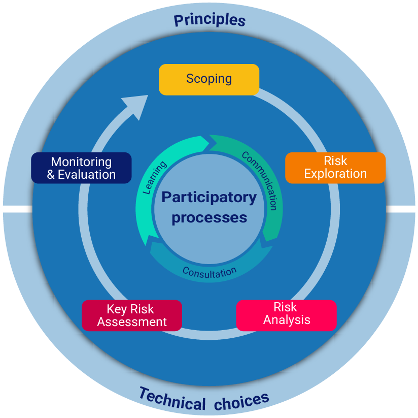
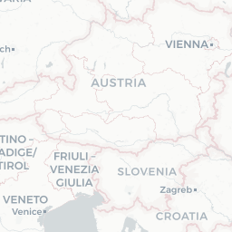
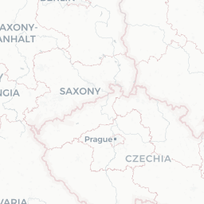
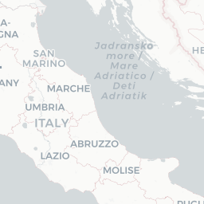

# CLIMAAX CRA Handbook — CLIMAAX CRA Handbook

Regional Climate Risk Assessment Resources

Navigating Climate Risk Assessments (CRA): CLIMAAX guides you through your regional Climate Risk Assessments and provides you with tools and datasets for the assessment.

## Do you have an up-to-date climate risk assessment for your region?

A regional climate risk assessment is often needed to design or update a climate adaptation and/or risk management plan. Regular updates are needed considering changing climate risk profiles!


HAZARD × EXPOSURE × VULNERABILITY = RISK


Changing trends in climate hazards (extreme weather or hydrological conditions)

Changing exposure (due to evolving land use or infrastructure layout)

Changing vulnerability patterns (due to dynamic population structures)

Before starting your climate risk assessment, it is recommended to make an inventory of potential hazards affecting your region and sketch the policy context where the CRA will be used.

## The Framework

The CLIMAAX CRA Framework is designed to support you in your regional climate risk assessments in five participatory steps while ensuring social justice and equity.

Read more about the CLIMAAX Framework: https://handbook.climaax.eu/CRA\_steps/framework.html

## The Workflows

The CLIMAAX CRA Workflow provides tools and datasets that you can use for your regional climate risk assessments.\
The Workflow is designed in such a way that it can be used by any region while maintaining a high level of flexibility to adjust it to the needs of your region! This might include replacing European datasets with local datasets, adjusting parameters of the assessment, or changing the visualization.

* Explore European datasets for the risk assessment: https://handbook.climaax.eu/CRA\_steps/analysis/datasets.html
* Explore workflows for the risk assessment for various hazards: https://handbook.climaax.eu/CRA\_steps/analysis/workflows.html

## A quick example for a river flood risk assessment

By combining the river flood hazard map with other layers such as critical infrastructure or vulnerable population, we can identify areas that are at risk.

The map below shows an example of flood risk assessment for health facilities across the EU. Users can simply overlay the flood hazard map corresponding to a 100-return period with the locations of health facilities to identify at risk of flooding. The source of data for this map are the river flood hazard maps from the EU Joint Research Centre: https://data.jrc.ec.europa.eu/collection/id-0054. The locations of EU health facilities are retrieved from OpenStreetMap.

(Several map tile images — these render tiled basemap imagery)

  .png>) .png>)  .png>) .png>) .png>) .png>) .png>) .png>) .png>) .png>) .png>) .png>) .png>) .png>) .png>) .png>) .png>) .png>) .png>) .png>) .png>) .png>) .png>) .png>)

(Map layer showing EU health facilities — WMS tile images)

        

(Flood hazard map (RP100y) — WMS tile images)

\&width=256\&height=256\&srs=EPSG%3A3857\&bbox=1252344.2714243277,5635549.221409476,1878516.407136492,6261721.357121641) \&width=256\&height=256\&srs=EPSG%3A3857\&bbox=1252344.2714243277,6261721.357121641,1878516.407136492,6887893.492833805) \&width=256\&height=256\&srs=EPSG%3A3857\&bbox=626172.1357121639,5635549.221409476,1252344.2714243277,6261721.357121641) \&width=256\&height=256\&srs=EPSG%3A3857\&bbox=1878516.407136492,5635549.221409476,2504688.5428486555,6261721.357121641) \&width=256\&height=256\&srs=EPSG%3A3857\&bbox=1252344.2714243277,5009377.085697314,1878516.407136492,5635549.221409476) \&width=256\&height=256\&srs=EPSG%3A3857\&bbox=626172.1357121639,6261721.357121641,1252344.2714243277,6887893.492833805) \&width=256\&height=256\&srs=EPSG%3A3857\&bbox=1878516.407136492,6261721.357121641,2504688.5428486555,6887893.492833805) \&width=256\&height=256\&srs=EPSG%3A3857\&bbox=626172.1357121639,5009377.085697314,1252344.2714243277,5635549.221409476) \&width=256\&height=256\&srs=EPSG%3A3857\&bbox=1878516.407136492,5009377.085697314,2504688.5428486555,5635549.221409476)

Zoom: \[+] https://handbook.climaax.eu/iframes/home/cra\_map\_example.html#\
Zoom: \[−] https://handbook.climaax.eu/iframes/home/cra\_map\_example.html#

Layers (in the original interactive map)

* Base layer
* EU health facilities
* EU Flood hazard map (RP 100y)

Leaflet: https://leafletjs.com/ | © OpenStreetMap contributors © CartoDB, CartoDB attributions: http://cartodb.com/attributions
