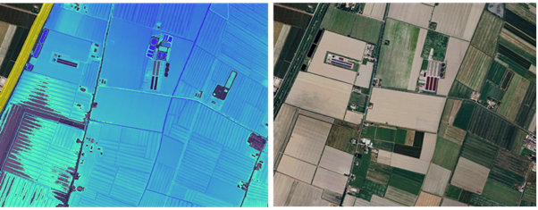

# Risk Assessment Methodology

This module outlines the methodology for conducting a climate risk assessment. The process includes:

* **Risk Identification:** Identify hazards and the elements at risk.
* **Impact Analysis:** Evaluate potential losses and damages.
* **Adaptation Options:** Identify Nature-Based Solutions and other measures.
* **Prioritization:** Rank measures based on effectiveness and feasibility.
* **Implementation Planning:** Develop a roadmap for action.
* **Monitoring & Evaluation:** Define indicators to track performance.

A core part of the toolbox is a standardized **risk assessment methodology** that cities and regions can follow. This methodology is rooted in international best practices (e.g. the IPCC framework) and ensures a comprehensive evaluation of risk. According to the IPCC, _“climate risk results from the interaction of hazard, exposure and vulnerability”_&#x200B; [iea.org](https://www.iea.org/reports/climate-resilience-policy-indicator/climate-hazard-assessment).&#x20;

Our toolbox guides users through assessing each of these dimensions:

1. **Hazard Assessment:** Identify and characterize the climate hazards of concern. Use data such as flood frequency curves, drought severity indices, fire weather indexes, or heatwave thresholds. For example, a city might assess the _100-year flood_ level or the number of _heatwave days per year_. The toolbox can include methods for both current climate conditions and future scenarios (e.g. mid-century projections under different emissions pathways).
2. **Exposure Analysis:** Determine what people, infrastructure, and ecosystems are exposed to each hazard. This involves mapping assets and populations in hazard-prone areas. For instance, calculate the population living in a floodplain, the length of roads in high wildfire risk zones, or the number of hospitals and schools in areas prone to heatwaves. Data from local spatial plans or national databases (served via CKAN) can support this. Exposure can be quantified in terms of economic value, population counts, or critical facility counts.
3. **Vulnerability Assessment:** Evaluate how susceptible those exposed elements are to harm, and their capacity to cope. Vulnerability has social, physical, and economic aspects – for example, elderly populations are more vulnerable to heat, poorly constructed buildings are more vulnerable to floods, and degraded ecosystems recover slower from droughts. Include indicators of sensitivity (e.g. % of impermeable surface in a city affecting flood runoff, or water demand per capita during drought) and adaptive capacity (e.g. existence of early warning systems, household income levels). **Vulnerability indices** or proxy indicators (like those for social vulnerability or ecosystem health) can be provided for users to select.

Combining these, the methodology leads to a **risk evaluation**. This could be quantitative – such as calculating expected annual damage from floods using hazard-intensity vs. damage curves​

[climaax.eu](https://www.climaax.eu/handbook/toolbox/)– or qualitative, such as scoring risk on a matrix (e.g. low/medium/high risk based on probability and impact)​[climaax.eu](https://www.climaax.eu/handbook/toolbox/). The toolbox can accommodate different approaches:

* _Risk = Hazard × Exposure × Vulnerability:_ a formula-based approach yielding risk metrics (useful for comparisons or aggregation).
* _Scenario analysis:_ modeling outcomes under various climate scenarios or development pathways.
* _Risk matrices and indices:_ if data is limited, a simpler ordinal ranking of risks can be used (combining likelihood and impact into categories).

This section should provide templates or worksheets for conducting the assessment. For instance, a **Risk Assessment Worksheet** might walk through a flood risk example step-by-step (possibly using Emilia-Romagna data as a case): starting from identifying flood hazard zones, overlaying exposed assets, assessing their vulnerability (e.g. building quality), and then summarizing risk. Throughout, it will reference data sources (like “use the flood inundation map from CKAN dataset X”) and tools (like GIS software or a spreadsheet model). By following this methodology, users will identify which climate risks are most critical in their region, and have a baseline against which to plan adaptation measures.

#### Climate Risk Assessment Framework

The climate risk assessment framework for each Innovation Lab across the Arcadia Regions has been defined after thorough consultation and is illustrated in the images below.

<figure><figcaption></figcaption></figure>

<figure><figcaption></figcaption></figure>

To ensure a comprehensive evaluation:

* **Hazard Analysis:** Identify climate hazards specific to the region.
* **Exposure Mapping:** Detail exposed populations, infrastructure, and ecosystems.
* **Vulnerability Assessment:** Evaluate susceptibilities and coping capacities.
* **Risk Evaluation:** Combine the above assessments to calculate risk levels.

This framework serves as a guide to tailor specific strategies for climate adaptation, prioritizing actions that address the most critical risks.

<figure><figcaption></figcaption></figure>

#### 🧭 Comparative Matrix – ARCADIA Innovation Labs (WP8)

| **Country / Region**                 | **Innovation Lab**                                  | **Main Climate Hazards**                            | **NBS / BGI Projects**                                                                              | **Models / Tools Used**                                      |
| ------------------------------------ | --------------------------------------------------- | --------------------------------------------------- | --------------------------------------------------------------------------------------------------- | ------------------------------------------------------------ |
| 🇮🇹 **Italy – Emilia-Romagna**      | **Lab 1 – SFM for flood & landslide risks**         | Floods, landslides                                  | Sustainable Forest Management (SFM), slope stabilization                                            | INVEST (SDR), RUSLE, CRITERIA3D                              |
|                                      | **Lab 2 – SFM for forest resilience & wood supply** | Floods, droughts, biodiversity loss                 | Forest resilience enhancement, sustainable harvesting                                               | INVEST (CSS), RUSLE, SWY                                     |
|                                      | **Lab 3 – FIAs for water quality & storage**        | Drought, heavy precipitation                        | Forested Infiltration Areas (FIAs), soil and water monitoring                                       | **SWAT+**, **IRRIFRAME**                                     |
| 🇦🇹 **Austria – Lower Austria**     | **Wagram–Tulln**                                    | Floods, droughts, heatwaves                         | Agroforestry systems, hedges, multifunctional shelterbelts                                          | Copernicus ERA5, CMIP5/6, Flood & Heat Models                |
|                                      | **Mistelbach–Wolkersdorf**                          | Urban heat, flooding                                | Urban greening, depaving, green facades                                                             | EUROCORDEX, UERRA, E-OBS                                     |
|                                      | **Amstetten**                                       | Soil erosion, drought                               | Rural greening, water retention                                                                     | Dashboards, story maps, REST APIs                            |
| 🇭🇷 **Croatia**                     | **Zagreb**                                          | Urban heat, flash floods                            | Rain gardens, green-blue belt                                                                       | Copernicus ERA5, Flood Hazard Models, GIS tools              |
|                                      | **Krapina–Zagorje**                                 | Landslides, biodiversity loss, heat                 | Urban gardens, green roofs (planned)                                                                | UERRA, E-OBS, INVEST                                         |
| 🇸🇪 **Sweden – Skåne Region**       | **Malmö**                                           | Heatwaves, floods                                   | Urban Landscape Lab (multifunctional green public spaces)                                           | Copernicus ERA5, CMIP6, Heat & Flood Models                  |
|                                      | **Helsingborg**                                     | Floods, drought, biodiversity loss                  | Blue-green peri-urban corridors                                                                     | Hydrological & land-use models                               |
|                                      | **Lund**                                            | Flood, drought                                      | Urban Forest (climate-adapted species, phytoremediation)                                            | SMHI, EUROCORDEX                                             |
| 🇩🇰 **Denmark – Funen Region**      | **Vollsmose (Odense)**                              | Floods, sea-level rise, groundwater rise, pollution | Rainwater lakes, open channels, reforestation, coastal wetlands, eelgrass & reef restoration        | DK2020 datasets, Copernicus ERA5, Jupyter NB, WMS dashboards |
| 🇸🇮 **Slovenia – Podravje Region**  | **Podravje**                                        | Flood, drought, urban heat                          | Wetland restoration, water reservoirs, vegetation restoration, rain gardens                         | Copernicus ERA5, Water Quality & Flood Models                |
| 🇧🇬 **Bulgaria – Plovdiv Province** | **Plovdiv**                                         | Floods, droughts, heatwaves, wildfires              | Floodplain/wetland restoration, riverbank stabilization, afforestation, biodiversity corridors      | ARPEGE, ALADIN, ERA5, Flood Hazard Models                    |
| 🇷🇴 **Romania – Centru Region**     | **Centru Region**                                   | Heatwaves                                           | Green & blue infrastructure, irrigation/drainage rehab, ecological wastewater plant, green mobility | Copernicus ERA5, CMIP6, National hydrological & GIS models   |

***

#### 🔍 Observations

* **Common Hazards:** Floods and droughts are universal; heatwaves dominate in urban regions (Zagreb, Malmö, Brașov).
* **Dominant NBS Types:**
  * _Forestry & watershed management_ → Italy, Slovenia, Bulgaria
  * _Urban greening & blue-green corridors_ → Austria, Croatia, Sweden
  * _Coastal & water cycle management_ → Denmark
  * _Green infrastructure & eco-urban planning_ → Romania
* **Most Used Models:**
  * **SWAT+** and **RUSLE** for hydrology and erosion
  * **INVEST** for ecosystem services
  * **EUROCORDEX / ERA5 / CMIP6** for climate projections
  * **Local DSS or national platforms** (ARPAE, SMHI, DK2020, IRRIFRAME) for regional integration

Below is a **comparative matrix** showing the relationship between **climate hazard classes** and the **types of Nature-Based Solutions (NBS) or Blue-Green Infrastructure (BGI)** implemented in the ARCADIA Innovation Labs (from _Annex 5 Flowcharts_ and _M8.2 Toolkit_).

***

### 🌍 Combined Matrix — Climate Hazards × NBS/BGI Types

| **Climate Hazard Class**                                                | **Typical NBS / BGI Project Types**                                                                                                                                                         | **Regions / Innovation Labs Applying Them**                                                                                                                                                                    | **Main Expected Benefits**                                                                                                |
| ----------------------------------------------------------------------- | ------------------------------------------------------------------------------------------------------------------------------------------------------------------------------------------- | -------------------------------------------------------------------------------------------------------------------------------------------------------------------------------------------------------------- | ------------------------------------------------------------------------------------------------------------------------- |
| **1. Floods (pluvial, fluvial, coastal)**                               | - Wetland & floodplain restoration - Riverbank & riparian vegetation - Forested Infiltration Areas (FIAs) - Agroforestry belts - Urban drainage / rain gardens - Blue-green corridors       | 
🇮🇹 Emilia-Romagna (Labs 1 &#x26; 3) 

🇦🇹 Lower Austria (Wagram–Tulln) 

🇩🇰 Funen (Vollsmose) 🇸🇪 Helsingborg, Malmö 

🇸🇮 Podravje 

🇧🇬 Plovdiv 

🇷🇴 Centru Region
 | - Reduced runoff & flood peaks - Increased infiltration and retention - Improved water quality - Biodiversity restoration |
| **2. Droughts / Water Scarcity**                                        | - Water reservoirs & infiltration forests - Irrigation & drainage rehabilitation - Wetland rewetting - Sustainable forest management (SFM) - Soil moisture monitoring & adaptive irrigation | 
🇮🇹 Emilia-Romagna (Lab 3) 

🇸🇮 Podravje 

🇩🇰 Funen 

🇷🇴 Centru (Irrigation rehab) 

🇸🇪 Helsingborg
                                                                        | - Increased water storage - Soil moisture conservation - Crop and forest resilience - Improved water reuse cycles         |
| **3. Landslides / Erosion**                                             | - Slope reforestation (SFM) - Terracing & soil retention buffers - Vegetated barriers - Erosion control forests (RUSLE-based)                                                               | 
🇮🇹 Emilia-Romagna (Lab 1) 

🇭🇷 Krapina-Zagorje (Pregrada) 

🇧🇬 Plovdiv
                                                                                                                  | - Stabilized slopes - Reduced sediment yield - Soil protection & reduced runoff                                           |
| **4. Heatwaves / Urban Heat Island (UHI)**                              | - Urban greening / depaving - Green roofs & facades - Urban forests - Parks & green corridors - Water-based cooling (urban blue elements)                                                   | 
🇦🇹 Lower Austria (Mistelbach, Amstetten) 

🇭🇷 Zagreb, Zabok 

🇸🇪 Malmö, Lund 

🇷🇴 Brașov 

🇩🇰 Funen (urban drainage + greening)
                                           | - Temperature reduction (2–4°C) - Improved air quality - Urban comfort & wellbeing - Carbon sequestration                 |
| **5. Biodiversity Loss / Ecosystem Fragmentation**                      | - Habitat restoration & green corridors - Forest & marine connectivity networks - Agroforestry & hedgerows - Blue-green infrastructure networks                                             | 
🇮🇹 Emilia-Romagna (SFM 2) 

🇦🇹 Lower Austria 

🇭🇷 Zabok 🇸🇪 Helsingborg 

🇧🇬 Plovdiv 

🇩🇰 Funen (BGI network)
                                                            | - Habitat connectivity - Pollination & ecosystem services - Soil & water quality improvement                              |
| **6. Coastal / Marine Hazards (Sea-level rise, erosion, salinization)** | - Coastal wetland & salt meadow restoration - Natural barriers (reefs, dunes, vegetated levees) - Blue corridors linking river–coast systems                                                | 
🇩🇰 Funen (Odense Fjord) 

🇸🇪 Helsingborg (peri-urban blue corridors) 🇧🇬 Plovdiv (riparian restoration)
                                                                                       | - Coastal protection - Reduced wave energy & erosion - Marine biodiversity enhancement                                    |
| **7. Wildfires**                                                        | - Afforestation & fire-resilient forestry - Forest fuel management (SFM)                                                                                                                    | 
🇧🇬 Plovdiv 

🇮🇹 Emilia-Romagna
                                                                                                                                                                 | - Reduced fire spread risk - Increased forest resilience                                                                  |
| **8. Air & Water Pollution**                                            | - Ecological wastewater treatment (constructed wetlands, vegetation filters) - Buffer strips & riparian zones - Rainwater harvesting systems                                                | 
🇷🇴 Viscri (ecological WWTP) 

🇩🇰 Funen (stormwater &#x26; nutrient control)

 🇮🇹 Emilia-Romagna (water quality SFM)
                                                                     | - Water purification - Reduced nutrient loads - Enhanced ecosystem health                                                 |

***

#### 🔍 Key Insights

* **Multi-hazard overlap:** Most NBS target _multiple hazards_ — e.g. wetlands address both floods _and_ droughts.
* **Dominant classes per region:**
  * _Forestry–mountain regions:_ Italy, Slovenia, Bulgaria
  * _Urban/heat–resilience:_ Austria, Croatia, Sweden
  * _Coastal/water systems:_ Denmark
  * _Infrastructure–pollution mitigation:_ Romania
* **Cross-cutting tools used:**
  * Hydrological & ecosystem models (**SWAT+**, **INVEST**, **RUSLE**)
  * Climate datasets (**ERA5**, **EUROCORDEX**, **CMIP6**)
  * Decision Support Systems (e.g. **IRRIFRAME**, **DK2020**, **ARPAE APIs**)

***

Would you like me to extend this matrix into a **visual cross-tab (hazards × NBS categories grid)** — e.g., with ✔️ marks or color-coded intensity (low/medium/high applicability) — suitable for inclusion in a report or ArcGIS dashboard?

🇮🇹 **Italy – Emilia-Romagna Region**

| **Innovation Lab**                                                                 | **Main Hazards**                    | **NBS / Projects**                                        | **Models / Tools Used**         |
| ---------------------------------------------------------------------------------- | ----------------------------------- | --------------------------------------------------------- | ------------------------------- |
| **Lab 1 – Sustainable Forest Management (SFM) aimed at flood and landslide risks** | Floods, landslides                  | Forest management for slope stability and runoff control  | INVEST (SDR), RUSLE, CRITERIA3D |
| **Lab 2 – SFM for forest resilience and wood supply chain valorization**           | Extreme rainfall, biodiversity loss | Sustainable forest harvesting and wood chain valorization | INVEST (CSS), RUSLE, SWY        |
| **Lab 3 – Forested Infiltration Areas (FIAs) for water quality and storage**       | Drought, heavy precipitation        | Forested infiltration areas, water quality monitoring     | **SWAT+**, **IRRIFRAME**        |

***

#### 🇦🇹 **Austria – Lower Austria Region**

| **Innovation Lab**         | **Main Hazards**         | **NBS / Projects**                                    | **Models / Tools Used**                                         |
| -------------------------- | ------------------------ | ----------------------------------------------------- | --------------------------------------------------------------- |
| **Wagram–Tulln**           | Flood, drought, heatwave | Agroforestry/hedges, multifunctional shelterbelts     | Flood hazard & heat models, Copernicus ERA5, CMIP5/6            |
| **Mistelbach–Wolkersdorf** | Urban heat, flooding     | Urban greening, depaving, climate-resilient buildings | EUROCORDEX, UERRA, E-OBS                                        |
| **Amstetten**              | Floods, drought          | Rural greening, water retention systems               | Same as above; models integrated into dashboards and story maps |

***

#### 🇭🇷 **Croatia**

| **Innovation Lab**  | **Main Hazards**                    | **NBS / Projects**                  | **Models / Tools Used**                              |
| ------------------- | ----------------------------------- | ----------------------------------- | ---------------------------------------------------- |
| **Zagreb**          | Urban heat, flash floods            | Rain gardens, green-blue belt       | Copernicus ERA5, Flood Hazard Models, GIS dashboards |
| **Krapina–Zagorje** | Landslides, biodiversity loss, heat | Urban gardens, under-evaluation NBS | E-OBS, UERRA, INVEST                                 |

***

#### 🇸🇪 **Sweden – Skåne Region**

| **Innovation Lab** | **Main Hazards**                    | **NBS / Projects**                                       | **Models / Tools Used**                           |
| ------------------ | ----------------------------------- | -------------------------------------------------------- | ------------------------------------------------- |
| **Malmö**          | Heatwave, flood                     | Urban Landscape Lab for multifunctional public spaces    | Copernicus ERA5, CMIP6, Heat Model                |
| **Helsingborg**    | Floods, droughts, biodiversity loss | Blue-green peri-urban corridors                          | Hydrological & land-use models                    |
| **Lund**           | Flood, drought                      | Urban Forest (climate-adapted species, phytoremediation) | SMHI data, EUROCORDEX, blue-green corridor models |

***

#### 🇩🇰 **Denmark – Funen Region**

| **Innovation Lab**     | **Main Hazards**                             | **NBS / Projects**                                                                                 | **Models / Tools Used**                                                              |
| ---------------------- | -------------------------------------------- | -------------------------------------------------------------------------------------------------- | ------------------------------------------------------------------------------------ |
| **Vollsmose (Odense)** | Flooding, sea level rise, rising groundwater | Rainwater lakes, open water channels, reforestation, coastal wetlands, eelgrass & reef restoration | DK2020 climate data, Copernicus ERA5, Jupyter NB, WMS dashboard, Flood Hazard Models |

***

#### 🇸🇮 **Slovenia – Podravje Region**

| **Innovation Lab**  | **Main Hazards**           | **NBS / Projects**                                                          | **Models / Tools Used**                              |
| ------------------- | -------------------------- | --------------------------------------------------------------------------- | ---------------------------------------------------- |
| **Podravje Region** | Flood, drought, urban heat | Wetland restoration, water reservoirs, vegetation restoration, rain gardens | Copernicus ERA5, Flood Hazard & Water Quality Models |

***

#### 🇧🇬 **Bulgaria – Plovdiv Province**

| **Innovation Lab**   | **Main Hazards**                       | **NBS / Projects**                                                                                    | **Models / Tools Used**                             |
| -------------------- | -------------------------------------- | ----------------------------------------------------------------------------------------------------- | --------------------------------------------------- |
| **Plovdiv Province** | Floods, droughts, heatwaves, wildfires | Floodplain and wetland restoration, afforestation, biodiversity conservation, riverbank stabilization | Copernicus ERA5, ARPEGE/ALADIN, Flood Hazard Models |

***

#### 🇷🇴 **Romania – Centru Region**

| **Innovation Lab** | **Main Hazards** | **NBS / Projects**                                                                                               | **Models / Tools Used**                                              |
| ------------------ | ---------------- | ---------------------------------------------------------------------------------------------------------------- | -------------------------------------------------------------------- |
| **Centru Region**  | Heat waves       | Green & blue infrastructure, irrigation & drainage rehab, Viscri wastewater plant, green urban strategy (Brașov) | Copernicus ERA5, CMIP6, national hydrological models, GIS dashboards |

