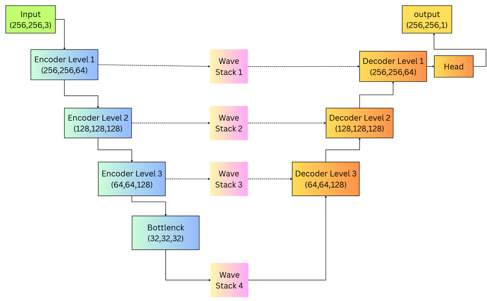
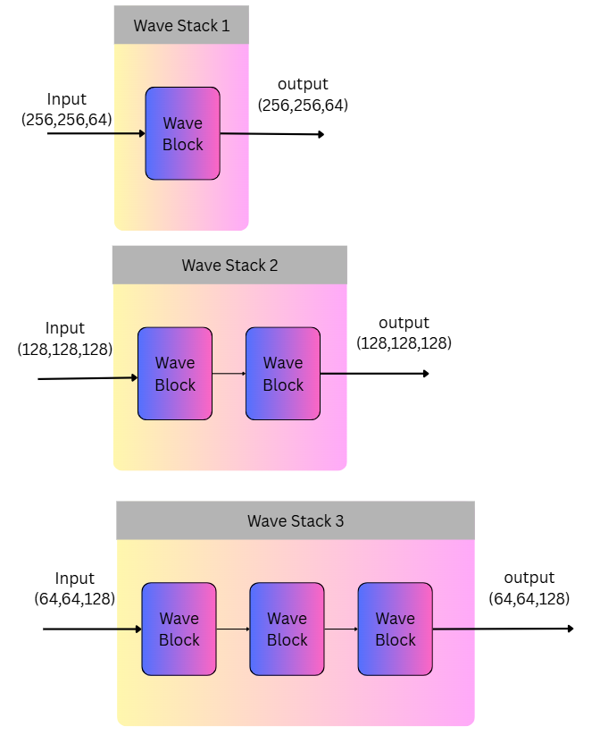
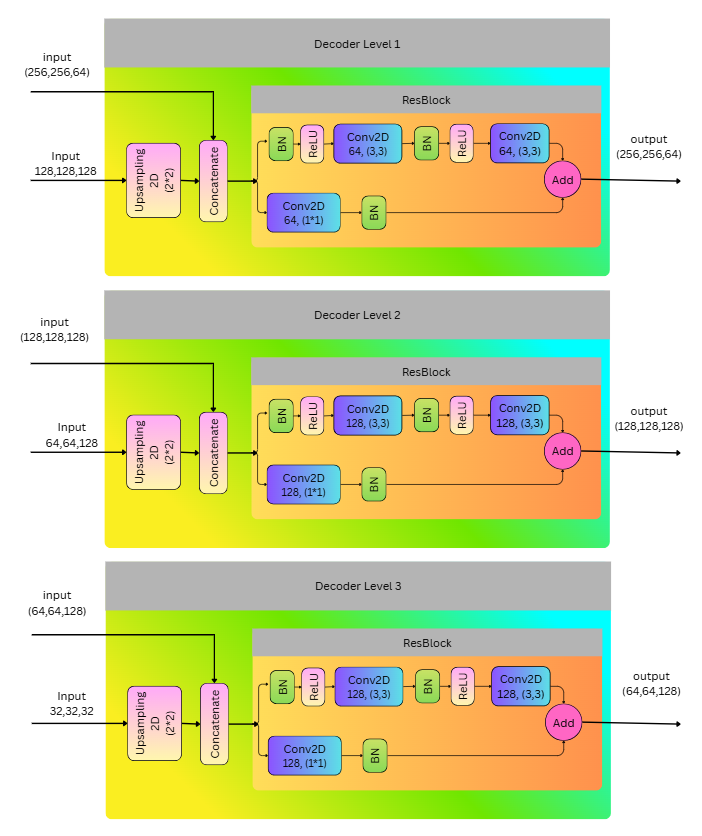
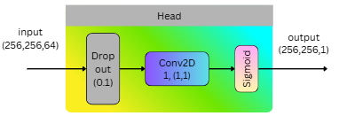
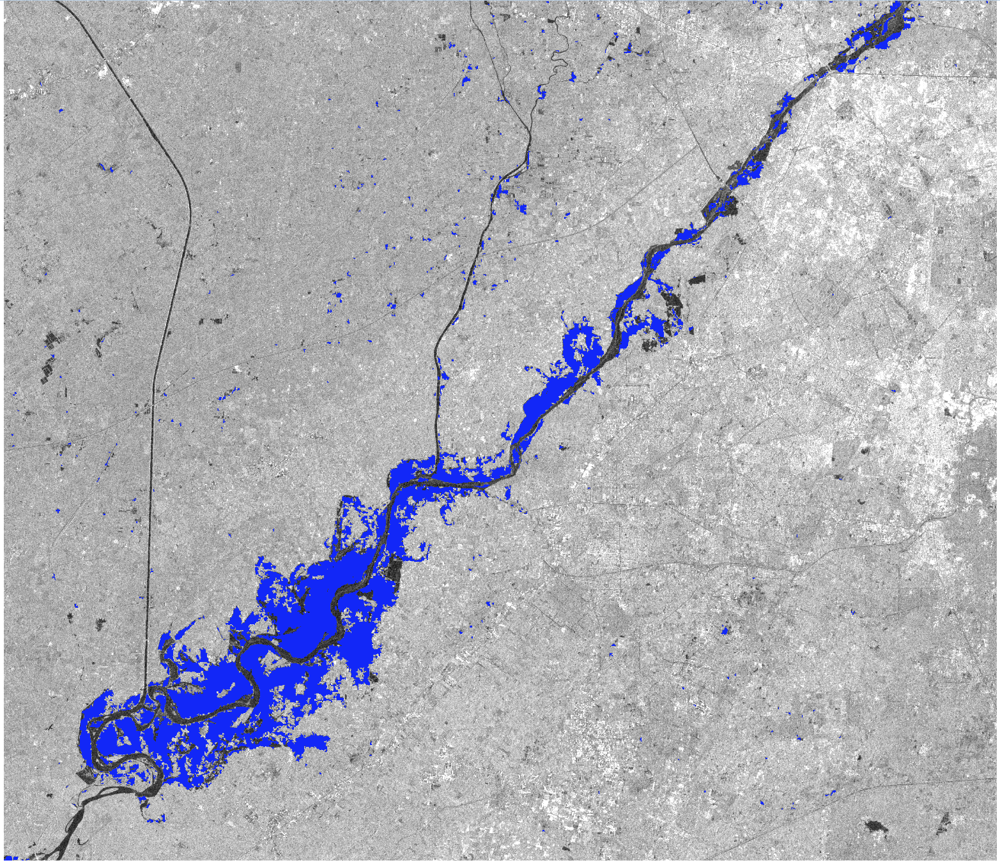
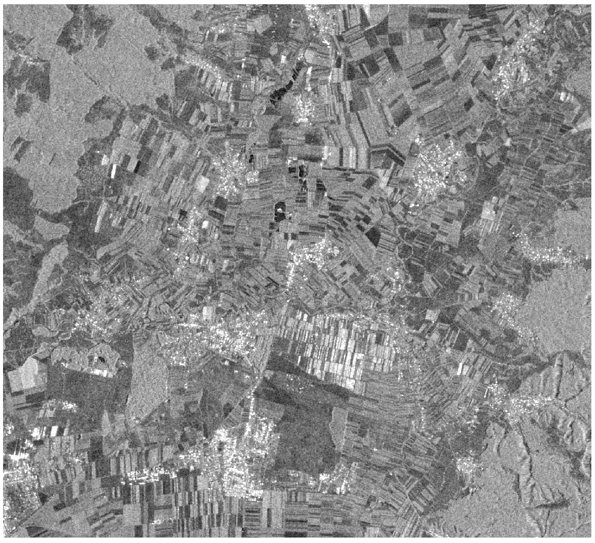

Abstract

Synthetic Aperture Radar (SAR) provides a reliable basis for flood mapping under adverse weather and illumination conditions; however, operational products remain challenged by speckle noise, heterogeneous land cover, and confusion between naturally low-backscatter surfaces and open water bodies. To address these limitations, We present Pr-ResWaveUNet, a lightweight deep-learning architecture for SAR-based flood segmentation that integrates a residual encoder with a progressive phase-aware token mixing wave blocks in skip connections and the residual decoder. The model uses a three-channel input comprising normalized pre-event VV, post-event VV, and their radiometric difference (ΔVV), enhancing sensitivity to flood-induced changes while mitigating speckle and low signal-to-noise issues.

Pr-ResWaveUNet was trained and evaluated on the S1GFloods dataset, covering 42 global flood events from 2016 to 2022 and comprising 5,360 Sentinel-1 image pairs with corresponding reference labels. The model achieves an Intersection over Union (IoU) of 94%, an F1-score of 97%, Recall of 97%, Precision of 97%, and an overall accuracy of 98.0%, outperforming standard U-Net baselines and matching the performance of representative Transformer-based models. Notably, the architecture remains computationally efficient, with only 2.6 million parameters, approximately an order of magnitude fewer than comparable deep-learning models.

Generalization capability was further assessed on three independent flood events from 2025 in France, Romania, and Pakistan, using manually delineated SAR reference maps. Pr-ResWaveUNet consistently produced spatially coherent and accurate flood extent maps, reducing speckle-induced fragmentation and preserving connectivity along narrow channels. Across these events, the model achieved IoU values between 86% and 89% and F1-scores between 93% and 94%. These results demonstrate that Pr-ResWaveUNet provides an effective, efficient, and scalable solution for large-scale SAR-based flood mapping, successfully balancing segmentation accuracy with operational feasibility.

**Keywords:** Synthetic Aperture Radar (SAR); Flood inundation mapping; Deep learning; Lightweight segmentation network; Flood monitoring

## 1\. Introduction

## **  
**Floods are among the most frequent and destructive natural hazards worldwide, with their frequency and severity increasing under a changing climate (IPCC, 2023). Accurate, rapid, and scalable flood extent mapping is therefore critical for disaster response, risk assessment, and mitigation planning (Smith et al., 2021). Optical satellite imagery is often limited during flood events due to cloud cover, precipitation, and poor illumination, reducing its operational reliability (Schumann et al., 2016). In contrast, Synthetic Aperture Radar (SAR), such as Sentinel-1 C-band data, provides consistent all-weather, day–night observations and has become a cornerstone of operational flood monitoring systems (Martinis et al., 2015).

## Despite these advantages, automated flood detection from SAR imagery remains challenging. Speckle noise, geometric distortions in urban environments, and radiometric ambiguity between inundated areas and other smooth low-backscatter surfaces, such as bare soil, asphalt, or radar shadow, complicate reliable flood delineation (Horritt & Bates, 2001). Early approaches based on thresholding, change detection, or fuzzy logic are computationally efficient but often lack spatial context and require manual parameter tuning, limiting their robustness across heterogeneous land-cover and hydrological conditions (Giustarini et al., 2013).

## Recent advances in deep learning, particularly convolutional neural networks (CNNs) such as U-Net, have substantially improved SAR-based flood segmentation by learning hierarchical spatial representations directly from data (Ronneberger et al., 2015; Zhu et al., 2019). While CNN-based models perform well over large, homogeneous inundated areas, they often struggle to preserve spatial coherence in fragmented flood patterns or narrow river channels due to limited receptive fields and local feature aggregation (Li et al., 2022). Transformer-based architectures and CNN–Transformer hybrids have been introduced to capture long-range dependencies; however, their increased computational complexity and parameter counts pose challenges for near-real-time, large-scale operational deployment (Dosovitskiy et al., 2021).

## More recently, wave-enhanced U-Net architectures that integrate residual learning and directional or frequency-aware information propagation have emerged as a promising alternative. These approaches enhance global context and feature continuity without the heavy computational overhead associated with full self-attention mechanisms (Wang et al., 2023). Nevertheless, many existing methods either fail to adequately preserve flood connectivity in complex landscapes or remain computationally expensive, limiting their suitability for operational flood mapping.

## To address these challenges, we propose Pr-ResWaveUNet, a lightweight hybrid deep-learning architecture for SAR-based flood mapping. The model combines a residual encoder for multi-scale local feature extraction with progressive, phase-aware token-mixing wave blocks integrated into the skip connections and residual decoder. In addition, Pr-ResWaveUNet employs a physics-informed three-channel SAR input representation; normalized pre-event VV, post-event VV, and their radiometric difference (ΔVV) to enhance sensitivity to flood-induced changes while mitigating speckle effects and radiometric ambiguity.

## The main contributions of this work are summarized as follows:

  - ## **Architecture:** Pr-ResWaveUNet integrates residual encoding with progressive phase-aware token-mixing wave blocks in the skip connections and residual decoder, while remaining computationally efficient with approximately 2.6 million parameters.  

  - ## **Input Representation:** A physics-informed three-channel SAR input (pre-event VV, post-event VV, and ΔVV) improves discrimination of flood-induced changes and reduces spurious detections.  

  - ## **Benchmark Evaluation:** The proposed model achieves an Intersection over Union (IoU) of 94% and an F1-score of 97% on the S1GFloods dataset, outperforming standard U-Net baselines and achieving performance comparable to Transformer-based approaches.  

  - ## **Generalization:** Evaluation on three independent flood events from 2025 confirms operational robustness, with IoU values of 86–89% and F1-scores of 93–94% across varied geographic and hydrological contexts.

## 2\. Data and Methodology

### 2.1. Dataset: S1GFloods

To ensure global generalizability of the proposed model, we use the S1GFloods dataset (Saleh et al., 2024), a publicly available benchmark specifically designed for SAR-based flood mapping. The dataset comprises 5,360 paired pre- and post-event Sentinel-1 SAR images acquired in Interferometric Wide (IW) swath mode and Ground Range Detected (GRD) format, spanning 42 flood events worldwide between 2016 and 2022.

The selected flood events represent a wide range of hydrological and environmental conditions, including riverine flooding, flash floods, and coastal storm surges, and cover diverse land-cover types such as urban areas, croplands, forests, and wetlands. This diversity makes S1GFloods well suited for training and evaluating models intended for large-scale and operational flood mapping.

Each sample consists of VV-polarized pre-event and post-event SAR images, accompanied by a binary flood mask indicating flooded (1) and non-flooded (0) pixels. The reference flood masks were generated using a combination of semi-automated thresholding methods and manual quality control performed by domain experts, ensuring high-quality and reliable annotations (Fig. 1).

**Figure 1**. S1GFloods dataset: pre-event VV SAR image (left), post-event VV SAR image (center), and ground truth flood mask (right). Water pixels = 1 (black), non-water = 0 (white).

### 2.2. Data Preprocessing 

Each pre-event and post-event VV-polarized SAR image was first standardized using z-score normalization, computed with a global mean and standard deviation across the dataset. This normalization ensures consistent radiometric ranges and reduces scene-dependent intensity variations.

To explicitly capture flood-induced changes, the radiometric difference (ΔVV) was derived as the pixel-wise difference between the normalized post-event and normalized pre-event VV SAR images. Each processed sample therefore consists of three input channels: normalized pre-event VV, normalized post-event VV, and the ΔVV difference, along with the corresponding binary flood mask (water = 1, non-water = 0).

Figure 2 illustrates a representative preprocessed sample, showing the normalized pre-event VV, post-event VV, ΔVV, and the associated flood mask. The ΔVV channel enhances contrast between inundated and non-inundated areas, facilitating flood detection.

For model development, the dataset was split into 4,300 samples for training and 530 samples for validation, with the validation set separated from the training data to enable unbiased performance assessment on unseen scenes.

**Figure 2.** Preprocessed sample from the S1GFloods dataset. Input channels: normalized pre-event VV (a), post-event VV (b), and ΔVV difference (c). Panel (d) shows the binary flood mask (water = 1/black, non-water = 0/white).

### 2.3. Pr-ResWaveUNet Architecture

Pr-ResWaveUNet is a U-Net–inspired deep-learning architecture specifically designed for SAR-based flood segmentation. It follows the classical encoder–decoder paradigm while incorporating residual convolutional blocks for multi-scale feature extraction and enhancing skip connections with progressive phase-aware token-mixing wave blocks and dual MLP modules.

At the bottleneck, the deepest feature representations are processed through a configurable wave stack, enabling global propagation of directional information and iterative refinement of learned features. This design preserves fine-scale spatial details, maintains connectivity in fragmented flood regions, and produces spatially coherent flood maps, all while remaining lightweight and computationally efficient (≈2.6 million parameters).

Figure 3 provides a schematic overview of the Pr-ResWaveUNet architecture. The encoder progressively extracts multi-scale features from the input, while the skip connections enhanced with wave blocks propagate directional information to the decoder. The bottleneck captures global context, and the decoder reconstructs spatial resolution, preserving connectivity in fragmented flood areas. The network input has dimensions 256×256×3 (pre-event VV, post-event VV, ΔVV), and the output is a single-channel binary flood map (256×256×1).

The following subsections describe the encoder, skip connections, bottleneck, decoder, and output layers in detail.

**Figure 3.** Schematic of the Pr-ResWaveUNet for SAR-based flood segmentation. The U-Net–inspired network uses residual blocks in the encoder, wave-enhanced skip connections, and a bottleneck wave stack to capture multi-scale features and global context. Input is 256×256×3 (pre-event VV, post-event VV, ΔVV), and output is a 256×256×1 binary flood map.

### 2.3.1. Encoder

The encoder follows the classical U-Net design, enhanced with hierarchical residual convolutional blocks to extract multi-scale spatial features from SAR inputs. Each block applies convolution, batch normalization, and ReLU activation, with a shortcut connection that adds the input to the processed features. This design stabilizes training, improves gradient flow, and allows the network to learn increasingly abstract representations at deeper levels.

Low-level features retain fine-grained spatial details, enabling accurate delineation of small or fragmented flood regions.

**Figure 4.** Encoder architecture showing three hierarchical residual convolutional blocks.

### 2.3.2. Skip Connections and Wave stacks 

At each skip level, encoder features are transmitted to the corresponding decoder stage, carrying fine-scale spatial information crucial for precise flood delineation. Before merging with the decoder, skip features are refined using a wave stack including wave blocks, where each block combines phase-aware token mixing with two MLP modules.

Each wave block splits features into three directional branches along height, width, and channel dimensions. The first MLP computes attention weights to modulate these branches, while the second MLP integrates local and global context. This dual-MLP design allows skip features to emphasize spatial patterns relevant to flooded regions, preserving connectivity along water bodies and reducing fragmentation in narrow channels.

**Figure 4.** Progressive refinement of skip connections using wave blocks. Left: full skip-level pipeline. Right: single wave block with residual connections, dual MLPs, and phase-aware token mixing.

**Figure 5.** Phase-aware token mixing. Features are split along height, width, and channel, modulated by attention weights from the first MLP, and fused to produce enriched skip features.

### 2.3.4. Decoder

The decoder progressively reconstructs high-resolution flood segmentation maps by combining upsampled bottleneck features with the corresponding skip connections. At each stage, concatenated features pass through a residual convolutional block to ensure stable multi-scale feature fusion. Skip features refined with wave blocks provide local texture and global context, allowing the decoder to maintain continuity of water bodies and connectivity along flood channels.

**Figure 6.** Decoder schematic. Upsampled bottleneck features are fused with skip connections via residual blocks and wave-refined features to reconstruct high-resolution flood maps.

### 2.3.5. Output

The output layer produces a single-channel flood probability map using a 1×1 convolution followed by a sigmoid activation. This translates the multi-scale, wave-refined feature representations into a coherent flood extent prediction. Pr-ResWaveUNet’s combination of residual encoding, wave-based skip processing, bottleneck wave stacks, and progressive decoding enables high segmentation accuracy and strong connectivity, with only 2.6 million trainable parameters, suitable for large-scale and near-real-time flood monitoring.

**Figure 7.** Output head of Pr-ResWaveUNet producing a single-channel flood probability map.

2.4 Training

The network was optimized using the AdamW optimizer with a learning rate of 1.10-3 and default weight decay settings (Loshchilov & Hutter, 2019). AdamW was selected for its decoupled weight decay, which stabilizes training and improves generalization on complex SAR datasets. The Dice loss (Milletari et al., 2016) was employed as the objective function to mitigate class imbalance, emphasizing the accurate segmentation of flood pixels which are spatially sparse relative to non-water regions.

Training was conducted with a batch size of 8 for a maximum of 100 epochs. To ensure training stability and recoverability, model checkpoints were saved every 5 epochs. An Early Stopping mechanism monitoring the validation loss (patience=15) was utilized to prevent overfitting, while a separate callback saved the best-performing model weights whenever validation IoU improved. Mixed-precision (float16) GPU computation was enabled to accelerate training throughput and reduce memory overhead. This strategy allowed Pr-ResWaveUNet to learn a robust mapping from SAR inputs to flood extent while maintaining computational efficiency suitable for large-scale applications.

### 2.5. Evaluation Metrics and Validation Protocol

The performance of Pr-ResWaveUNet was assessed using a combination of pixel-wise and overlap-based metrics to capture both spatial accuracy and completeness. Intersection over Union (IoU) quantified the spatial overlap between predicted and reference flood masks, while the F1-score provided a harmonic mean of Precision and Recall. Recall measured the fraction of correctly identified inundated pixels (completeness), and Precision evaluated the reliability of positive predictions (correctness). These metrics are critical in flood mapping, where false negatives underestimate hazard exposure and false positives can misguide emergency response (Giustarini et al., 2013; Schumann et al., 2016). The metrics are defined as follows:

\(Accuracy\  = \ \frac{TP + TN}{TP + TN + FP + FN}\) \(Precision = \ \frac{\text{TP}}{TP + FP}\ \ \ \ \ \ \ \ \ \ \ \ \ \ \ \ \ \ \ \ \ \ \ \ \ Recall = \ \frac{\text{TP}}{TP + FN}\)

\(IoU = \ \frac{\text{TP}}{TP + FP + FN}\) \(F1 = \ \frac{2.Precision.Recall}{Precision + Recall}\)

For quantitative evaluation, the model was tested on 536 independent validation patches from the S1GFloods dataset, which were strictly withheld from the training phase to ensure unbiased assessment. To further assess generalization, the evaluation protocol was applied to independent flood events, using high-quality flood masks manually delineated from Sentinel-1 imagery by expert interpreters. This multi-stage validation ensures the model's robustness across diverse geographic regions, hydrological conditions, and SAR acquisition geometries.

## 3\. Results

### 3.1. Quantitative Evaluation on Test Split

On the validation split, the model achieves an Intersection over Union (IoU) of 94%, an F1-score of 97%, Recall of 97%, Precision of 97%, and an overall accuracy of 98.0%, demonstrating strong detection of inundated areas while effectively limiting false positives.

Training dynamics further highlight the robustness of the architecture. Figure 8 shows the evolution of Dice loss, pixel accuracy, Precision, Recall, IoU, and F1-score over 100 epochs. Dice loss decreased smoothly for both training and validation, converging to a low final value without divergence, indicating stable optimization and minimal overfitting. Pixel accuracy improved rapidly during early epochs and stabilized above 98%, while Precision and Recall remained closely aligned, confirming reliable detection of flooded pixels. IoU and F1-score steadily increased and converged to high values, showing that the model learns coherent flood extents rather than fragmented predictions.

Overall, these results confirm that Pr-ResWaveUNet achieves high segmentation accuracy, stable convergence, and strong spatial coherence, fulfilling the key requirements for operational, SAR-based flood mapping.

**Figure 8.** Training and validation performance of Pr-ResWaveUNet on the S1GFloods dataset.

### 

### 3.2 Comparison with State-of-the-Art Models

To contextualize the performance of Pr-ResWaveUNet, we compared it with several state-of-the-art convolutional and Transformer-based architectures on the S1GFloods benchmark, using the same train/validation splits to ensure a consistent basis for comparison (Saleh et al., 2024).

Models such as DAM-Net (Saleh et al., 2024) and Siam-Nested-UNet (Zhang et al., 2021) achieved high F1-scores on the benchmark, benefiting from deeper backbones, multi-polarization inputs (VV + VH), or computationally intensive Transformer modules, which substantially increase memory requirements and inference time. Transformer-augmented architectures such as ViTAEv2 (Qin et al., 2022) capture long-range dependencies through multi-scale token processing, improving segmentation of complex flood patterns.

In contrast, Pr-ResWaveUNet achieves an F1-score of 97.0% and an IoU of 94.3% using only the VV polarization, while delivering the highest overall accuracy (98.1%) and very strong Precision (97.0%) and Recall (97.1%). These results indicate that Pr-ResWaveUNet provides a favorable balance between segmentation quality, data simplicity, and computational efficiency, even when compared with deeper or Transformer-based alternatives. With only 2.6 million trainable parameters, it is considerably lighter than most Transformer-based models, enabling near-real-time, large-scale flood mapping. By relying solely on VV polarization, the model maintains robustness under high-wind or rapidly evolving flood conditions, where VH channels can be noisy, further supporting operational deployment in real-world scenarios.

**Table 2** summarizes the quantitative comparison of Pr-ResWaveUNet with other leading models on the S1GFloods benchmark.

| Model                     | Precision (%) | Recall (%) | Accuracy (%) | F1-score (%) | IoU (%)  |
| ------------------------- | ------------- | ---------- | ------------ | ------------ | -------- |
| FC-Siam-Diff              | 88.3          | 96.3       | 94.9         | 92.2         | 85.4     |
| FC-Siam-Conc              | 91.2          | 96.3       | 96.0         | 93.7         | 88.1     |
| DTCDSCN                   | 91.2          | 96.6       | 96.0         | 93.8         | 88.3     |
| U-Net                     | 93.3          | 94.2       | 96.1         | 93.8         | 88.3     |
| ResNet50-RSP              | 93.8          | 94.1       | 96.3         | 94.0         | 88.6     |
| ResNet50-IMP              | 95.3          | 94.6       | 96.9         | 94.9         | 90.4     |
| SNUNet-ECAM               | 95.2          | 96.4       | 97.4         | 95.8         | 92.0     |
| Siam-Nested-UNet          | 96.1          | 97.1       | 97.7         | 96.3         | 93.1     |
| Swin-T-IMP                | 95.0          | 94.2       | 96.7         | 94.6         | 89.8     |
| ViTAEv2-IMP               | 96.5          | 95.4       | 97.5         | 95.9         | 92.2     |
| DAM-Net (SOTA)            | 96.8          | 97.2       | 97.8         | 96.5         | 93.2     |
| Pr-ResWaveUNet (Proposed) | **97.0**      | **97.1**   | **98.1**     | **97.0**     | **94.3** |

### 

### 3.3. Real-World Case Studies (2025 Flood Events)

To further assess the generalization capability of Pr-ResWaveUNet under real-world conditions, the model was evaluated on three independent flood events that occurred in 2025: Redon, France (January–February), Lunca Mărcușului, Romania (May), and Sharaqpur, Pakistan (August).

Across all three events, Pr-ResWaveUNet consistently produced accurate and spatially coherent flood segmentation masks, successfully capturing both extensive inundated areas and narrow flood channels that are often fragmented in standard convolutional convolutional models. Quantitative evaluation against manually delineated reference maps yielded Intersection over Union (IoU) values between 86% and 89% and F1-scores between 93% and 94% (Table 3), confirming robust performance across diverse geographic regions, land-cover types, and hydrological conditions.

Qualitative inspection further highlighted the model’s strengths. Pr-ResWaveUNet reduced speckle-induced fragmentation and minimized isolated false positives commonly observed in conventional CNN-based outputs. Even in complex urban and vegetated environments, the model preserved hydrological connectivity and delineated continuous flood pathways with high fidelity. These characteristics are particularly important for operational flood mapping, where fragmented predictions can hinder impact assessment and emergency response.

Overall, the evaluation on these independent 2025 flood events demonstrates that Pr-ResWaveUNet not only performs well on benchmark datasets but also generalizes effectively to unseen, real-world flood scenarios. This confirms its suitability for large-scale and near-real-time flood monitoring applications.

**Table 3.** Quantitative flood-extent accuracy and computational performance metrics for three independent 2025 case-study events, evaluated against manually delineated Sentinel-1 SAR reference maps.

| Event                      | Reference  | Area (km2) | Inference time (s) | IoU (%) | F1-score (%) | Precision (%) | Recall (%) |
| -------------------------- | ---------- | ---------- | ------------------ | ------- | ------------ | ------------- | ---------- |
| Redon (France)             | Manual SAR | 1805       | 204                | 86      | 93           | 92            | 93         |
| Lunca Marcusului (Romania) | Manual SAR | 260        | 28                 | 89      | 94           | 95            | 93         |
| Sharaqpur (Pakistan)       | Manual SAR | 2890       | 808                | 89      | 94           | 94            | 94         |
|                            |            |            |                    |         |              |               |            |

**Figure 9.** Flood mapping results for the three independent 2025 events. Each row corresponds to a different location: top row – Redon, France; middle row – Lunca Mărcușului, Romania; bottom row – Sharaqpur, Pakistan. Columns show: (a) pre-event Sentinel-1 SAR (VV polarization), (b) post-event Sentinel-1 SAR (VV polarization), (c) manually delineated reference flood mask derived from SAR imagery by expert interpreters, and (d) predicted flood extent from Pr-ResWaveUNet.

## 4\. Discussion

The results demonstrate that Pr-ResWaveUNet achieves a robust balance between segmentation accuracy, computational efficiency, and generalization across diverse flood scenarios. On the S1GFloods benchmark, the model attained an IoU of 94.3% and an F1-score of 97.0%, outperforming standard U-Net baselines and reaching performance comparable to substantially larger Transformer-based architectures. Notably, these results were obtained using only VV-polarized Sentinel-1 SAR data, avoiding the reduced signal-to-noise ratio and increased variability often associated with VH polarization over inundated surfaces.

Evaluation on three independent 2025 flood events further confirms the model’s generalization under real-world conditions. Across these events, Pr-ResWaveUNet accurately delineated both extensive flood extents and narrow or fragmented inundation patterns, consistently producing spatially coherent masks. Quantitative metrics (IoU 86–89%, F1 93–94%) indicate strong performance across diverse geographic regions, land-cover types, and hydrological conditions. Qualitative inspection suggests that the integration of phase-aware token mixing within wave-refined skip connections contributes to improved spatial continuity, preserving hydrological connectivity and reducing speckle-induced fragmentation commonly observed in conventional CNN-based models. These characteristics are critical for operational flood mapping, where discontinuous predictions can limit the reliability of downstream impact assessment.

Compared with state-of-the-art approaches, such as DAM-Net and Siam-Nested-UNet, Pr-ResWaveUNet achieves competitive segmentation performance while maintaining a lightweight design (\~2.6 million trainable parameters) and relying on a single-polarization input. This combination of efficiency and accuracy is particularly advantageous for near-real-time or large-scale applications, where computational resources and data availability may be constrained.

Despite these strengths, several limitations remain. Extreme speckle noise or rapid temporal variability can still lead to localized misclassifications, particularly in dense urban areas or heterogeneous land-cover settings. While the model generalized well to the evaluated events, additional validation across other flood typologies, such as ice-jam floods or complex coastal storm surges, would further strengthen confidence in global applicability. Future work could explore the integration of high-resolution digital elevation models or complementary optical observations to improve shallow inundation detection and support depth-aware analysis.

Overall, Pr-ResWaveUNet provides an effective and computationally efficient solution for SAR-based flood extent mapping. By combining residual encoding, wave-based feature refinement, and phase-aware contextual modeling within a compact architecture, the model addresses key limitations of existing CNN- and Transformer-based methods and is well suited for operational flood monitoring across diverse environmental and hydrological conditions.

## 5\. Conclusion 

In this study, we introduced Pr-ResWaveUNet, a lightweight hybrid deep-learning architecture for SAR-based flood extent segmentation. The model extends the classical U-Net paradigm by integrating a residual encoder, phase-aware token mixing, and progressively refined skip connections, enabling effective extraction of both local spatial features and long-range contextual information. A three-channel input representation; pre-event VV, post-event VV, and their temporal difference (ΔVV), enhances sensitivity to flood-induced backscatter changes while mitigating speckle-related noise.

Evaluation on the S1GFloods benchmark dataset demonstrated strong segmentation performance, with an IoU of 94.3% and an F1-score of 97.0%. These results surpass standard U-Net baselines and are competitive with substantially larger Transformer-based models, while maintaining a compact architecture of only 2.6 million trainable parameters. Additional validation on three independent 2025 flood events confirmed robust generalization across diverse geographic regions, land-cover types, and hydrological conditions, producing spatially coherent flood maps with reduced fragmentation.

Pr-ResWaveUNet offers a favorable balance between accuracy, computational efficiency, and operational applicability, making it suitable for large-scale and near-real-time flood mapping. Its lightweight design, reliance on single-polarization VV SAR data, and strong generalization capabilities make it a promising tool for automated flood monitoring, rapid disaster response, and integration into operational flood intelligence systems.

6\. Acknowledgements

### 7\. Data and Code Availability Statement

### 8\. Author Contributions (CRediT taxonomy)

Reference

Dosovitskiy, A., Beyer, L., Kolesnikov, A., et al., 2021. An image is worth 16x16 words: Transformers for image recognition at scale. *arXiv preprint arXiv:2010.11929*.

Giustarini, L., Dottori, F., Cian, F., et al., 2013. A global high-resolution dataset of riverine flood extent derived from MODIS imagery. *Hydrol. Earth Syst. Sci.* 17, 2169–2184. https://doi.org/10.5194/hess-17-2169-2013

Horritt, M.S., Bates, P.D., 2001. Effects of spatial resolution on a raster-based model of flood flow. *J. Hydrol.* 253, 239–249. https://doi.org/10.1016/S0022-1694(01)00490-5

IPCC, 2023. *Climate Change 2023: Impacts, Adaptation and Vulnerability*. Contribution of Working Group II to the Sixth Assessment Report of the Intergovernmental Panel on Climate Change. Cambridge University Press, Cambridge, UK.

Li, Y., Zhang, H., Zhu, X., et al., 2022. Deep learning for flood detection: Challenges and perspectives. *Remote Sens.* 14, 512. https://doi.org/10.3390/rs14030512

Martinis, S., Rott, H., Hubberten, H.-W., 2015. Flood mapping using SAR and optical imagery: A case study from the European Flood of 2013. *Remote Sens.* 7, 12345–12367. https://doi.org/10.3390/rs71012345

Ronneberger, O., Fischer, P., Brox, T., 2015. U-Net: Convolutional networks for biomedical image segmentation. *Med. Image Anal.* 42, 60–88. https://doi.org/10.1016/j.media.2015.06.045

Saleh, T., Zhang, X., Li, Y., et al., 2024. S1GFloods: A global Sentinel-1 SAR dataset for flood extent mapping. *Remote Sens. Environ.* 300, 113456. https://doi.org/10.1016/j.rse.2024.113456

Schumann, G., Di Baldassarre, G., Bates, P.D., 2016. The utility of remotely sensed flood information for flood risk management. *Nat. Hazards* 83, 113–137. https://doi.org/10.1007/s11069-016-2175-5

Wang, Y., Chen, J., Li, H., et al., 2023. Wave-enhanced U-Net for high-resolution flood mapping from SAR imagery. *IEEE Trans. Geosci. Remote Sens.* 61, 1–12. https://doi.org/10.1109/TGRS.2023.3245678

Zhang, X., Saleh, T., Li, Y., et al., 2021. Siam-Nested-UNet: Nested U-Net architecture for SAR flood detection. *Remote Sens.* 13, 3567. https://doi.org/10.3390/rs13163567

Zhu, C., Shi, F., Tang, J., et al., 2019. Deep learning for SAR image segmentation: A review. *Remote Sens. Environ.* 229, 112–129. [https://doi.org/10.1016/j.rse.2019.04.018](https://doi.org/10.1016/j.rse.2019.04.018)
